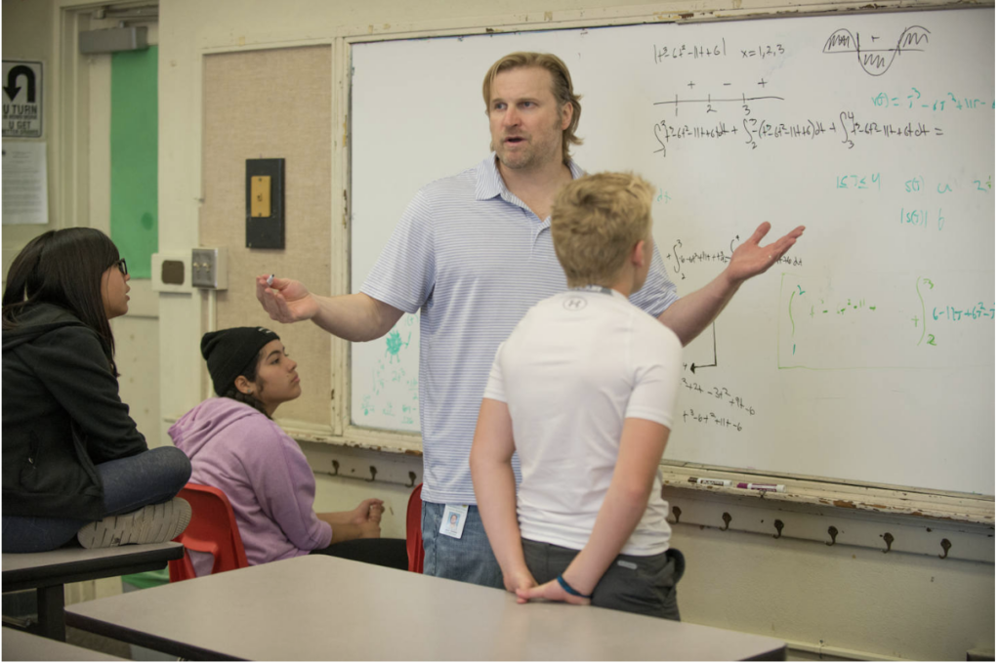

在[Math Academy:让天下没有学不会的数学](https://journeytomath.com/math-academy-make-math-learning-easier/)末尾,我提到要做一个系列,介绍Math Academy的使用方法和学习技巧. 正式介绍功能之前,我想分享Math Academy 背后的故事: 一对热爱数学的夫妻为儿子参加数学竞赛花了10年打造了一款数学学习神器. 这款神器不仅能让中小学生快速掌握数学知识,现在也成了人工智能从业者学习数学的热门工具.

以下内容是Math Academy官网[About us](https://mathacademy.com/about-us)内容的中文翻译,略作删减.

—-

Jason Roberts与Sandy Roberts是一对夫妻,都热爱数学和孩子. Jason 在芝加哥大学主修数学，原本计划成为一名数学家，但后来投身于创办科技创业公司和开发高频交易系统。Sandy 在芝加哥大学获得经济学学位，一直对数学充满热爱。他们育有三个活泼的孩子，其中老大和小儿子都参加过 Math Academy 的课程。

Roberts夫妻的大儿子四年级时加入了学校的数学竞赛队。由于老师知道两人都懂数学且对教学有兴趣，他们就”被自愿”成为了数学队的竞赛教练。他们收到的”装备”只有一份学生名单、一摞厚厚的习题纸、一大袋水果糖，却没有任何教学指导。就这样，他们开启了教孩子数学的征程。

<figure class="wp-block-image size-large">

<figcaption>Jason Roberts with his students from mathacademy.com</figcaption>
</figure>

虽然准备不足，但 Jason 和 Sandy 还是走进了教室。在了解孩子们的数学水平时，Jason 特别惊讶于他们还不懂的一些数学概念。尽管这些内容超出了数学竞赛的范围，但 Jason 忍不住说：”让我快速教你们这个吧。”

为了真正掌握如何让孩子们有效学习，他们投入了数千小时研究实证的认知科学教学法。他们在课堂上运用了主动学习、间隔重复、混合复习、层层递进、自动化等教学理念。同时，作为运动员的经验也影响了他们的教学方式。就像没有人能通过听一个小时的讲解就学会打篮球一样（你得先示范几分钟，然后让他们自己拿球练习），他们也采用类似的方法：简单讲解指数运算的原理，然后给每个孩子一支彩色白板笔，让他们开始动手做题。

在第一年里，在 Jason 的”原来你们还不知道这个？”和孩子们永不满足的求知欲推动下，这些四年级的孩子们竟然通过了五年级的期末考试。于是，Jason 和 Sandy 与学校达成协议，每周抽出几天时间单独辅导这些孩子，看看他们能学到什么程度。

Jason 一鼓作气，开始教授代数。整个五年级期间，他们不断完善教学方法，通过反复尝试和研究，发现了一个教学的”金钥匙”：孩子们学得越多，就越能学习更多，学习欲望也越强。这形成了一个极其良性的循环。到了学年中期，孩子们开始问：”最难的数学是什么？”Jason 回答说：”其实数学并没有’最难’一说，不过对你们来说，就算是微积分吧。””那我们什么时候学微积分？”他们几乎每天都这么问。终于，在学年快结束时，Jason 答应了：”今天就开始。”没想到，孩子们学起来如鱼得水。

当地的一位教育局长对 Jason 和 Sandy 的工作产生了极大兴趣,并于期末最后一天到访学校。看到这些孩子们兴致勃勃地在白板上演算导数和积分时，教育局长惊得下巴都要掉下来了。就这样，Math Academy 正式诞生了。

当这批孩子升入初中后，Jason 和 Sandy 开始与学区合作，开发让更多孩子加入 Math Academy 项目的试点计划。这时他们遇到了两个明显的问题：一是孩子终究是孩子，二是公立教育体系中存在大量繁文缛节。

第一个问题相对容易解决。Jason 听够了孩子们各种不交作业的理由：忘记做作业啦，不记得怎么做啦，忘带铅笔啦。作为一个坚信软件能解决一切问题的人，Jason 着手开发了一个在线系统，让孩子们可以在上面复习教材、完成作业，同时也免去了教师及时批改每份作业的繁重工作。

第二个问题则花了多年时间，需要非凡的创造性思维、坚定的意志力，以及与学区、帕萨迪纳教育基金会和帕萨迪纳社区基金会的密切合作才得以解决。由于 Jason 和 Sandy 都不是轻言放弃的性格，帕萨迪纳学区的 Math Academy 项目最终成形，并在 PUSD（帕萨迪纳联合学区）获得了完整的资金支持和整合。他们非常幸运地找到了志同道合的合作伙伴，这些伙伴愿意寻找创新解决方案，共同创建一个完全符合学区和州教育标准要求的项目。

对于那些想在常规学年开始之外的时间加入学校项目的学生，这带来了一个有趣的挑战。为了让所有学生都有机会接触这个高阶数学项目，软件的在线特性提供了可能性。但 Jason 很快就被手动为不同水平、不同学习速度的学生创建作业的工作压垮了。是时候将软件提升到一个新的水平了，于是他开始热火朝天地开发后来被亲切地称为”自动化神器”的系统。

这是Math Academy发展的一个转折点，它从单纯的作业系统进化成了一个完整的独立数学学习平台。新冠疫情的爆发迫使所有教学转向线上，促使他们加速开发更多工具，使系统更加高效和独立。Jason 和 Sandy 觉得是时候扩大核心团队了，他们委派一些课程创建专家责任构建和添加课程，还引入了一位算法专家来整合知识图谱和认知学习策略等功能，这些都是使Math Academy如此有效的关键。不久之后，团队齐心协力，成功获得了西部学校和学院认证委员会（WASC）的完整认证。

—

以上就是Math Academy的创始故事。MA异常强大,吸引了众多学生和AI领域的从业者学习数学.我从2024年9月3日开始在MA学习数学,到今天(2024.10.22)已经积累了9331个XP了. 

我女儿初一,在我的不懈引导下,上周六开始学习初一的数学知识了,我很期待到年底她对Math Academy有什么样的评价.
