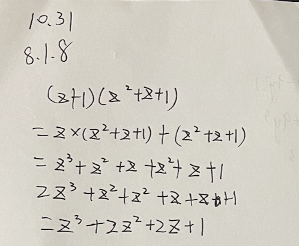
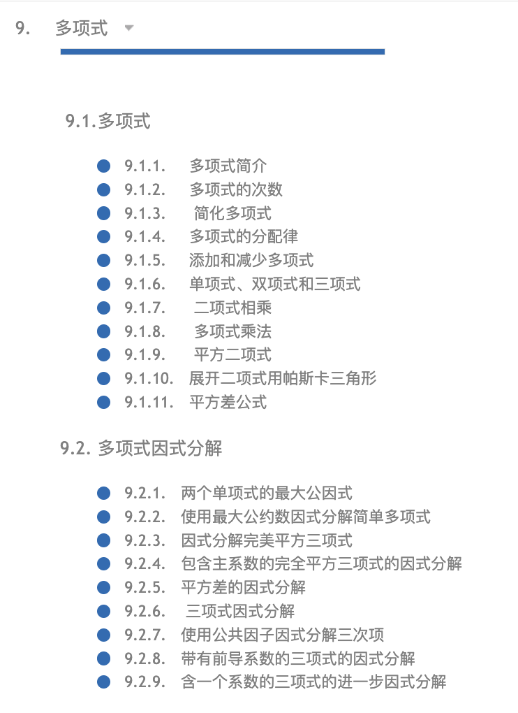
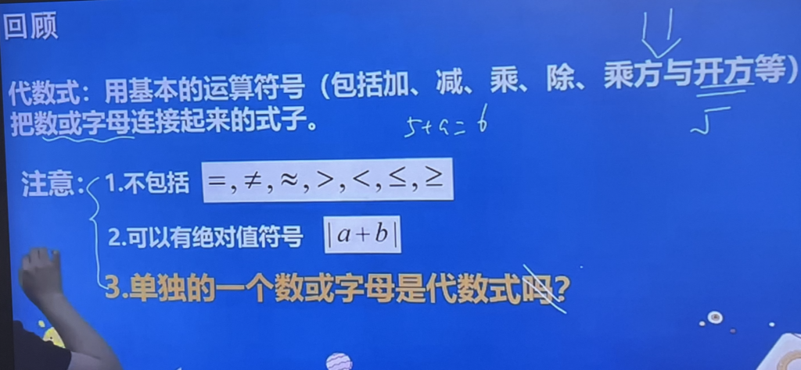

昨天晚上女儿有点儿沮丧,她说同桌数学考了146,她才110+,会不会她不是学数学的料儿?

我说这是最大的谎言.有研究指出,女孩长大后平均数学成绩不如男生,源于整个社会都认为女生数学就是比男生差,而女孩大约从6岁起就慢慢自我认同这个说法,然后就进入自证预言的漩涡.

<figure class="wp-block-image size-large">

</figure>

8月Hacker News有篇[文章](https://news.ycombinator.com/item?id=41338354)在美国科技圈非常火,原文在这里:

> [You Are NOT Dumb, You Just Lack the Prerequisites](https://lelouch.dev/blog/you-are-probably-not-dumb/)

文章非常短,我翻译成了中文,有兴趣的家长可以给孩子看看.

**你不是笨,只是基础还不够扎实.**

很多时候,我们都会陷入这样的自我怀疑:”为什么别人学数学这么轻松,而我却总是一头雾水?”

记得在学生时代,我就深深地被这种想法困扰着。看着同学们轻松解决数学题,而我却要绞尽脑汁,这让我不得不怀疑:也许我真的不够聪明。

这种想法像一片挥之不去的阴影,即使我在其他方面表现不错,但总觉得自己差那么一点。

直到最近,我投入了150天专门学习数学,才恍然大悟 – 问题的根源不在于能力,而在于基础知识的缺失。

这就像是看电影从中间开始看,又或者是在第一关就要去挑战游戏最终boss – 不是你能力不行,而是你跳过了必要的准备阶段。

想象一下,如果让一个小学生直接去解高中数学题,那结果可想而知。这不是聪明与否的问题,而是他还没有掌握必要的前置知识。

认识到这一点后,我决定从最基础开始重新学习。是的,这个过程可能会很慢,甚至会让人感到有些挫折。但就像盖房子一样,只有打好地基,才能建起稳固的高楼。

现在的我依然不能说已经精通数学,但我确实在一步步进步。最重要的是,我不再被”自己不够聪明”这个想法所困扰。

与其质疑自己的能力,不如先问问:我是否真的掌握了所有必要的基础知识?

—-

文章作者从2024年初开始在Math Academy学习数学,至今超过200天.作者还做了一份[学习报告](https://lelouch.dev/progress-reports),有兴趣的可以看看 .

我女儿在math Academy学习了8天,目前感觉良好.我给她设定了最低的目标,每天学习一个小节,5-10分钟就可以完成. 内容选择了她正在学习的多项式,老师都教过,她感觉相对简单.  我要求她做习题,一定要写清楚解题步骤,目前执行的还不错.

<figure class="wp-block-image size-full">

</figure>

Math Academy的一个特点是把知识点分解成小块,再通过知识图谱链接在一起,让学生在过程中一直处于较低的认知负荷状态下.

<figure class="wp-block-image size-full">

</figure>

而国内教培机构的老师恨不得一次把所有知识都塞给学生,在一个页面讲完所有知识点,最后只能是老师自嗨,学生懵圈. 你能相信吗?有老师可以对着这个页面讲十几分钟,学生能听进去就见鬼了.

<figure class="wp-block-image size-large">

</figure>

我在研究AI教育时发现了Math Academy,最初的想法是为女儿找到一个AI驱动的数学学习工具.体验后我自己学上瘾了,打算把AI需要数学重刷一遍,50天冲到大学微积分了.现在我可以确认,Math Academy就是最好的一对一数学辅导老师,包括真人名师,没有之一.

我follow的好几个老外描述第一次遇到Math Academy,用的词是”fall in love”, 比如Lelouch在[Math For Machine Learning \[Resources\]](https://lelouch.dev/blog/math-for-machine-learning/)是这么说的:

> I immediately fell in love due to its gamified UI, bite-sized lessons, and tremendous thought that went into picking and implementing the cutting-edge cognitive learning theory. Frankly, I stopped consuming other math resources ever since then and just started grinding lessons on the platform.

[Math Academy](http://www.mathacademy.com)的网站在大陆可以直接访问.49美元/月的亲民价格,差不多是数学补习班一次课的费用. 使用第一个月不满意还可以无理由全额退款.

不过Math Academy是全英文界面,对英语水平不够的中国孩子有一定障碍.我是通过“[沉浸式翻译](https://immersivetranslate.com/zh-Hans/)”这个浏览器插件解决语言问题的.下篇文章说说如何配合这个插件在MA学习数学.

欢迎有孩子的家长一起讨论AI时代更科学的学习方法.
