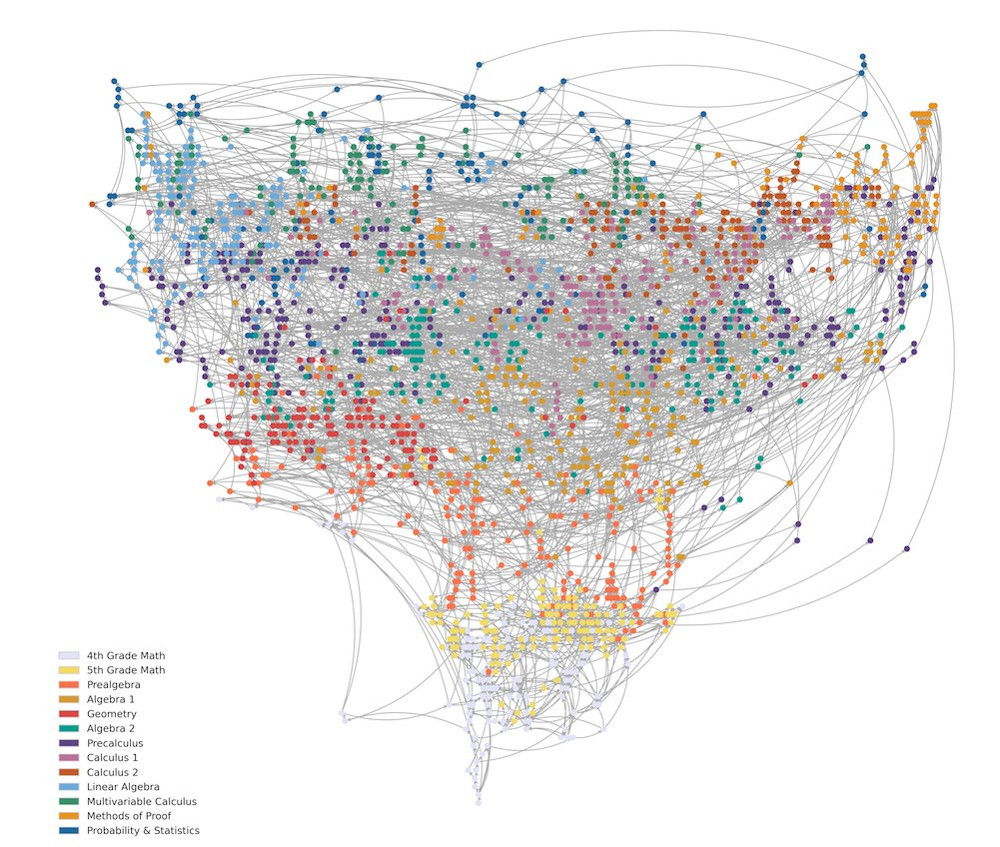

**“** Math Academy是高考数学的最佳提分工具。**”**

01  主动学习 VS 被动学习

中文网络有很多家长推荐可汗学院,只有我在不遗余力的推荐Math Academy.

我带娃儿在可汗学院学过 1 学期数学.

我已在MA学过270+小时数学.

我觉得MA比可汗学院更适合学数学.

虽然可汗免费,MA 49美元/月,

比起几百块一次的补习,

MA就是白菜价.

更重要的是,

在MA学生主动学习,

他们阅读、看图、计算, 解决问题.

而以视频为主的教学平台,

老师讲得很High,学生看得很爽,

但这是被动学习,

它会产生集体幻觉:

老师: 我教会了

学生:我学会了

考试后

学生:我挂了

老师:再来  

02 高考是抗压测试

Math Academy最符合中国国情.

为什么?

Math Academy是高考数学的最佳提分工具。

高考的本质是什么?

2天4考9小时,检验一名学生15年的学习成果.

高考是分配高等教育资源的手段,

更是一场全面检验考生抗压能力的考试.

而压力处理与认知负荷直接相关.

考场中,不能管理好认知负荷的学生将出局,

无论ta平时有多优秀.

对于压力测试,

目前主流方法是高频率模考,

仿佛考得多了自然就能抗压了.

有效果,但副作用极大.

03 认知负荷减压

认知负荷很难通过高强度训练大幅度提高.

大脑受制于工作记忆,

 通常只能同时处理3-5件事情,

手机号码经常用4-4-3分组记,就是一种体现.

高考数学题的特点是综合,

一道考题通常涉及多个知识点,

单个知识点还要多个计算步骤.

考场上时间有限,神经极易紧张,

导致工作记忆过载,大脑就会罢工,

“考糊了”,“考蒙了”,“脑子空了”就是形象的说法.

最近我看了很多数学大V的教学视频,

也和一些数学老师交流过,

我看到的是,

极少有老师从认知负荷的角度帮助学生.

老师为了追求效率,往往跳过中间步骤,

只把关键节点讲出来,剩下的让学生自己搞定.

这种教学方法,

无论是校内课堂还是校外培训,

都看不到改良的迹象.

Math Academy找到了解决办法. 

MA的方法笨,但极其有效.

MA把大的数学知识块拆分成一个个小知识点,

再通过知识图谱把它们连接成有向无环图.

<figure class="wp-block-image size-full">

</figure>

一个学生只要掌握了基本的加减乘除运算,

就可以沿着图谱一步一步往上爬,

学到大学甚至更高级的数学知识.

MA把知识拆分成小块,

是降低认知负荷的有效方法.

一次只学一个知识点,

前面的知识点作为后面知识的垫脚石,

积跬步以致千里.

04 AI数学导师

拆分知识并不新鲜.

脚手架理论和最近发展区提出都几十年了,

为什么没有大规模应用呢?

上周五我和一位高中数学老师交流,

他的日常教学提供了答案,

也印证了业界研究结论:

学校老师没有时间为每位学生定制脚手架,

虽然老师已经花了巨大精力了解每个学生的状态.

AI帮助Math Academy解决了这个问题.

MA用知识图谱了解每位学生的最新知识水平,

据此提供最适合的下一个知识点.

MA本质是一个AI版数学导师,

在所有我体验过的数学学习工具中,

包括可汗学院,油管大V,国内教培机构,

只有MA同时解决了认知负荷和最近发展区两个学习难题.

05 行动才是硬道理

以上是我开足自来水,向所有家长推荐Math Academy的原因.

愿意尝试的家长可以去MA官网,

[mathacademy.com](http://www.mathacademy.com),

也可以参考我的系列文章.

强烈建议家长先自己体验一周,

然后再带娃儿一起体验.

如果不适合,一个月内可以申请全额退款.

我有一个MA共学群,

使用MA的朋友可以加我一起交流.

加我微信,验证MA身份后会邀请入群.

<figure class="wp-block-image size-large is-resized">

</figure>
