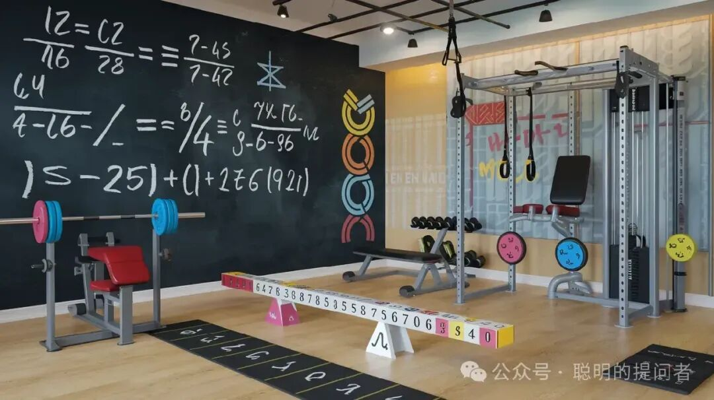

Deepseek最近一个月刷屏了,不仅中国,美国都直呼Deepseek太强大了.

Claude创始人Dario Amodei预计,在所有方面都比人类聪明的AI将在2026-2027年出现.

问题来了:

AI都这么强大了,

孩子学习的意义在哪里?

我的观点:

1. 孩子将比以前更喜欢学习.

2. 自主学习将是唯一的学习方式.

3. 全球会出现各种形式的“健脑房”.

1. 没有“好奇”,学习就不会发生

孩子为什么会更喜欢学习?

回答这个问题,得先问另一个问题:

为什么三岁的孩子整天问“为什么”,

上了小学却天天想着躺平?

三岁孩子只问自己感兴趣的问题,

而小学生被迫学习自己不喜欢的“知识”,

家长觉得这些“知识”是孩子今后谋生的手段.

如果AI在各个方面的“知识”都超越了人类,

这些“知识”就不再具有比较优势,

也就不再具有经济和投资价值.

但这些“知识”就是人类知识的全部吗?

显然不是.

这些“知识”只是人类的显性知识,

人类还有大量的隐性知识,存在于每个人的大脑中.

这些隐性知识很难用语言和文字描述,

有时我们会用“经验”,“直觉”,“智慧”指代.

这些才是人类相对于AI的优势,也是AI学不来的优势.

隐性知识很难被外显,

就像人类还不知道大模型究竟是怎么学习的,

人脑和AI的内部都还是黑箱,需要一点一点地照亮.

当显性知识没有比较优势时,

人们就会花更多时间在创造自己的隐性知识.

创造源于“好奇”,而不是被动学习.

乔布斯喜欢捣鼓电子器件,

才创立了苹果公司,发明了个人电脑、iPod和iPhone.

比尔盖茨喜欢编程,

才创立了微软,发明了Windows和Offices.

没有3D游戏,就没有如今的黄仁勋,

也就没有今天的AI大模型.

好奇让乔布斯、比尔盖茨和黄仁勋比其他人更努力,

学习任何他们认为有趣的知识.

2. 所有的学习都是自主学习

脑科学和认知科学认为,

所有的学习都是主动学习.

脑科学认为,

学习是神经元受到外部刺激后的重塑.

认知科学认为,

学习是大脑对环境信息的加工与反馈.

学习过程发生在大脑内部,

家长和老师都不能撬开孩子的大脑,

强行改变内部结构.

他们能做的,

就是提供学习发生的环境.

好的环境促进孩子与环境的互动,

孩子就会自主学习.

坏的环境促进孩子与环境的隔离,

孩子就会习得性无助,或躺平,或抑郁.

3. 好的学习环境是“健脑房”

工业革命后,

体力劳动越来越多的被机器取代,

人类终于不需要辛勤劳作才能维持温饱了.

有趣的是,

健身房和马拉松越来越流行.

人们为什么要去撸铁和跑步呢?

躺平不舒服吗?

原来运动可以促进分泌多巴胺和释放内啡肽,

这些都是快乐的源泉.

现代神经科学研究表明,

沉浸式学习也可以让人获得类似的快乐,

而且比运动获得的快乐,

更温和,更持久.

当孩子不再为谋生学习知识时,

就会转入为好奇而学习.

隐性知识的积累,

将帮助个人建立持久的竞争优势.

好奇心也会驱动,

沉浸式学习的“健脑房”诞生.

Math Academy就是数学学习的健脑房.

上周五群友John提出这个新概念时,

我的感觉是:这TM太棒了!

群友嘉榆也说过,在MA学习能让她平静下来.

我迫不及待地想把“健脑房”分享出去,

希望越来越多的孩子用MA来健脑,

而不是被迫刷题.

Math Academy,

一个打破布鲁姆 2 Sigma难题的学习系统.

一个不仅是学霸,更是为普娃儿准备的学习系统.

一个让孩子重建数学学习信心的自主学习系统.

MA注册后,第一个月不满意全额退款,

实际上用户得到了一个月的安全体验期.

具体注册请参考

[手把手教你注册Math Academy](https://mp.weixin.qq.com/s?__biz=MzIwNzMzODkyNA==&mid=2247484009&idx=1&sn=95ca5bd210dc22300030f485e1d131c8&scene=21#wechat_redirect)

了解MA请参考

[Math Academy正在取代可汗学院成为数学学习首选平台](https://mp.weixin.qq.com/s?__biz=MzIwNzMzODkyNA==&mid=2247484169&idx=1&sn=fd8f4d65ea68eb3f59caf16239e82794&scene=21#wechat_redirect)

[Math Academy: 数学奇才为儿子打造的数学学习神器](https://mp.weixin.qq.com/s?__biz=MzIwNzMzODkyNA==&mid=2247483928&idx=1&sn=16fb7b41ca69377c67c3c3c4738ae737&scene=21#wechat_redirect)

MA共学群现有用户180+,供MA用户交流学习.

加我微信,验证MA用户身份后邀请入群.

如果你有娃儿要学数学,欢迎订阅+点赞+转发本文,一起共学
