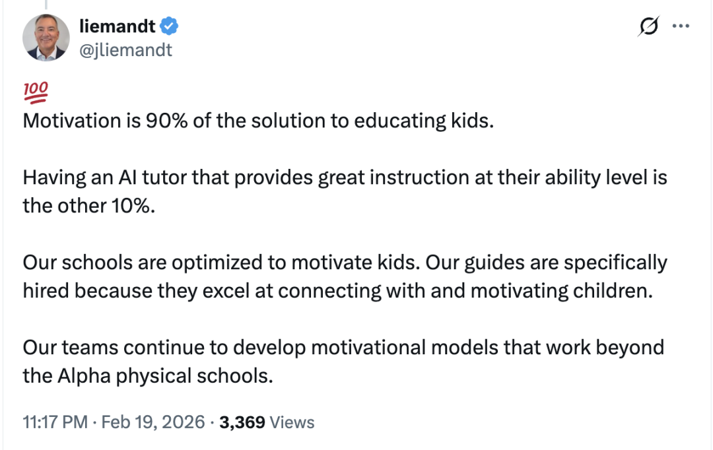

Alpha School 是一所什么样的学校?

绝大多数人说是一所 AI 驱动的学校.

Alpha School 校长 Liemandt 可不这么认为.

原来 Alpha School 首先是一所动机驱动的学校。AI只是手段，把学科教学压缩到每天两小时以内，好把时间省出来。

省出来干嘛？去解决那个真正难的问题：让孩子想学。

这件事为什么难？因为我们整个教育系统从来没有把它当成自己的责任。孩子不想学？那是孩子的问题——自制力差、不懂事、没吃够苦。

Liemandt 说，不是。99%的情况下，孩子不想学，是系统没设计好。

他怎么设计的？

上午两小时AI搞定学习，下午时间全部还给孩子。打球、拍视频、做项目，随便。

这不是放养。是一笔交易：你专注两小时，剩下的时间就是你的。

一个妈妈担心儿子坐不住，导师说，如果他知道专注完就能打一下午篮球，你觉得他坐不坐得住？

妈妈不担心了。

三个女孩讨厌数学。校长没安排补课，而是查了她们在读什么，发现都迷一本科幻小说。他买了三张同名电影票：这周数学达标就一起去看。三个人全部达标。

Liemandt 甚至直接给孩子发钱，借鉴哈佛经济学家Roland Fryer的研究。他说，你让八岁孩子理解"数学对二十年后有用"，这是反人性的。成年人自己都做不到。先让他动起来，动的过程中他自己会发现乐趣。

听着功利。但数据不功利。

中期测试，94%的学生达到或超过预期，增长速度是正常水平的七倍。一个15岁的孩子 SAT 数学790，同时靠自己的 AI 项目赚了3万美元。

做匿名调查，43%的孩子选"上学"而不是"放假"。

这些不是天才。是动机被激活之后的普通孩子。

Alpha School招导师，最看重的不是教学水平，是能不能跟孩子建立真实连接。AI管知识，人管动机。分工极其清楚。

Liemandt反复说的是：我们不是在教孩子，我们是在设计一个孩子不想逃离的环境。

这句话才是真正值得想的。

我们一直把"孩子不爱学"当成孩子的问题去解决。补课、盯着、讲道理、发脾气。

有没有可能，不是孩子的问题？

一个孩子每天被按在椅子上六小时，学他看不到意义的东西，做完还有作业，做完作业还有补习班。然后我们说他"缺乏内驱力"。

这不是缺乏内驱力。这是正常反应。

换你你也不想学。

Liemandt说: At Alpha School, motivation is everything.

中国没有Alpha School,但不妨碍我们研究和学习它.

有数百位中国家长在带着孩子学 Math Academy, 而 Math Academy 正是 Alpha School 数学课程的核心供应商. 如果你对数学学习感兴趣,欢迎加我微信交流.

