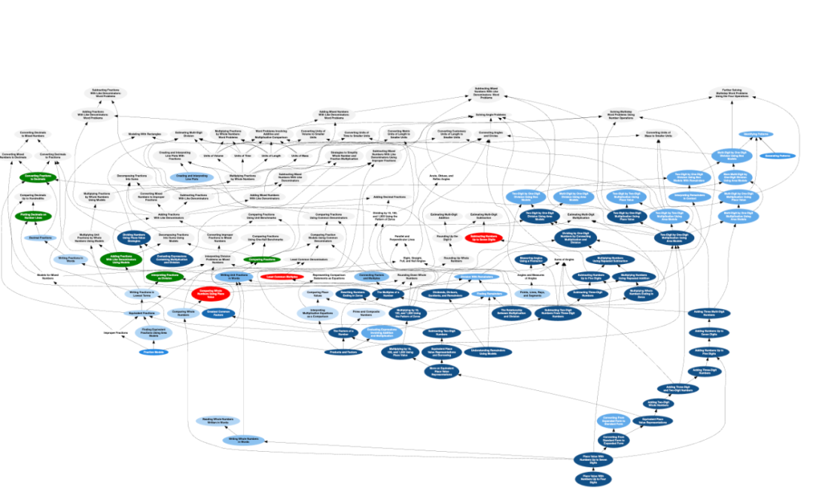
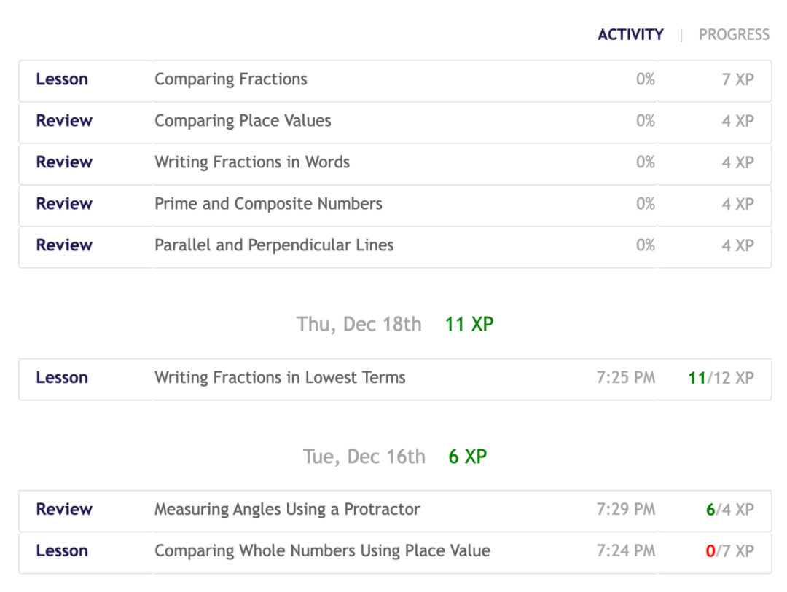
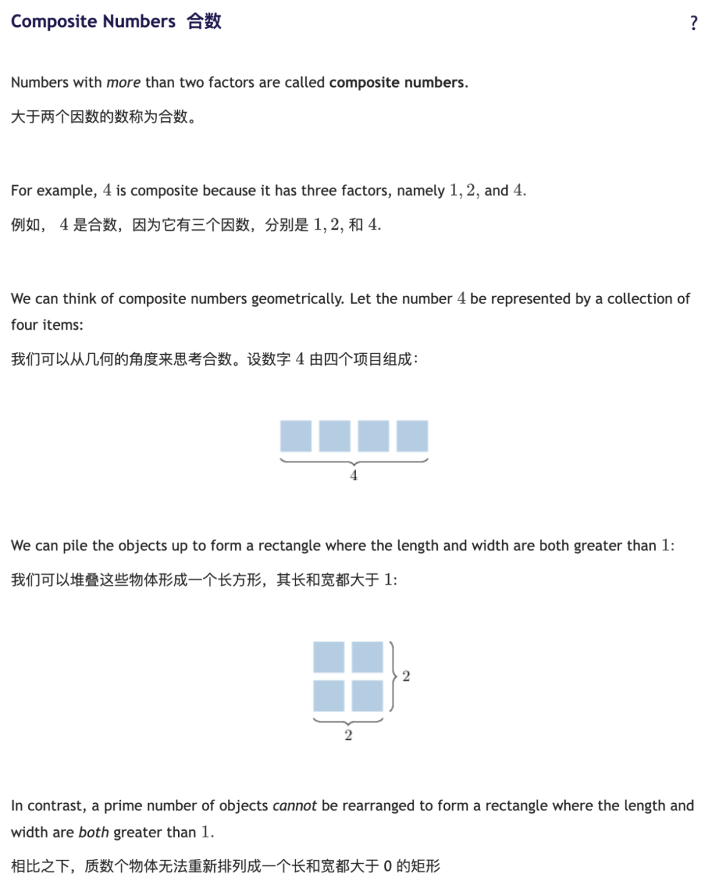
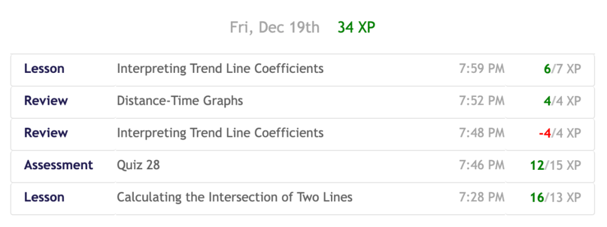
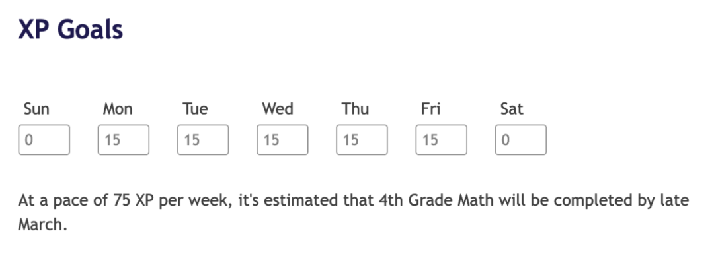
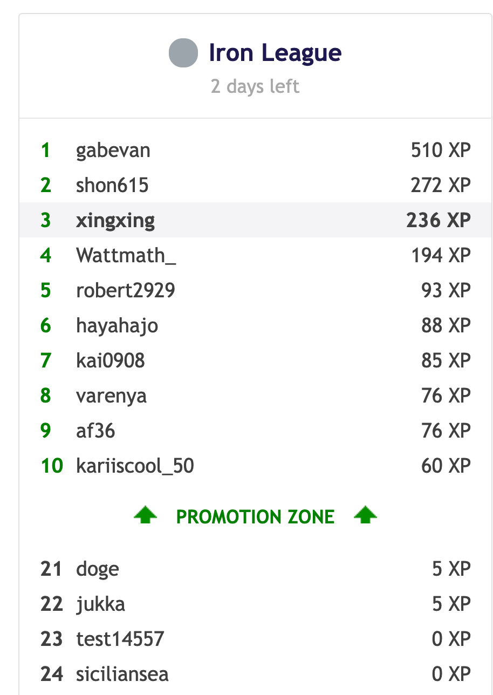
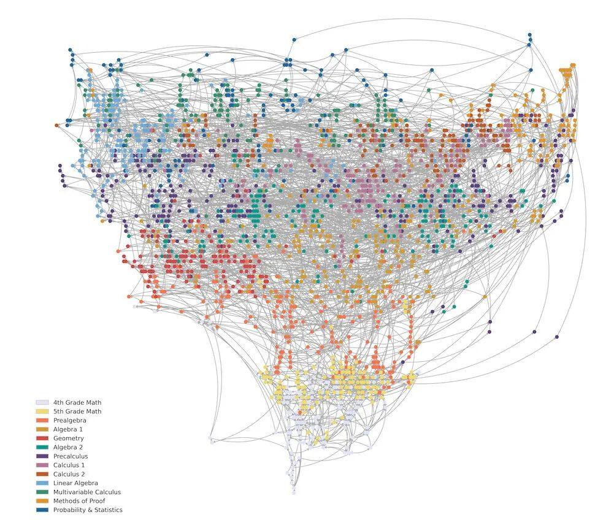
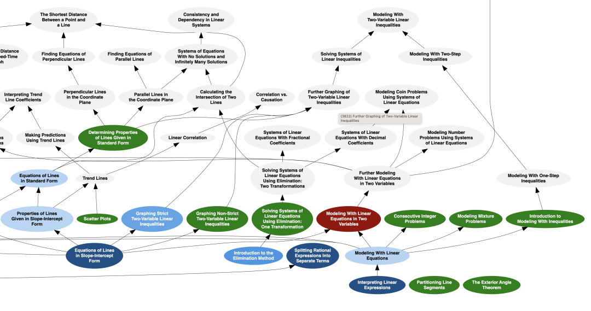
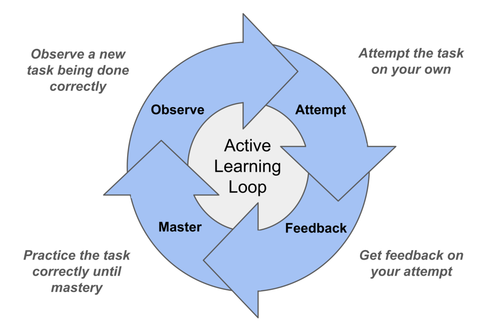

Math Academy（MA）是一个“把**一对一名师辅导**的关键决策流程产品化”的系统：用**知识图谱**表达数学知识结构，用**学生模型 + 间隔复习算法**持续估计掌握度/自动化程度，用**诊断与任务选择算法**在每一分钟里最大化学习增益，并用**XP/任务机制**把学习行为工程化为可持续的日常训练。核心不是某个单点技巧，而是这一整套“闭环”。

---

## 1. Math Academy 的运作原理

### A. 入口：自适应诊断 → 定位“知识前沿”

• 学生先做一个**自适应诊断**（约 30–45 分钟，可分段完成），系统动态调整题目以把学生放到课程中“刚好够得着”的位置（knowledge frontier），并生成个人知识图谱与定制学习路径。

• 诊断不仅测“会不会”，也关注**熟练度/自动化（automaticity）**；同时会识别低年级基础缺口，但又能让学生在不依赖缺口的地方继续推进，避免传统课堂常见的“基础缺口 → 全面停摆”。

### B. 日常学习：任务驱动 + 主动练习为主

• 学生以完成 学习任务（lesson/review/multistep/quiz）推进课程；每个任务完成后获得 XP，系统用 XP 近似度量投入时间（约 1 XP ≈ 1 分钟专注），并用奖励结构“约束”良好解题习惯（认真读题、纸笔演算、复盘错题等）。

• 课程呈现上强调降低认知负荷：内容被切成更小的“knowledge points”，每个知识点从**worked example**起步，并尽可能用图示做**双编码**；随后是练习题，常见规则是“连续做对两题就前进，否则加练”，并且每题都有讲解用于即时纠错与对照学习。

### C. 检测与修复：低风险测验 + 立即回补

• 每累计 **150 XP**会开放一次**计时测验（quiz）**，测验时不允许翻看例题/讲解，以更真实地评估掌握度；做错的主题会立刻被分配为 review，复习后可选择重测以获得更多 XP，并且“低风险 + 复习 + 可重测”也被用来降低数学焦虑。

### D. 动机与节奏：XP 目标 + 联赛机制（可选）

• 学生有每日 XP 目标（可调）；系统还用“联赛/排行榜”按周提供游戏化竞争与新鲜感，但允许用户选择退出，以避免对不匹配人群造成干扰。

---

## 2. “AI”到底做了什么

MA 把自己的 AI 明确定位为**专家系统**：模拟资深导师在“此刻该让学生做什么”的决策，而不是泛泛的对话式讲解。

### A. 知识图谱：把数学“可学习结构”显式化

• 知识图谱存储：有哪些主题、主题的先修/后续关系、题型难度谱系、以及学生在某类题上卡住时可能关联到哪些更底层知识点等（相当于把老师的“教学地图”结构化）。

### B. 学生模型：把作答历史映射为“知识画像”

• 学生模型把答题记录叠加到知识图谱上形成**knowledge profile**，并用**间隔复习**思想来估计每个主题的稳定程度（更暗=更稳）。

### C. FIRe：适配“层级知识”的间隔复习

• 传统间隔复习适合独立闪卡，但数学是层级结构：练高阶题往往隐含练到了低阶技能。MA 提出“隐式复习 credit 沿图谱下沉”的思路，但强调现实中有折扣、部分覆盖等复杂性，于是提出 **Fractional Implicit Repetition（FIRe）**来处理这些细节（隐式练到≠100%计入）。

### D. 诊断算法：用更少题估计更多主题掌握度

• 诊断通过压缩图谱覆盖课程+基础，并迭代选择“信息量最大”的主题来测；正确/错误分别提供正/负证据，遇到矛盾证据会权衡，且会把“勉强通过”的主题视为“条件完成”，后续一旦暴露问题就会沿学习路径快速回退补洞（非常像好老师的动态判断）。

### E. 任务选择：把认知科学约束“编译”成每日任务队列

• 任务选择目标很直白：**最大化单位时间学习量**；手段包括 mastery learning、layering、spaced repetition、interleaving，并显式规避**联想干扰（associative interference）**：尽量把相近概念错开，把不相干概念并行学，减少混淆与回忆竞争。

• 对基础缺口也做“动机优化”：允许学生先做当前课程中不依赖缺口的部分以建立 momentum，到必须补基础时再切入，减少挫败与掉队风险。

---

## 3. Pedagogy 与 Common Core：它想培养的“能力画像”是什么

### A. Pedagogy：把“训练运动员/音乐家”的训练法搬到数学

• MA 明确强调：不是 edutainment，也不是轻量 enrichment；而是用被研究证实有效的学习科学策略，让学生**高标准掌握**且更高效率地掌握。

• 它把自己的总体目标放在解决 Bloom 的 **2-Sigma**：把通常需要高成本一对一辅导才能实现的效果，用平台化方式逼近（核心抓手是高粒度 mastery learning + 反馈）。

• 强调 automaticity：通过高标准掌握与持续复习，把低阶技能自动化以释放工作记忆，从而支撑更高阶推理与综合。

### B. Common Core（实践标准）：用“任务与例题结构”去落实数学实践

• Math Academy 把 CCSSM 的 8 条实践标准逐条展开，并把“课程设计如何落实它们”讲得很具体：例如课程覆盖多种情境与应用；把每课拆成 2–4 个递进的 knowledge points；每个 knowledge point 从 worked example 开始，并提供完整解答供对照与反思。

---

## 4. 评估：Math Academy 的核心价值究竟在哪里？

**MA 的核心价值是把“高质量一对一导师”的关键机制做成了可规模化、可度量、可持续运行的系统闭环。**

这个闭环由四个“不可拆”的部件共同构成：

1. **结构化的数学知识工程（知识图谱）**：把“先学什么、为何卡住、卡住该补什么”显式化，而不是仅靠内容堆叠。

2. **细粒度学生建模（掌握度 + 自动化 + 遗忘）**：不仅判断对错，还把时间/稳定性纳入证据权重，并用间隔复习维护长期保留。

3. **把学习科学“落地成调度算法”**：layering、interleaving、抗干扰、复习优化不是写在理念里，而是直接决定你今天看到的任务队列。

4. **行为工程（XP/测验/复盘）**：用 XP 把“有效学习行为”变成可执行、可坚持的日常节奏；用频繁测验与即时回补把错误变成系统性信号而不是一次性惩罚。

### MA的“护城河”

Math Academy 的强大不在于 AI 讲题多聪明,而在于它把**诊断—练习—测验—复习—再诊断**做成了高频闭环，并且闭环内部有明确的优化目标（单位时间学习增益最大化）。

### MA的“适配边界”

Math Academy 更适合愿意投入、目标明确、能接受“训练式学习”的学生；对追求轻松体验、强社交互动或开放式探索的学习者，可能需要额外的外部支持与动机设计.

我是董志辉,目前厦门大学工作. 我的关注的领域是如何用AI赋能光学应用研究与产业化.

我有两个娃儿,业余我探索如何用AI辅助青少年学习. 我希望孩子们能够“从容”地学习任何知识. AI将是孩子们最强大的武器.

如果你家里有娃儿要学习数学,正在寻找数学学习工具,请关注本公众号,也可以加我微信交流.

