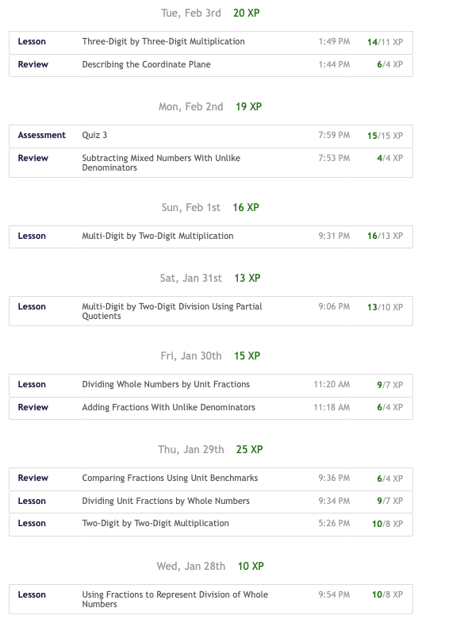
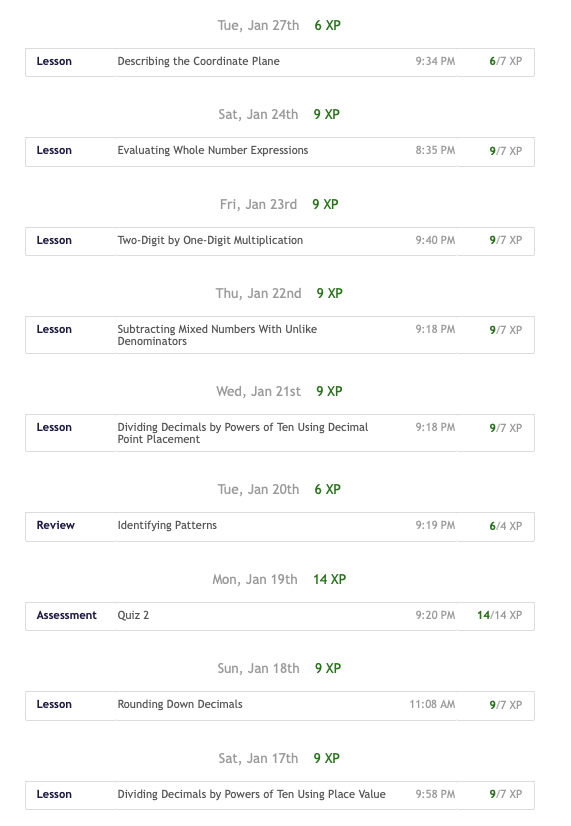
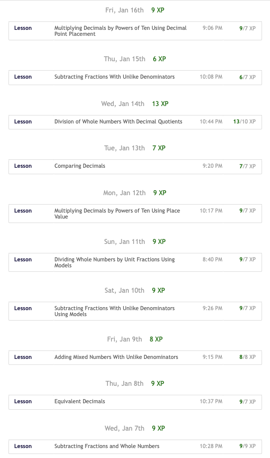
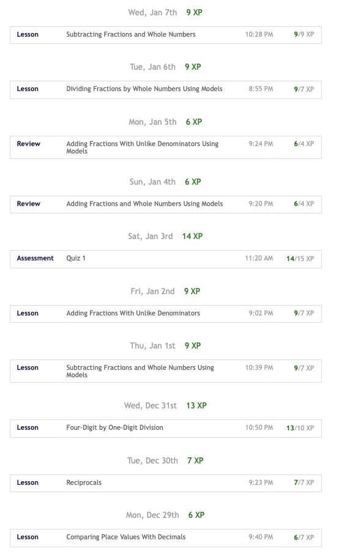
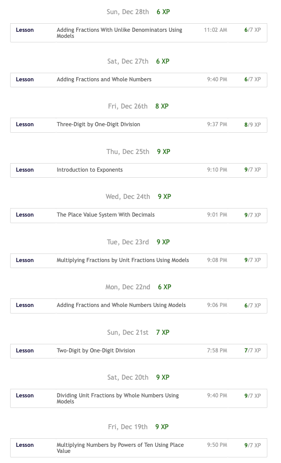
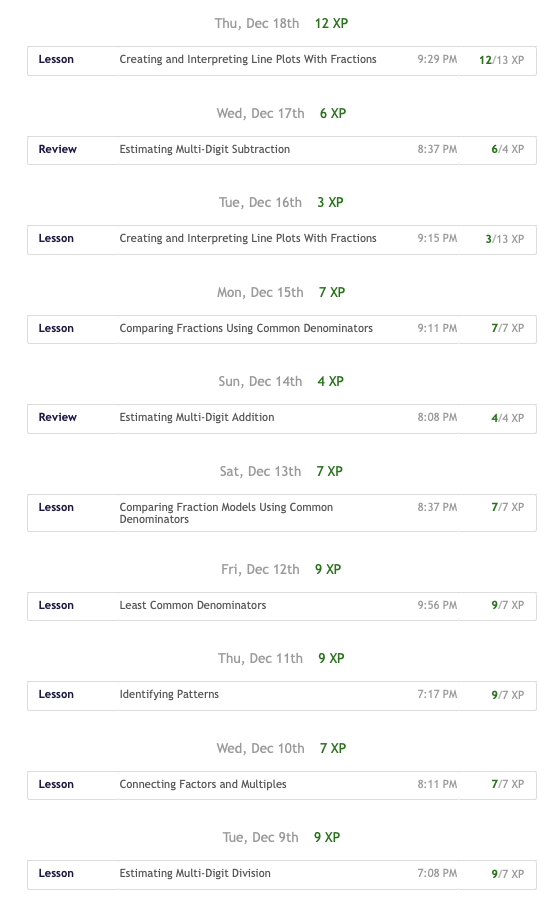
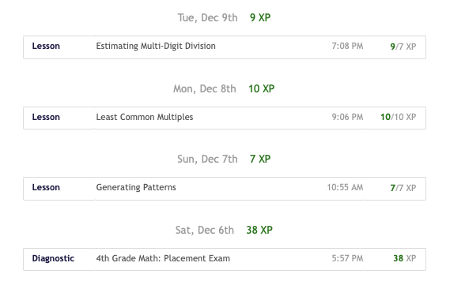
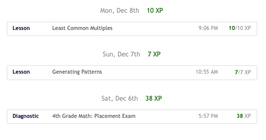

昨晚和西川小学谭老师交流,提到了他们学校一个5年级的小学生,从2025年12月6日开始,每天花10-20分钟在Math Academy 学习1-2个lesson,到期末数学考试100分,以前长期霸榜的第一名这次只能屈居第二.

小朋友非常开心,不是考了第一名,而是看到没见过的试题不再恐惧,敢尝试老师没有教过的方法解题甚至合理猜测.

我看到的不是成绩,而是这个小朋友的耐力.不是冲刺式一天做很多lesson,而是每天坚持,没有落空,哪怕是周末,哪怕是考试.

一下子是孩子最近2个月的学习记录,平稳但有力,希望能一直坚持下去.

欢迎更多的对数学有兴趣的孩子加入Math Academy的学习共同体,加我微信咨询.

