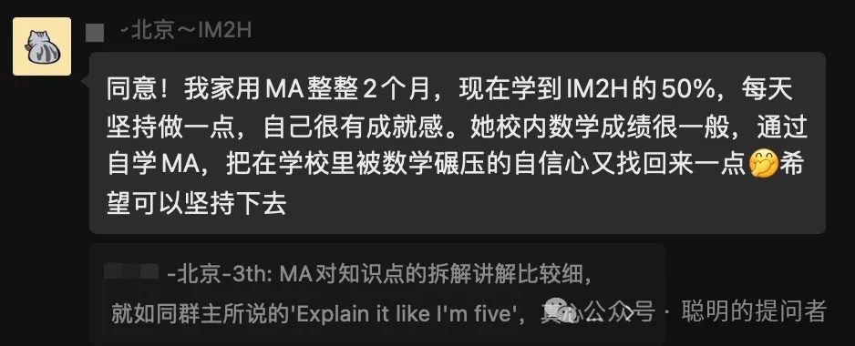
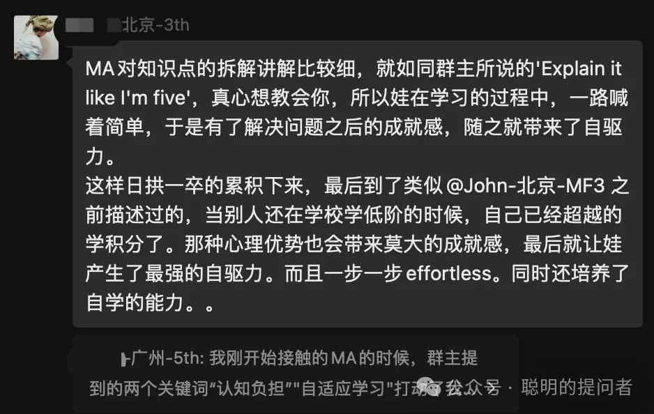
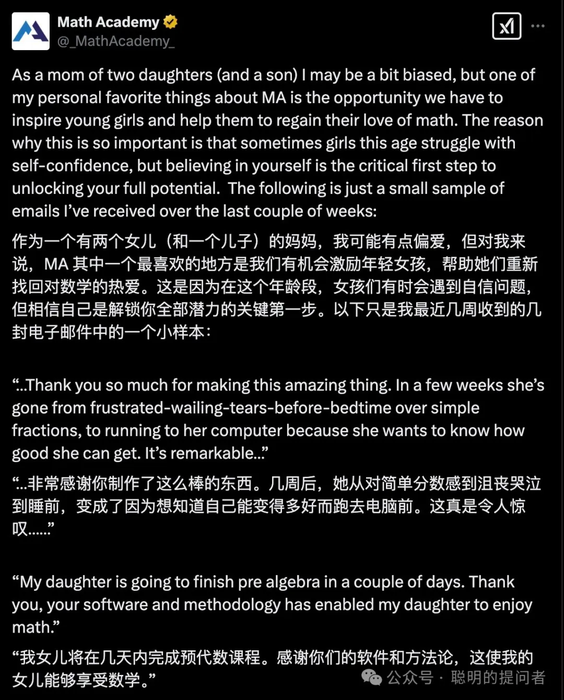
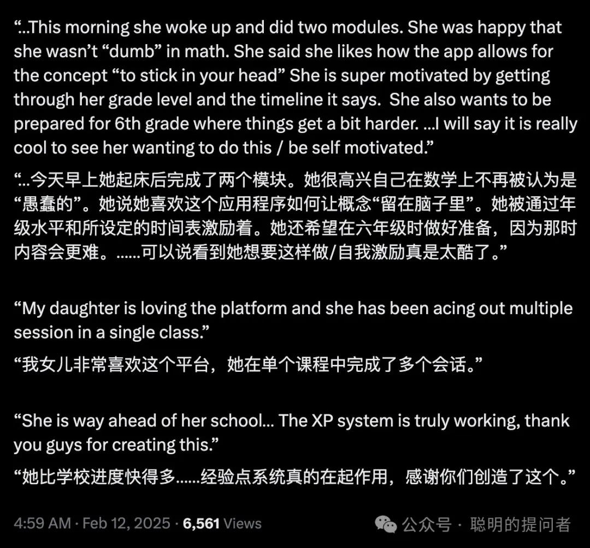

Math Academy共学群成立 4 个月了. 越来越多的学生和家长遇到了自己的“知识前沿”,学习速度慢了下来,开始体会到MA系统设计的精妙.

前 3 个月的总结文章

[Math Academy共学群成立第一月回顾](https://mp.weixin.qq.com/s?__biz=MzIwNzMzODkyNA==&mid=2247484186&idx=1&sn=35538691651ce001dd6ecd4a5dbdab3e&scene=21#wechat_redirect)

[Math Academy共学群成立第二月回顾](https://mp.weixin.qq.com/s?__biz=MzIwNzMzODkyNA==&mid=2247484219&idx=1&sn=49490eef8516334ccdd2b62925cde33a&scene=21#wechat_redirect)

[Math Academy共学群成立第三月回顾](https://mp.weixin.qq.com/s?__biz=MzIwNzMzODkyNA==&mid=2247484299&idx=1&sn=92cd9bd93a1eaee5e80ef2c7d7b5d390&scene=21#wechat_redirect)

以下是MA共学群2025年2-3月总结

1.

1. 截至2025年3月15日,本群共用230+MA用户.小学超过65%,初中其次,高中以上比较少.地理分布:北上广深占比50%,海外华人用户越来越多.

2.

2. 本月做了两场群友分享. 文一分享的是Math Academy与中小学数学教学体系的比较; LotusDocoder分享的是如何用AI做情绪咨询.都是非常精彩的分享,在中文网络中很少看到的. 本次一并把群友分享的三期视频放出.

3.

## 羊叔: Math Academy的鱼与熊掌,我们都要 ^_^

日期：2025-01-30 19:56:47

录制文件：https://meeting.tencent.com/crm/2kWDy3P416

### 文一: MA vs 中小学数学教学体系

日期：2025-03-05 12:14:33

录制文件：https://meeting.tencent.com/crm/2Y8pRZY3e7

1.

## LotusDecoder: 如何使用AI做情绪咨询

日期：2025-03-13 20:00:00

录制文件(1)：https://meeting.tencent.com/crm/NAGdxr7E8e

录制文件(2)：https://meeting.tencent.com/crm/2y5BMx1Vf2

3. 与群友文一深入探讨后,打算推出一个AMC竞赛与Math Academy结合的服务,用AMC的标准评测MA的学习效果. 文一多年一线培优的经验与他对Math Academy的痴迷,让我相信这会是一个非常受欢迎的服务.

4. 与群友羊叔深入探讨后,打算推出一个基于Math Academy的英语提升服务. 目前MA共学群很多学生需要翻译软件的辅助才能高效学习Math Academy,我们希望帮你丢掉拐杖,直接用英语学习数学,不仅是阅读,更是全方位的听说读写. 我们的愿景是: 学习过MA的学生都能熟练用英语与全世界的朋友交流数学和其他科学知识. 我还有更疯狂的想法,在羊叔之后,又与文一和Mima交流,我认为学习者可以利用MA学习所有主流语言最核心的知识,Math Academy是(自然语言+逻辑语言)的完美应用.

5. 我本来想独立翻译《The Math Academy Way》,现在没有必要了. 知乎专栏Thoughts Memo已经翻译了17章,翻译质量和翻译速度都有了明显提升,我们应用就好了.感谢Jarrett Ye组织翻译和所有译者的辛勤付出.

专栏地址在: https://www.zhihu.com/column/c_1858865163022786560

1.

6. 下个月会邀请更多群友分享经验,不限于Math Academy,但与教育和AI高度相关.

2.

7. 中国和美国都有妈妈反映女儿在MA找到了学习数学的自信.

3.

1.

Math Academy,

一个打破布鲁姆 2 Sigma难题的学习系统.

一个不仅为学霸,更是为普娃儿准备的数学学习系统.

一个让孩子重建数学学习信心的自主学习系统.

MA注册后,第一个月不满意全额退款,

实际上用户得到了一个月的安全体验期.

具体注册请参考

[手把手教你注册Math Academy](https://mp.weixin.qq.com/s?__biz=MzIwNzMzODkyNA==&mid=2247484009&idx=1&sn=95ca5bd210dc22300030f485e1d131c8&scene=21#wechat_redirect)

了解MA请参考

[Math Academy正在取代可汗学院成为数学学习首选平台](https://mp.weixin.qq.com/s?__biz=MzIwNzMzODkyNA==&mid=2247484169&idx=1&sn=fd8f4d65ea68eb3f59caf16239e82794&scene=21#wechat_redirect)

[Math Academy: 数学奇才为儿子打造的数学学习神器](https://mp.weixin.qq.com/s?__biz=MzIwNzMzODkyNA==&mid=2247483928&idx=1&sn=16fb7b41ca69377c67c3c3c4738ae737&scene=21#wechat_redirect)

MA共学群现有用户200+,供MA用户交流学习.

加我微信,验证MA用户身份后邀请入群.

如果你有娃儿要学数学,欢迎订阅+点赞+转发本文,一起共学
