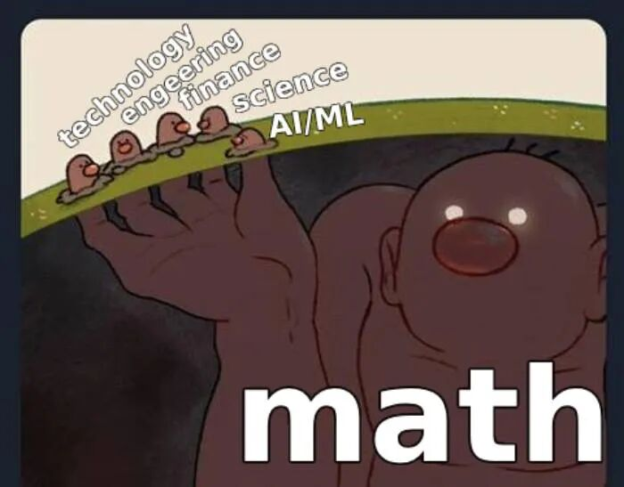

深圳有位今年的高考生加我微信,提出要在Math Academy学习数学. 我很好奇: 高考结束了才来学MA,这是无聊寂寞还是真爱? 原来这孩子想转专业,提前学大学数学能让自己更从容.

北京有位妈妈反馈反馈女儿今年6年级,4月开始学MA,至今已经学到Integrated Math 2 Honors. IM2H包含了中考所有考点,按照这个进度,这位学生很可能在初一第一学期就学完了初中的所有知识.

我组里有一位大四毕业生和一位大三实习生,都是二本,都用了不到一个月完成了Math for Machine Learning这门课. 我对这位大四毕业生的要求是毕业一年时,学完Math Academy的所有数学课程,成为我们所在大学最好的算法工程师. 以他的投入度,我认为有90%的概率达成目标.

Math Academy的Justin Skycak最近提到,超前学习数学,不是为了和同龄人竞争,而是自己和时间赛跑.

中译本使用了李继刚老师的翻译prompt,我觉得挺好:

对于任何想在科技、工程等理工领域有所作为的学生来说，提前学好高等数学，无异于掌握了一门最强大的“武功秘籍”。

它能让你更早地推开一扇扇大门，而一旦先行一步，下一扇门也会向你提前敞开。这个良性循环一旦开启，就会像滚雪球一样，让你遥遥领先。这种领先优势，为你赢得了宝贵的时间和经验，让你能从容地看清，自己真正想玩的人生游戏究竟是什么。

这正是许多人没搞明白的一点：教育上的“抢跑”，其核心目的，从来不是为了和同龄人赛跑，而是为了和时间赛跑。

一个人为什么会放弃梦想，甚至放弃寻找梦想？往往是时间逼得他无路可走。平克·弗洛伊德的歌词说得最好：“你总觉得年轻，来日方长，今天有大把时间可以挥霍。直到某天，你发现十年已悄然溜走。没人告诉你何时该跑，你错过了发令的枪响。于是你跑啊，跑啊，想追上太阳，但它已然西沉。”

无论你多少次告诉自己绝不妥协，都无法阻止日落西山，无法留住飞逝的光阴。你也终将渴望安稳生活所带来的一切，会不知不觉地，把人生的重心从“开拓”转向“经营”。

不管你是否意识到，实现梦想，本就是一场与时间的赛跑。你被时间甩得越远，就越可能陷入一种“还行”，甚至“挺好”的生活，但在内心深处，你始终无法摆脱一种怅然若失：如果当初有更多时间，我本可以抵达一个更远的地方。

而“抢跑”的全部意义，就在于赢得这场与时间的赛跑。它让你能尽早推开大门，去探索那些你或许感兴趣的道路。这样一来：

1）万一发现脚下的路已不再适合自己，你还有充足的时间和机会回头，另寻他途，而不必担心身后的门已一扇扇锁死。

2）如果你志存高远，不满足于走现成的路，你便有底气去“破壁”，而不是匆忙地“穿门”。

3）而一旦你找到了那片让你心驰神往的天地，你就能拥有最充裕的时间，在那里尽情耕耘，发光发热。

Math Academy,

一个打破布鲁姆 2 Sigma难题的学习系统.

一个不仅为学霸,更是为普娃儿准备的数学学习系统.

一个让孩子重建数学学习信心的自主学习系统.

MA注册请参考

[手把手教你注册Math Academy](https://mp.weixin.qq.com/s?__biz=MzIwNzMzODkyNA==&mid=2247484009&idx=1&sn=95ca5bd210dc22300030f485e1d131c8&scene=21#wechat_redirect)

了解MA请参考

[Math Academy正在取代可汗学院成为数学学习首选平台](https://mp.weixin.qq.com/s?__biz=MzIwNzMzODkyNA==&mid=2247484169&idx=1&sn=fd8f4d65ea68eb3f59caf16239e82794&scene=21#wechat_redirect)

[Math Academy: 数学奇才为儿子打造的数学学习神器](https://mp.weixin.qq.com/s?__biz=MzIwNzMzODkyNA==&mid=2247483928&idx=1&sn=16fb7b41ca69377c67c3c3c4738ae737&scene=21#wechat_redirect)

MA共学群现有用户290+,供MA用户交流学习.

加我微信,验证MA用户身份后邀请入群.

