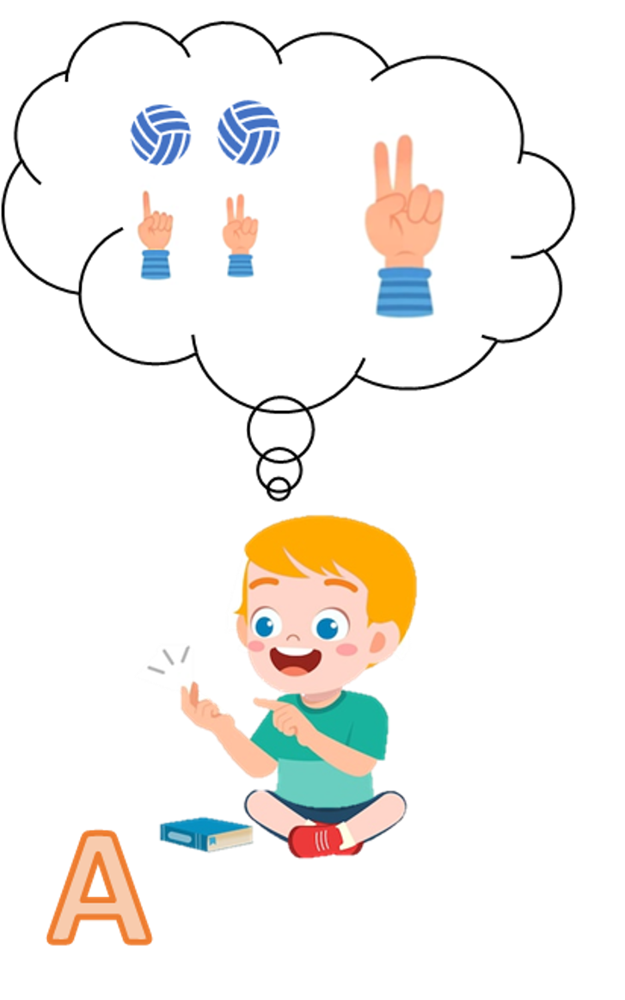
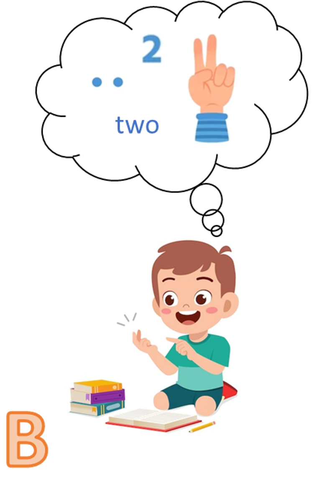
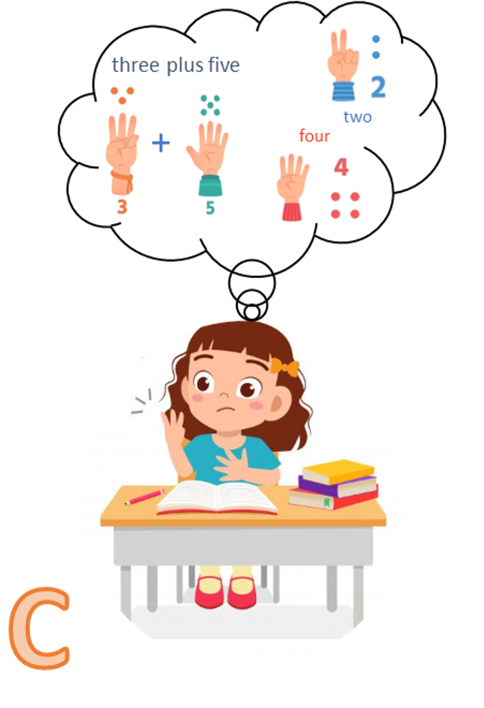
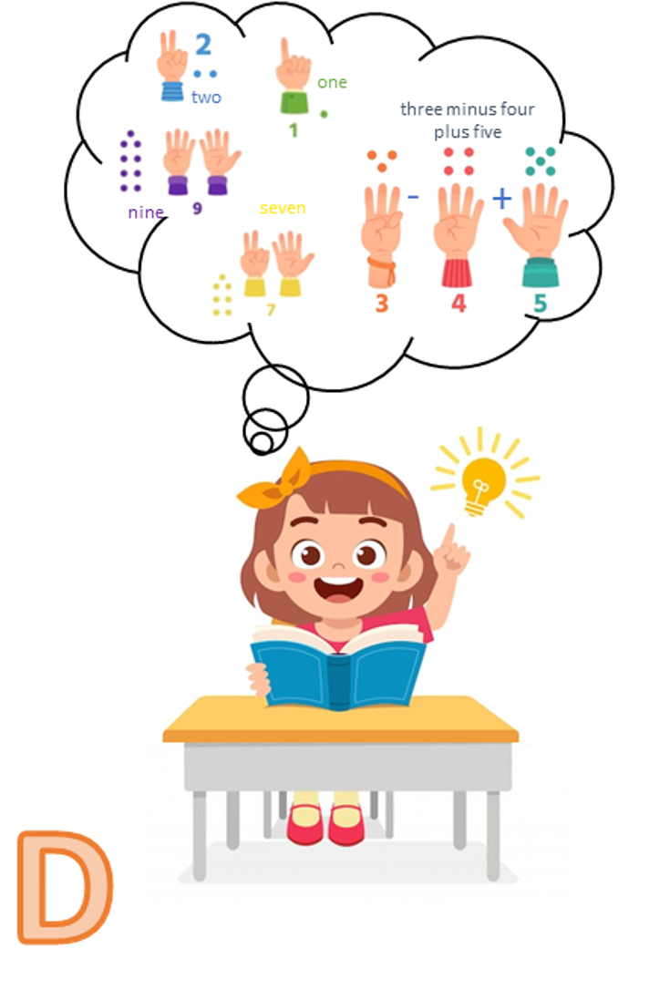

你有没有想过，我们人类究竟是如何思考的？

人类的思想看似天马行空，无边无际，但一些科学家认为，思想的根基，深深地扎在我们实实在在的身体经验之中。这便是“具身认知”（embodied cognition）理论的核心，它旨在揭示我们心智与身体之间的紧密联系。在这篇文章里，我们就来深入聊一聊什么是具身认知，以及理解它为何可能彻底改变我们的学习方式。

身体，会影响我们的思考和学习吗？

想一想，我们在日常生活中，是多么频繁地使用身体相关的比喻来描述情感状态或抽象概念。我们会说自己心情“低落”，或者需要“助人一臂之力”。这恰恰反映出，我们有一种天性，习惯于将抽象的想法与那些摸得着、感受得到的身体经验（如温度、空间方位或特定身体部位）联系起来。可我们为什么会倾向于使用这类身体比喻呢？

具身认知理论强调，正是身体的经验塑造了我们的思维和心智。传统观点常将心智看作是处理抽象代码的软件，但具身认知理论不这么认为。它提出，我们与物理世界的互动，才是塑造我们思考和学习方式的关键。本质上，我们的思想深受物理互动和环境经验的影响，而并非仅仅局限于纯粹的脑内抽象活动。

>

……具身认知理论提出，我们与物理世界的互动，才是塑造我们思考和学习方式的关键。

想象一下你初次接触新事物时的情景，比如学一项运动或玩一盘桌游。你的大脑记录下来的，远不止是规则，它会捕捉所有的感觉：看到的、听到的、闻到的、身体的动作，以及四肢的参与感。日后，当你遇到类似情况时，你的大脑会在不知不觉中“回放”这些记录的片段，以更好地应对新状况。心理学家劳伦斯·巴萨卢（Lawrence Barsalou）将此称为“认知的模拟理论”（simulation view of cognition），即我们会在无意识中模拟或重演特定的身体经验。例如，有研究发现，仅仅是想象“使用锤子”这个动作，就能激活大脑中与“实际使用锤子”时相同的活跃区域。

这说明了我们是如何运用感知、动作和内在感受来与外部世界互动，并理解这个世界的。对于锤子这类有形之物，这种联系显而易见；但对于数学这类缺乏直接感官体验的抽象概念，情况就要复杂得多了。

我们如何掌握抽象的概念？

认知科学面临的一大挑战，就是如何将抽象概念与具体实例联系起来。具身认知理论为此提供了答案：关键在于将抽象概念与过往的经验紧密相连。

以教育领域的数学为例。我们反复观察到，孩子们在数数和进行初步计算时，很自然地就会用上自己的手指。这种看似简单的行为，建立了一种直观的联系，极大地促进了他们对数学的理解。这种具身方法，将数学思想与身体经验联系起来，让数学变得比死记硬背更容易理解和掌握。有趣的是，神经科学的证据也印证了这一点：我们活动手指和仅仅在脑中想数字时，激活的是相同的大脑区域。可见，我们的身体与数字等基础数学概念之间，似乎存在着直接的联系。

下面这几张图，生动地展示了身体如何参与到数学学习中，特别是在计数、理解数量大小和基础运算等基本功的形成过程中。

图 A 凸显了手指在计数中的重要作用。每伸出一根手指，就代表数了一个物体；而伸出手指的固定顺序，则反映了数数时念出的数字词序列也是固定的。这种系统性的手指运用，会形成与特定数字相对应的手势（例如，伸出食指和中指代表数了两个物体）。

图 B 接着展示，这些手指组合的形态，也代表了所数集合的数量大小。这样一来，特定的手势与数值大小之间，便建立起了一种独特的关联。

图 C 则说明了手指如何在基础运算中扮演关键角色，帮助孩子理解数的组合与分解。例如，在已经伸出3根手指的基础上再伸出5根，就得到了8根伸出的手指。于是，数字8就可以通过3（根手指）和5（根手指）的组合来表示。

通过在计数、表示数量和基础运算中持续地使用手指，大脑便在数字和手指/手势之间建立起了系统性的关联。

久而久之，这个过程会促进大脑形成一种特殊化的、基于手指编码的心理表征，它与我们看到的圆点图案、阿拉伯数字和听到的数字读音一样，都是数字的代表。最终，我们能熟练运用这些基于手指的表征，甚至无需真的动手指，就能在脑海中对这些概念进行操作。下图清晰地展示了这一过程：从身体力行的手指计数（图A-C），发展到每当思考数字时便在脑海中模拟手指计数的心理活动（图D）。

这种“具身表征”也能助力高等数学吗？

传统的数学课堂上，学生们通常被要求安安静静地坐着。然而，菲尔兹奖得主、加州大学洛杉矶分校数学家陶哲轩却曾描述过他如何解决一个复杂问题：他当时正躺在地板上滚来滚去。

他试图在脑中构想一个关于“波浪相互叠加旋转”的数学描述。通过亲身模仿波浪的运动，他发现这种方式能帮他建立更清晰的直觉。让身体的动作去模拟数学问题，使他得以从一个全新的视角“看清”了问题。

当然，这并非是说每个学生都得躺到地板上去学数学。但这个例子有力地说明了，身体的行动可以帮助我们理解数学问题——哪怕是那些非常复杂的问题。

>

让身体的动作去模拟数学问题，使他得以从一个全新的视角‘看清’了问题。

更重要的是，这个例子挑战了那种“学好数学就必须安安静靜坐在教室里”的传统观念。数学家们在钻研数学问题时，常常会四处走动、变换姿势、比手画脚。这种具身的视角，也突显了教育中动手活动和体验式学习的有效性。通过亲身参与，让身体动起来，学生能更深刻地理解数学原理，并形成一种更为直观的把握。

原文地址

https://blog.lboro.ac.uk/cmc/2024/05/22/embodied-math-how-physical-experience-shapes-learning/

作者简介

Venera Gashaj 博士是拉夫堡大学早期数学学习中心的博士后研究员，拥有发展心理学博士学位，致力于研究身体运动如何促进数学概念的理解。

Korbinian Moeller 教授是数学认知领域的专家，主要探索如何通过动手经验来发展数学技能。

Dragan Trninic 博士拥有科学与数学教育博士学位，专注于物理和社会环境对STEM学习的影响。

Math Academy,

一个打破布鲁姆 2 Sigma难题的学习系统.

一个不仅为学霸,更是为普娃儿准备的数学学习系统.

一个让孩子重建数学学习信心的自主学习系统.

MA注册后,第一个月不满意全额退款,

实际上用户得到了一个月的安全体验期.

具体注册请参考

[手把手教你注册Math Academy](https://mp.weixin.qq.com/s?__biz=MzIwNzMzODkyNA==&mid=2247484009&idx=1&sn=95ca5bd210dc22300030f485e1d131c8&scene=21#wechat_redirect)

了解MA请参考

[Math Academy正在取代可汗学院成为数学学习首选平台](https://mp.weixin.qq.com/s?__biz=MzIwNzMzODkyNA==&mid=2247484169&idx=1&sn=fd8f4d65ea68eb3f59caf16239e82794&scene=21#wechat_redirect)

[Math Academy: 数学奇才为儿子打造的数学学习神器](https://mp.weixin.qq.com/s?__biz=MzIwNzMzODkyNA==&mid=2247483928&idx=1&sn=16fb7b41ca69377c67c3c3c4738ae737&scene=21#wechat_redirect)

MA共学群现有用户290+,供MA用户交流学习.

加我微信,验证MA用户身份后邀请入群.

