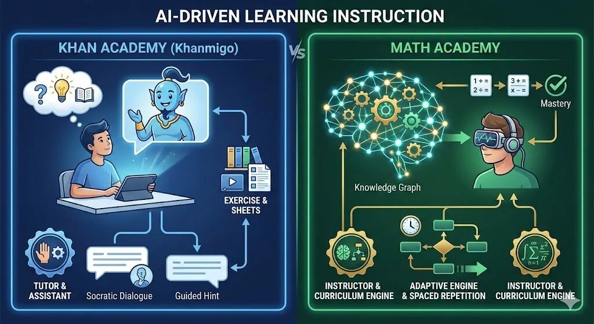

#

最近不少家长问我：网上学数学的平台那么多，Khan Academy（可汗学院）免费又有名，为什么还要花钱用Math Academy？

今天我就从教学设计、AI应用、学习效果三个维度，帮大家把这两个平台讲清楚。

---

## 一、两个平台是什么来头？

**Khan Academy（可汗学院）**：2008年成立的非营利组织，创始人萨尔曼·可汗最初只是给表妹录数学讲解视频。如今已有超过1.2亿注册用户，覆盖190多个国家，内容完全免费。

**Math Academy**：由一群数学教育专家和认知科学家创建，获得美国西部院校认证委员会（WASC）认证——这个机构同时认证斯坦福、加州理工等名校。课程覆盖小学四年级到大学数学，月费约50美元。

---

## 二、核心差异：教学理念完全不同

维度

Khan Academy

Math Academy

**学习方式**

先看视频，再做练习

直接做题，边做边学

**内容组织**

线性课程，按章节推进

知识图谱，多线并行

**掌握标准**

完成即过关

必须达到"精通"才能继续

**适合人群**

所有学生

有数学天赋或学习动力的学生

**打个比方**：Khan Academy像一本会说话的教科书，老师讲完你听懂了就行；Math Academy像一位严格的私教，不仅要你听懂，还要你能独立解决各种变式题才算过关。

---

## 三、AI应用：这才是真正的分水岭

##

### Khan Academy的AI：Khanmigo

Khanmigo基于GPT-4开发，本质是一个**对话式AI助教**：

-

• 当孩子卡住时，AI不会直接给答案，而是用苏格拉底式提问引导思考

-

• 可以帮助解释视频内容、回答作业问题

-

• 为老师自动生成教案、评分标准

**优点**：像一个有耐心的辅导老师，24小时在线答疑。

**局限**：AI只是"辅助角色"，核心学习路径仍由人工预设，不会根据孩子的掌握情况动态调整。

### Math Academy的AI：知识图谱引擎

Math Academy的AI完全不同——它不是聊天机器人，而是一个**学习智能体(learning agent)**：

1.

1. **精准诊断**：入学测试后，AI会生成详细报告，精确到每个知识点的掌握程度

2.

2. **动态路径**：根据每道题的表现实时更新"知识图谱"，自动规划最优学习路线

3.

3. **智能补漏**：发现基础薄弱？系统会在推进新内容的同时，穿插修补旧知识点

4.

4. **非干扰学习**：同时教授多个不相关的主题，避免相似概念互相混淆

**打个比方**：Khan的AI像GPS导航员，告诉你怎么走；Math Academy的AI像自动驾驶系统，直接帮你开到目的地，还能根据路况实时调整路线。

---

## 四、学习效果对比

### Khan Academy的研究数据

多项随机对照实验证实，坚持使用Khan Academy的学生数学成绩确实有提升。但效果高度依赖：

-

• 老师的配合指导

-

• 学生的自觉性

-

• 学习时长的保证

### Math Academy官方的用户反馈

许多家长报告了"加速效应"：

-

• 原本对数学无感的孩子开始主动学习

-

• 一年内完成传统课堂2-3年的内容

-

• 九年级学生学完大学工程数学课程

我追踪的学生中,北京一位五年级的小学生,一年前班里还是垫底,经过一年的坚持学习,如今已经进入IM2H的课程,对应中国初二数学的水平.

一位深圳的2025年的高考生,暑假开始学习学习MA,半年时间学完了微积分、线性代数和概率统计.

一位来自北京的程序员朋友,这周分享说已学完了MA的所有数学课程.

---

## 五、适合什么样的孩子？

### Khan Academy：

-

• 需要免费资源作为课堂补充

-

• 喜欢先看视频讲解再做题

-

• 需要覆盖多学科内容

### Math Academy：

-

• 数学基础不错，希望加速学习

-

• 有一定自律性，能坚持每天30-40分钟

-

• 家长愿意投资高质量数学教育

---

## 六、先试试Math Academy

我观察到一个现象：很多孩子不是学不会数学，而是在传统课堂里"吃不饱"或"跟不上"。
Math Academy的自适应系统恰好解决了这个痛点。

**具体建议**：

1.

1. **先做诊断测试**：Math Academy提供详细的入学评估，即使不订阅也能了解孩子的真实水平

2.

2. **从每天30分钟开始**：官方建议每天40-50XP（约30分钟），不贪多

3.

3. **善用游戏化机制**：积分、排行榜、段位系统对很多孩子很有激励作用

4.

4. **给孩子3个月时间**：适应期过后效果会明显提升

---

## 写在最后

Khan Academy的伟大在于它让全世界的孩子都能免费获得优质教育资源。但如果你希望孩子在数学上真正"突破"，Math Academy基于认知科学的系统化训练，可能是更高效的选择。

教育投资最怕的是"看起来在学习"。与其让孩子刷100道重复的题，不如让AI精准定位薄弱点，用最短的时间实现真正的掌握。

如果你有娃儿要学数学,欢迎订阅+点赞+转发本文,一起共学.

加我微信了解更多.

