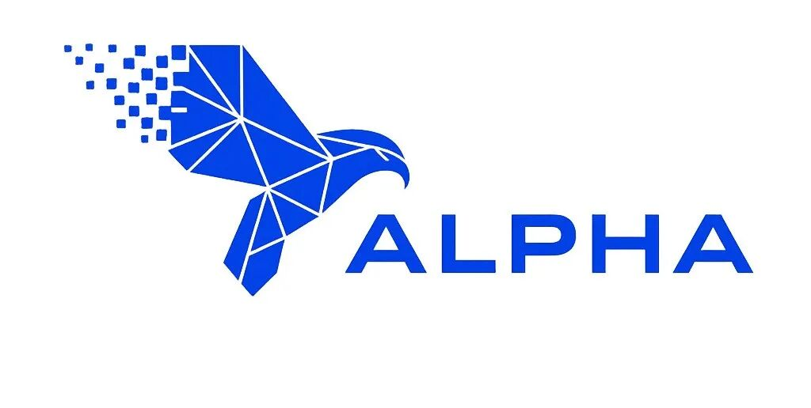
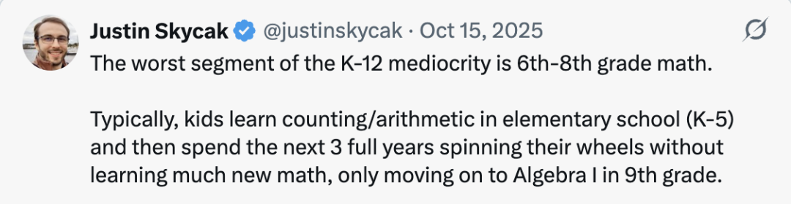

这是一位Alpha School了 家长的译文.

作者在美国罗德岛州教育部门工作多年,最扎心的来自最后一段:

>

在美国,K-12教育首先是一个庞大的成人就业项目，其次才是有效的儿童教育体系。

**2026年中国大概率会出现类似Alpha School的AI native School,深圳,北京,上海,成都,厦门?**

---

不久前，我转发了 Joe Liemandt 关于 Alpha 学校取得卓越成效的帖子，并附上了我儿子 Mac（11岁）自2025年8月加入 Alpha Anywhere 以来的亲身经历。

Bill Ackman 好心转发了我的帖子，引发了大量关注。借此机会，我想为正在考虑 Alpha School的家长们分享更深入的感悟，也谈谈这一切对未来教育意味着什么。

声明：我平时很少在社交媒体上谈论孩子。另外，抱歉没来得及把这篇文章写得更精炼、更有条理，也没用 ChatGPT 润色。

文中大部分内容改编自我在本地家长群中分享的消息——那个群里都是正在为孩子考虑 Alpha School 的父母。

---

## 我的背景

我是一名软件创业者，但在职业之外，我曾在罗德岛州K-12教育委员会任职多年。

我参与创建了该州第一所"零借口"公立特许学校（以KIPP和Achievement First为蓝本），该校成功扭转了学业差距，成为全州服务低收入家庭儿童中表现最优的公立学校。我推动了"为美国而教"（Teach for America）在罗德岛的落地，还参与聘任了州教育专员，并处理了诸多监管事务。

我妻子曾是公立学校教师，既教过普通小学生，也成功帮助自闭症儿童从受限环境回归到普通学校。

所以，虽然我的本行是商业，但这些经历深刻塑造了我的教育观。

2020年，政府实施封控期间，我们不知道秋季学校是否会重新开放，也不知道是否会强制戴口罩、执行毫无依据的六英尺社交距离等荒唐规定。

于是我们决定聘请一位教师，帮我们在家教育两个大孩子——当时一个即将升三年级，一个升一年级（最小的还没到学龄）。既然决定了在家教育，我们重新审视了居住地的选择（不再受制于学区），最终决定从罗德岛搬到波多黎各。

我们开办了自己的"单间教室小学堂"——没有口罩，没有疫情乱象，课程严谨扎实。

搬到波多黎各后，我们渴望孩子回到传统学校。2021-2022学年，两个儿子进入了当地一所口碑不错的私立学校，风格类似美国东北部的许多私校。

去年（2025年春），读五年级的二儿子告诉我们，他在学校感到有些无聊。他一直成绩优异，但成绩优异到底意味着什么呢？

作为科技创业者，我一直在X上关注到 Alpha 学校的信息——X是我获取新知的主要渠道。

我和妻子 Joanna 于三月份主动发邮件联系了 Alpha，问他们是否考虑扩展到我们所在的岛上。

Joanna 发现她的妈妈朋友圈里，竟然已经有人在游说 Alpha 到波多黎各开校。我们都很兴奋，但并不指望一所实体 Alpha 学校能在2025-2026学年及时开办。

通过这次对话，我们了解到了 Alpha Anywhere——当时还只是一个服务不到60个家庭的试点项目，让孩子们通过互联网在全球任何地方体验 Alpha 的AI驱动、每天两小时学习模式。

它的承诺是：只要孩子每天集中注意力学习2小时25分钟，就能让孩子的成长速度达到美国学校平均水平的至少两倍。费用仅为每月833美元，按SaaS订阅模式收取，随时可以取消。

我还感觉到他们对效果有某种程度的保证——至少他们对自己的项目极有信心。

我们把 Alpha Anywhere 作为2025-2026学年（Mac的六年级）的一个选项告诉了他，他说想试试。我们了解到 Alpha Anywhere 涵盖核心学科：阅读、语言、数学和科学，后来在2025年底又增加了写作。其他科目需要我们自行补充。但既然 Alpha 每天只占2.5小时，时间绰绰有余。

我一度担心历史课的缺失，但后来发现这完全是杞人忧天。Alpha 建议我们不要在其他在线课程上叠加太多，因为孩子每天完成一轮 Alpha 课程后，大脑已经"满负荷"了。

---

## 一个令人警醒的发现："全A"五年级生，竟只掌握了70%的五年级内容

八月中旬，我们正式开始了。第一步是参加MAP诊断测试，结果让我们作为家长大为震惊。

阅读方面，测试显示 Mac 在四年级阅读技能上有16.6%的知识缺口，五年级有29.4%，六年级有46.3%。

这令人不安——Mac 去年在那所口碑很好的私立学校阅读和语言艺术成绩全是A，但实际上，他欠缺了近30%的五年级阅读理解能力！

这是我们第一次真正看清儿子的知识盲点。随后我们与 Alpha 进行了入学流程中的视频通话，他们说不必担心。事实上，他们告诉我们，在许多美国学校，孩子一个学年下来往往只达到约60%的掌握度，然后就被直接升入下一年级。

我儿子五年级"全A"，但实际上只掌握了70%的五年级阅读内容。这真是出人意料。

Alpha 的工作人员解释说，他们的软件会从 Mac 有知识缺口的地方开始教起——换言之，最初所有的教学都聚焦于逐年级填补空白，直到达到90%或更高的掌握度。这一极高标准之所以能对每个学生实现，完全仰赖一对一的计算机辅助教学。

因为 Mac 在四年级数学上有16%的知识缺口，他的数学课是从四年级内容开始的，而且只针对那些有缺口的部分。我一直认为自己的孩子是优等生，结果他六年级的年纪却在学四年级的内容！但很快我便发现我的担忧是多余的——他进步极其神速。

---

## Alpha 将孩子保持在80-90%正确率的最佳状态

Alpha 高度个性化地针对知识盲点组织教学，根据孩子回答课堂问题的准确率，自动调整难易程度，始终将孩子维持在80%至90%正确率的"甜蜜区间"。我把这比作罗德岛已关闭的林肯公园赛狗场：

赛道上有一只假兔子装在杆上，始终保持在灵缇犬鼻尖前方、刚好够不着的距离——Alpha 的软件就是这个道理。孩子永远追不上那只兔子，但也从不觉得它遥不可及。

研究表明，当学生感觉自己能答对80%到90%的题目时，学习动力最强。一旦超过90%，系统就提高难度；如果持续低于80%，内容就变得简单一些。假兔子会凑近你的脸，让你始终觉得它触手可及。

这种精妙调节，只有技术驱动的个性化一对一教学才能实现。

---

## Alpha 大量运用成就测试来定制教学

当孩子完成了覆盖知识缺口的课程后，Alpha 会安排一次类似结业考试的水平测试。这种测试非常频繁。

Alpha 的软件会在认为孩子已经掌握了足够课程、有可能通过时，才"解锁"考试（有点像电子游戏中通关后解锁终极Boss战）。在 Alpha，"通过"不是60%，而是90%的掌握度。

这种水平测试不仅用于让孩子"毕业"进入下一年级，还用于"启动"下一阶段的课程。九月份，Mac 通过展示90%以上的掌握度"测出"了四年级数学后，系统立刻给他推送五年级数学水平测试，他在9月23日得了77分。

接下来几周，系统为他量身定制了针对性数学课程来弥补暴露出的缺口。结果：10月6日，他在五年级数学上展示了93%的掌握度，晋升到六年级内容。

然后循环再次开始——10月7日，他参加六年级测试得了64%。系统随即绘制出他的知识缺口图谱，在完成更多数学课后，Mac 又"解锁"了一次测试。

那是一份与德克萨斯州STAAR标准对齐的六年级数学考试——德州用它来检验孩子是否在六年级末掌握了数学标准。

如果得分90%以上，Alpha 就开始教七年级内容；如果低于60%，Alpha 就放弃让他跳级的尝试，转而让他完整学完六年级数学课程。这个过程Alpha称之为"区间定位"（bracketing）——要么测出90%以上直接晋级，要么低于60%转入完整课程模式。

---

## 每个孩子都有一份不断更新的个性化学习计划

我在九月底录制了一段视频，向本地考虑 Alpha 的家长群展示了整个运作方式。

---

## Alpha Read：项目中最出色的环节之一

很多人问我儿子读什么书。Alpha Read 项目非常引人入胜，帮助 Mac 从一个低得多的"蓝思指数"（Lexile Level）进步到现在阅读高中水平的文本，而这仅用了几个月。尤其让我印象深刻的是内容本身——不是《内裤超人》那种东西，而是在提升阅读理解能力的同时，教孩子们历史和科学知识。

Alpha 与传统学校的另一个显著区别是：Mac 每完成一节课或一次测验，不需要等到一周后才拿到批改结果——电脑在他完成任务后几秒钟内就显示分数，有时甚至在做题过程中就实时反馈。这极大地提升了学习动力——完成课程的那一刻，他就会兴冲冲地向爸爸妈妈炫耀自己的成绩。

---

## 见证成长：阅读难度飞速攀升

9月8日，Mac 在 Alpha Read 上的课程难度为751L-900L蓝思等级。几周后，随着他不断攻克更高难度，到10月8日，他已在阅读1201L-1350L和1351L-1500L等级的材料。

换个角度理解：仅一个月时间，他从六年级秋季第50百分位的990L水平，跃升到了九年级春季第50百分位的1200+水平。这对他来说并不轻松，遇到困难时系统会自动降低部分内容难度，确保他维持在80%正确率区间。但仅仅四周内阅读难度就有如此飞跃，着实令人振奋。这正是个性化一对一教学所释放的潜能，在没有技术加持的传统课堂中几乎不可能实现。

---

## 五个月后：惊人的成长

今天是2月16日。几周前，Mac 参加了冬季NWEA MAP成长测试。MAP不同于ISEE或ERB——它衡量的不是成就（虽然也能做到），而是随时间推移的成长。它不在意你起点高低（虽然会告诉你），它关心的是：你的孩子在一段时间内到底进步了多少？换言之，学校教育究竟为你的孩子增添了多少真实能力？

MAP在一个全国统一的RIT难度量表上衡量成长，再按年级和测试季节换算成常模。由于覆盖了全国海量数据，可以进行精确的横向比较。

截至今年冬季，Mac 相对于同龄全国常模的成长速度令人瞩目——不仅仅因为作为父亲我为他骄傲（那是当然的）。科学科目尚未达到2倍成长目标，但数学成长了**4.2倍**，语言成长了**5.0倍**，阅读成长了**17.0倍**（！！）。这是因为 Alpha 让 Mac 进步得更快，还是因为美国整体学习成长速度太慢？或许两者兼有，但我确信，在缺乏超级个性化教学的学校里，他不可能有如此进步。

我的儿子并非天才少年 Doogie Howser，你的孩子也不需要是"天赋异禀"才能从这种个性化学习中受益。在成就测试方面，Alpha 的数据确实可能因高学历富裕家庭的选择偏差而偏高——但成长指标修正了这一点。事实上，如果 Alpha 能招收更多低起点的学生，我怀疑他们的成长数据反而会更加亮眼。起点越低，上升空间越大。

---

## 教育的未来必将走向个性化

所有学校都应当引入 Alpha 正在商业化推广的这种个性化计算机一对一教学模式。工具（如 Math Academy、Alpha Read 等）还会不断进化，学校也需要时间去适应。它改变了学校的人力模型（这既是机遇也是挑战），但为孩子们开启了大量全新的可能。

Alpha 是先行者，但我认为十年之内，如果哪所私立学校的核心学术课程不是类似 Alpha 的模式，那才是真的疯了。

想想互联网从AOL和Prodigy时代至今如何改变了我们的生活！如今我们正处于儿童教育新纪元的黎明，三到五年内，尤其在AI的加持下，一切将精彩纷呈。

核心理念是：让孩子按照自己的节奏，学习自己准备好了的内容，一对一地学。灵感来自 Math Academy的Justin Skycak:

如今，孩子可以学得更快、每年进步更多、获得更强的成就感——只需给他们一个个性化的自适应学习工具。Alpha 是这一工具的先驱和推广者，但没有任何理由阻止其他学校采用同类工具或追随 Alpha 开辟的道路。

它让学数学、学阅读变得像打电子游戏一样，但孩子始终被保持在80-90%正确率的挑战区——既有成就感的奖赏，又有恰到好处的挑战。

这种一对一个性化自适应教学，在一个教师面对12、18乃至25个以上学生的传统课堂中不可能实现，但通过技术手段完全可以。在这种模式下，计算机替代了"讲师"角色，成人的职责从传授知识转变为激励孩子、维持专注、管理课堂秩序等。你需要招聘的，是一种完全不同的教育者技能。

---

## 后记：Alpha 学校，多拉多

在我职业生涯早期，一位出色的销售领导 Eric Alexander 教给我一句终身受用的话："不开口，答案永远是否。"

回到那些妈妈们的故事。正如大多数爸爸们会告诉你的——一群组织有序的妈妈，或许是这世上最强大的变革力量。Joanna 的朋友组织了我们社区的一群妈妈（和爸爸），如今 Alpha School Dorado 已蓄势待发，将于2026-2027学年在这里开校！

我们很珍惜 Alpha Anywhere 提供的灵活性，但对家长来说，扮演 Alpha 所谓的"引导者"——那个推动孩子保持专注的角色——确实不容易。

我们也很期待实体 Alpha 学校下午开设的现实生活技能课程。当你在上午的2.5小时里以两倍速搞定数学、科学、阅读、语言和写作之后，下午可以教一些令人惊叹的生活技能。

---

## 我的核心收获

自八月以来，作为一位"Alpha 老爸"，我的几点心得：

**个性化一对一教学，只有借助软件才能以合理成本实现。** Alpha 正处于自研（Alpha Read、Alpha Write、Timeback 等）和应用商用工具（如 Math Academy）的前沿。

绝大多数学校都应当规划核心课程的数字化转型，否则将被时代抛下。这将首先发生在私立学校——因为那里有市场那只看不见的手在发挥作用。

**考试成绩不仅关乎成就，更关乎成长。** 你送孩子上学是为了什么？托管？也许有人如此。但对大多数家长而言，他们希望孩子通过上学来提升技能。你怎么知道学校是否做到了？

答案是衡量成长。NWEA MAP 成长测试是全美数千所学校采用的金标准，精确衡量孩子在阅读、科学、语言和数学方面的成长值。

如果你的学校不提供成长测试，你可以通过 Homeschool Boss 平台自行为孩子安排MAP测试。如果你孩子的学校不用客观指标向你展示孩子的成长，那就好比电力公司寄给你账单却不读电表。

**Alpha 把水平测试从一年一次的年终大考，变成了频繁使用的诊断工具，** 用来识别孩子的知识缺口，并实时重组个性化课程来弥补。

附带好处是：这可能也让孩子们变成了更好的应试者，因为考试不再令人生畏，而是家常便饭。

**一旦转向计算机驱动的个性化一对一教学，你就能提高标准。** 你不再需要让全班达到70%——你可以让每个孩子达到90%的掌握度。

这在一个教师面对12到30个学生的传统模式中不可能实现，但在 Alpha，这不仅是常态，更是模式的根基。

**当核心教学成为软件的职责时，学校的人力模型将根本性改变。** 你招聘的不再是懂得如何教阅读或数学的人，而是懂得如何激励孩子的人。

**如果你身处偏远地区，你的孩子现在也能获得顶尖水平的教育——** 以学术成长衡量，或许是前10%甚至前0.1%的教学质量。你不再受限于当地师资市场。

一位"数字版理查德·费曼"将教你的孩子科学。离开纽约、波士顿或旧金山，不再意味着在教育质量上妥协。

**Alpha 会遭到攻击。** 这个国家的教育本质上是一个庞大的成人就业项目，披着儿童教育的外衣。任何挑战现状的事物都会遭到攻击。然而，客观的测量结果终将不言自明。

---

## 快问快答

**"只有富人家的孩子才能这样。"** Alpha Anywhere 每月833美元，随时取消，承诺2倍成长——只要你投入时间。对 Anywhere 家长来说，真正的成本是花时间"督促"孩子集中精力学习。

**"但实体学校每年要4到7.5万美元。"** 是的，这是私立学校在其所在市场的学费行情。但要理解：Alpha 的教学模式实际上应该会大幅降低教育成本。它彻底颠覆了学校运营的人力模型。而且他们给导师的薪酬很高，但生产力也高得多。

在设施免费的情况下，对比纽约州每年每生33000美元或罗德岛21000美元的公共教育支出来看——特斯拉也是从 Roadster 起步，最终造出了 Model 3。给它时间。

**"成绩好只是因为有钱有学历的家长把孩子送去了 Alpha。"** 毫无疑问，当前学生群体存在选择偏差，这会影响绝对成就分数。但真正重要的是学生成长——坦率地说，如果 Alpha 吸引到更多低起点的学生，我预计他们的成长数据反而会更高。

**"他们在应试。"** NWEA MAP 成长测试无法"应试"。它是计算机自适应的：每个孩子根据自己的作答获得不同的题目，题库庞大。没有一套固定的试卷可以针对性训练，而且它广泛抽样各项技能。

Mac 的考试没有任何准备，没有特殊早餐，只是"这周我们做MAP测试"。不过，Alpha 确实让孩子积累了更多考试经验——这是系统的常规工具。

不像传统学校把标准化考试搞得很隆重，在 Alpha，考试就是寻常的星期二，然后星期三继续上课，去攻克考试暴露出的知识缺口。

**"没有社交。"** 对于在家使用 Alpha Anywhere 的孩子来说，每天的集中学习只需2到3小时。我们有幸住在一个社交机会丰富的社区——下午有团体课外活动，晚上有橄榄球训练和其他运动。我们小区里到处是成群结队玩耍的孩子。

**"科技用太多了。"** 我的孩子每天花2.5小时对着笔记本电脑猛攻数学、阅读、语言、写作、科学……然后剩下的时间全是自由的。

他会告诉你，他最喜欢 Alpha 的一点就是——它给了他大把时间和朋友去附近的礁石钓鱼。我儿子接触大自然的时间远超一般孩子。

**"人生不只是学业成长。"** 如果你不想衡量孩子在学校到底学到了什么，那请便。但无论是你自费上私立学校，还是社区替你买单，这平均每年是17000美元的投入，相当于孩子在校期间每月约2800美元。

你会付着2800美元的月度电费却不看电表吗？况且，我儿子两小时学术课程省出来的下午时间所培养的生活技能，可没有哪个标准化考试能衡量。

**"如果我的学校不做MAP测试，怎么衡量孩子的成长？"** 如果你的学校像一家拒绝提供电表读数的电力公司，你可以自己动手。Homeschool Boss 提供家庭自助版NWEA MAP测试。这是一个计算机自适应测试（它会让孩子答错大约一半的题，所以可能令人沮丧——建议每天放学后做一科，一周就能做完）。

**"我读过一篇文章说 Alpha 很糟糕。"** 好的，现在你又读到一篇来自家长的不同说法。我在州教育委员会任职时学到的一件事是：在这个国家，K-12教育首先是一个庞大的成人就业项目，其次才是有效的儿童教育体系。

我们今天的K-12系统，完美地为它所产出的结果而设计，并且极其善于维护现状。

在这篇文章中，我给你展示了未来教育的一角。你不必听我的，我不过是互联网上的一个普通父亲。干杯！

---

巧了,我也是一位普通父亲,我白天做科研产业化,业余研究AI教育.

如果你对Alpha School和AI教育感兴趣的,可以加我微信一起探讨交流.

有对数学学习和Math Academy感兴趣的,我有一个300人的MA会员群,欢迎一起交流.

欢迎订阅+点赞+转发本文,一起共学
