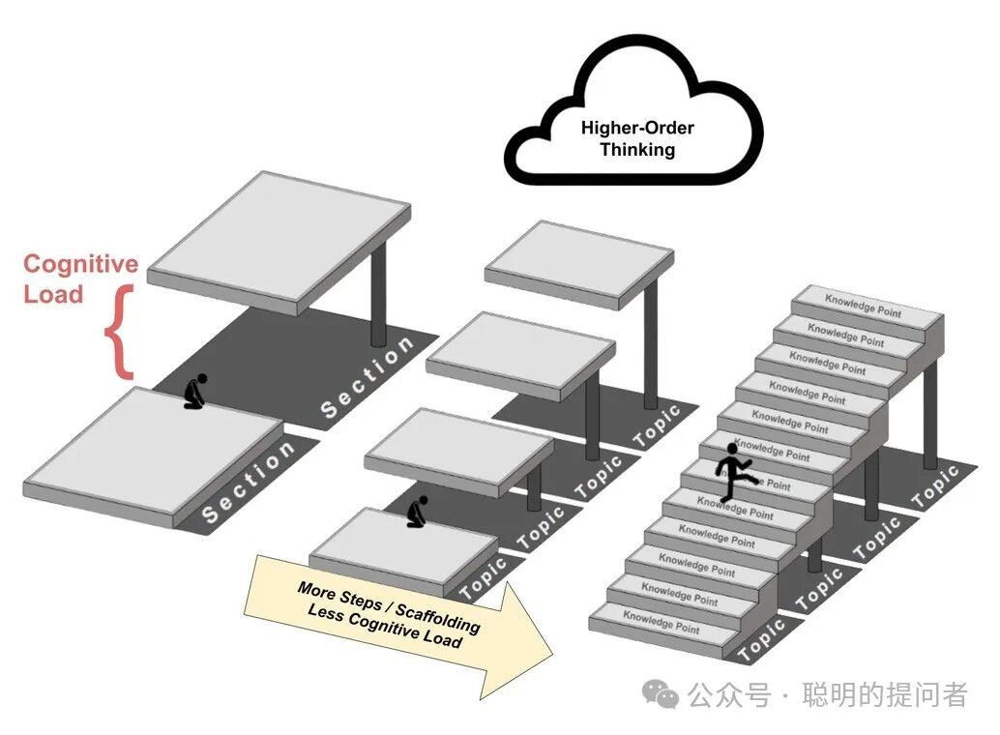
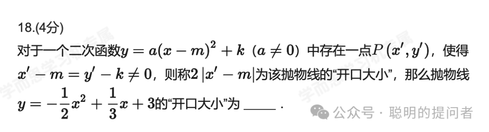

从脑科学角度看,自主学习是唯一的学习方式,因为学习是大脑神经元连接方式的重塑,是个人对外部环境信息的过滤加工和主动反馈. 家长、老师、同学都是“外部环境”,作用是提供优质信息.

什么是优质信息?

能够被自己大脑加工,并能优化大脑认知结构的信息,就是优质信息. 对99%的人而言:

-

• 爱因斯坦的相对论不算优质信息. 它有价值,但你理解不了,就没法改变你的🧠.

-

• 1+1=2 也不算优质信息.它有价值,但你早已知道,也不会再改变🧠.

优质信息因人而异. 对数学而言,比你已掌握的知识难一些的就是优质信息. 优质信息还需要直观的展现方法,让学习者有迹可循.

数学学不会,一个简洁方案是: 提供符合学生当下水平的知识,和尽可能详细的解题步骤,让学生在没有老师的帮助下,自学数学.

Math Academy一直倡导这种学习方式,并且提供了从4年级到大学本科的数学课程. 但这些课程重在基础概念学习和理解,没有针对中考和高考题目做适配.

我结合MA的学习方法、教育部考试中心分析方法和AI大模型的推理方法,拆解中考和高考题目. 教育部教育考试院编写的《高考试题分析-数学》,每道题目都提供了考察目标、试题分析、试题亮点. 我增加了“重点关注”和“对策建议”,提供了更详尽的解题思路,让学习和思考过程更加平滑.

这样的优质信息,不仅学霸,普娃儿也能看懂. 以下案例是2024年上海中考数学第18题的详细分析.

# 0. 试题原题

2024年上海中考数学第18题

# 1. 考察目标

-

• 考察学生对二次函数顶点式 y = a(x - m)² + k 的理解和掌握。

-

• 考察学生将一般式二次函数转化为顶点式的能力。

-

• 考察学生理解题中新定义的“抛物线的开口大小”的概念，并能根据定义进行计算。

-

• 考察学生方程求解能力。

# 2. 试题亮点

-

• **新概念引入:** 题目创新性地引入了“抛物线的开口大小”这一概念，并非直接考察课本上的标准定义，而是需要学生理解题意并应用新定义。

-

• **定义与顶点式结合:** 将新概念与二次函数的顶点式巧妙结合，考察学生对顶点式的应用和理解。

-

• **开放性:** 虽然最终答案是确定的，但在解题过程中，点 P 的选择具有一定的开放性，只要满足条件 x' - m = y' - k ≠ 0 即可，体现了一定的灵活性。

-

• **实际应用背景弱化:** 题目更侧重于数学概念的理解和计算，弱化了实际应用背景，纯粹考察数学思维能力。

# 3. 解题思路

-

• **理解“开口大小”定义:** 首先需要准确理解题目中给出的“开口大小”的定义：2|x' - m|，其中 (x', y') 是抛物线上满足 x' - m = y' - k ≠ 0 的点，(m, k) 是抛物线的顶点。

-

• **将一般式转化为顶点式:** 将给定的抛物线方程 y = -1/2 x² + 1/3 x + 3 转化为顶点式 y = a(x - m)² + k，确定 a, m, k 的值。

-

• **寻找满足条件的点 P:** 根据条件 x' - m = y' - k ≠ 0，设 x' - m = t，则 y' - k = t，即 x' = m + t，y' = k + t。将 x' 和 y' 代入抛物线方程，求解 t 的值（需保证 t ≠ 0）。

-

• **计算“开口大小”:** 利用求得的 t 值（或 x' - m 的值），计算 2|x' - m|，即为所求的“开口大小”。

# 4. 解题步骤

-

• **步骤一：将抛物线方程转化为顶点式**

y = -1/2 x² + 1/3 x + 3
 = -1/2 (x² - 2/3 x) + 3
 = -1/2 (x² - 2/3 x + (1/3)²) + 3 + 1/2 * (1/3)²
 = -1/2 (x - 1/3)² + 3 + 1/18
 = -1/2 (x - 1/3)² + 55/18

由此得到 a = -1/2, m = 1/3, k = 55/18。

-

• **步骤二：设点 P 坐标并代入方程**
设x' - m = t，则x' = m + t = 1/3 + t。
由条件x' - m = y' - k，得y' - k = t，则y' = k + t = 55/18 + t。
将x'和y'代入抛物线方程：

55/18 + t = -1/2 (1/3 + t)² + 1/3 (1/3 + t) + 3
55/18 + t = -1/2 (1/9 + 2/3 t + t²) + 1/9 + 1/3 t + 3
55/18 + t = -1/18 - 1/3 t - 1/2 t² + 1/9 + 1/3 t + 3
55/18 + t = -1/18 + 2/18 + 54/18 - 1/2 t²
55/18 + t = 55/18 - 1/2 t²
t = -1/2 t²
1/2 t² + t = 0
t (1/2 t + 1) = 0

解得t = 0或t = -2。
因为t ≠ 0，所以取t = -2。

-

• **步骤三：计算“开口大小”**
“开口大小”为 2|x' - m| = 2|t| = 2|-2| = 4。

-

• **步骤四：填写答案**
所以，抛物线 y = -1/2 x² + 1/3 x + 3 的“开口大小”为 4。

# 5. 重点关注

-

• **对新定义的理解偏差:** 学生可能不理解“开口大小”的定义，或者理解错误，导致解题方向偏差。

-

• **顶点式转化错误:** 在将一般式转化为顶点式时，容易出现符号错误或计算错误，导致 m 和 k 值错误。

-

• **方程求解错误:** 在求解关于 t 的方程时，可能出现计算错误或遗漏解。

-

• **忽略 t ≠ 0 的条件:** 解方程得到 t = 0 和 t = -2 两个解时，容易忽略条件 t ≠ 0 而误选 t = 0。

# 6. 对策建议

-

• **加强新概念学习:** 遇到新定义的题目，务必仔细阅读题目，准确理解新概念的含义，并结合题目条件进行分析。

-

• **熟练掌握顶点式转化:** 多加练习二次函数一般式转化为顶点式的题目，确保转化的准确性。

-

• **细心计算，规范步骤:** 在计算过程中要细心，每一步都应清晰书写，避免计算错误。解方程时要全面考虑，避免遗漏解。

-

• **重视条件限制:** 注意题目中给出的所有条件，如本题中的 x' - m = y' - k ≠ 0，要根据条件筛选合理的解。

-

• **反思检验答案:** 解题完成后，可以尝试代入点 P 的坐标验证是否在抛物线上，以及是否满足 x' - m = y' - k ≠ 0 的条件，检验答案的正确性。

接下来会陆续发布历年中高考真题的详解版本,感兴趣的可以关注公众号

继续推荐Math Academy,

一个打破布鲁姆 2 Sigma难题的学习系统.

一个不仅是学霸,更是为普娃儿准备的学习系统.

一个让孩子重建数学学习信心的自主学习系统.

MA注册后,第一个月不满意全额退款,

实际上用户得到了一个月的安全体验期.

具体注册请参考

[手把手教你注册Math Academy](https://mp.weixin.qq.com/s?__biz=MzIwNzMzODkyNA==&mid=2247484009&idx=1&sn=95ca5bd210dc22300030f485e1d131c8&scene=21#wechat_redirect)

了解MA请参考

[Math Academy正在取代可汗学院成为数学学习首选平台](https://mp.weixin.qq.com/s?__biz=MzIwNzMzODkyNA==&mid=2247484169&idx=1&sn=fd8f4d65ea68eb3f59caf16239e82794&scene=21#wechat_redirect)

[Math Academy: 数学奇才为儿子打造的数学学习神器](https://mp.weixin.qq.com/s?__biz=MzIwNzMzODkyNA==&mid=2247483928&idx=1&sn=16fb7b41ca69377c67c3c3c4738ae737&scene=21#wechat_redirect)

MA共学群现有用户200+,供MA用户交流学习.

加我微信,验证MA用户身份后邀请入群.

如果你有娃儿要学数学,欢迎订阅+点赞+转发本文,一起共学
