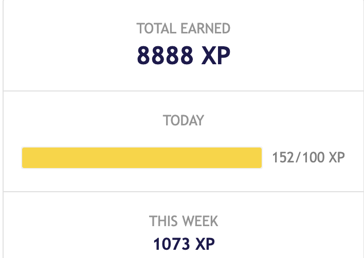
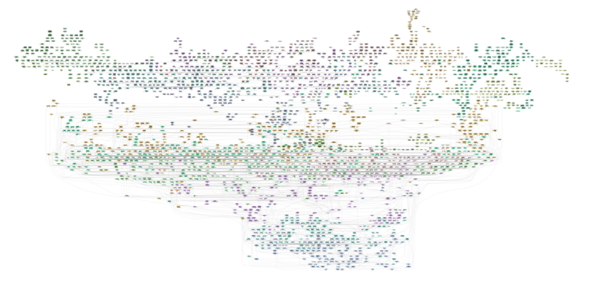
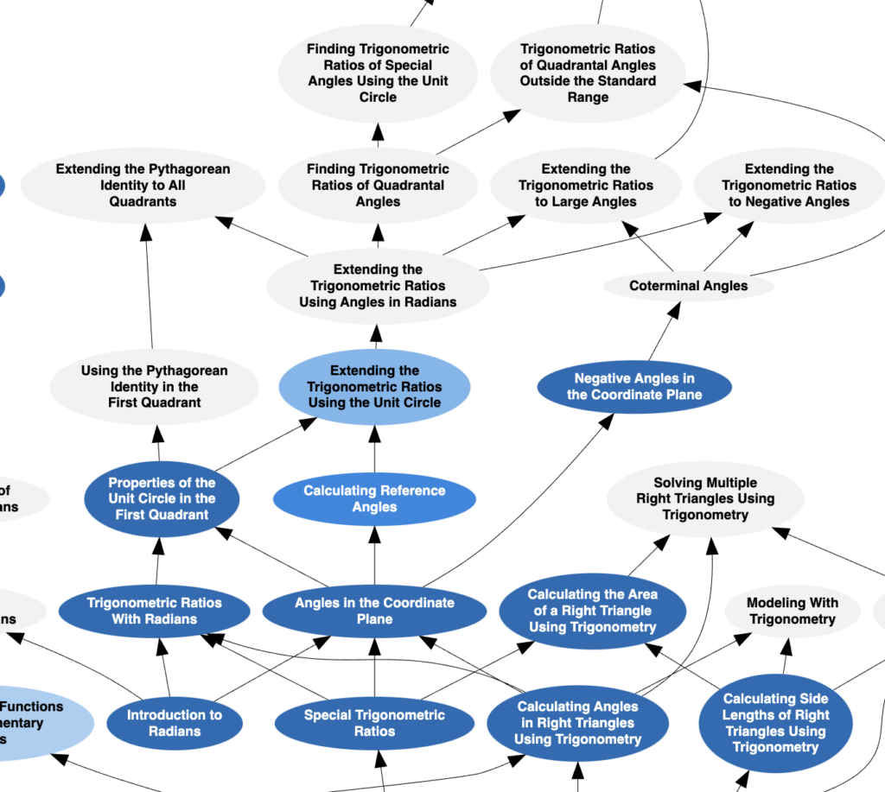
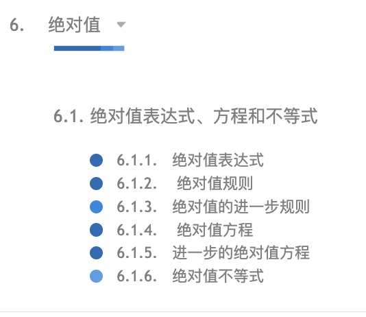
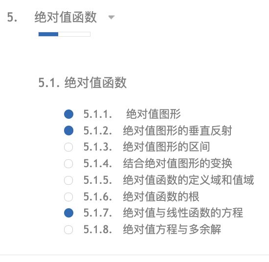
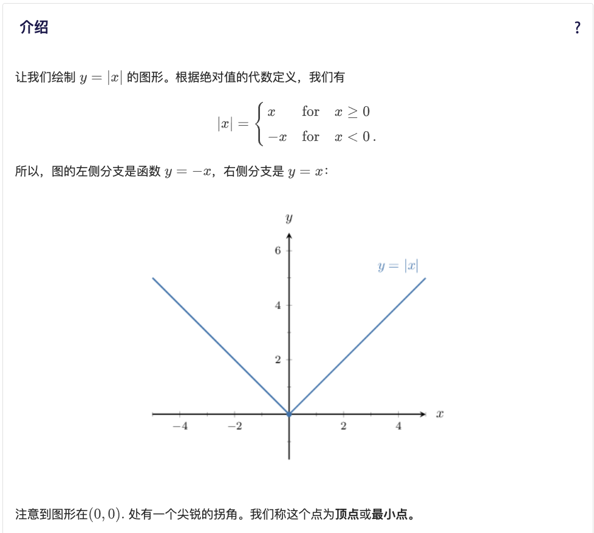
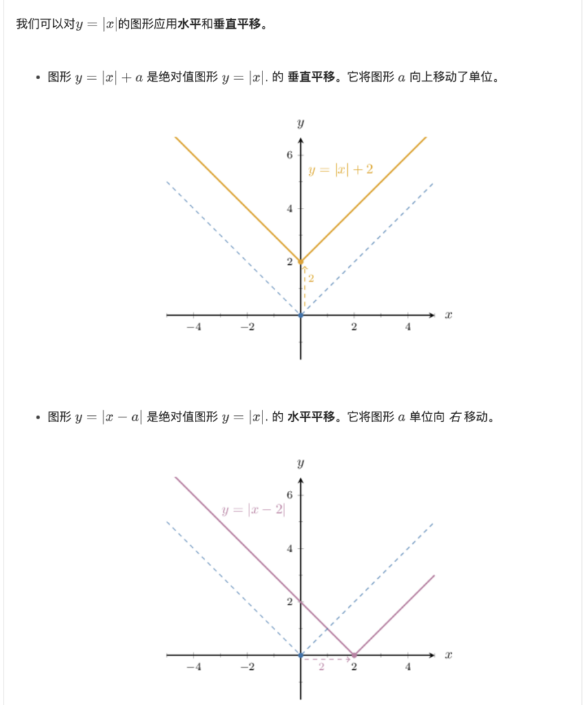
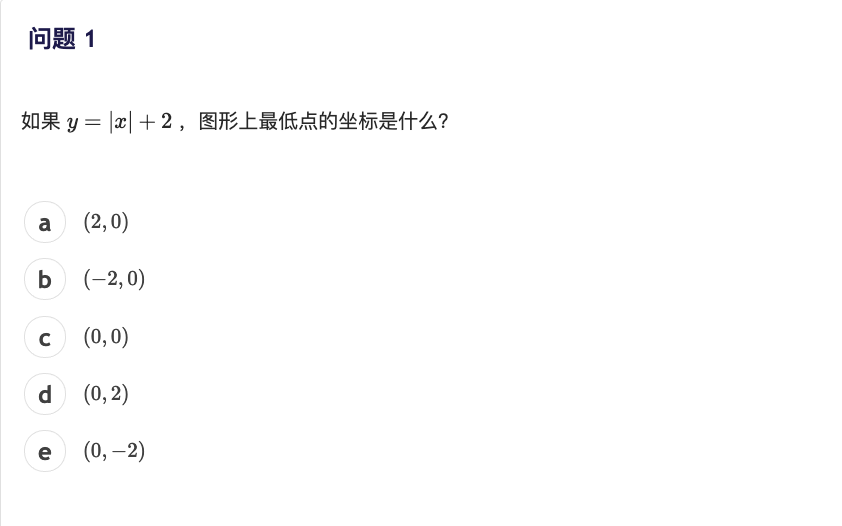
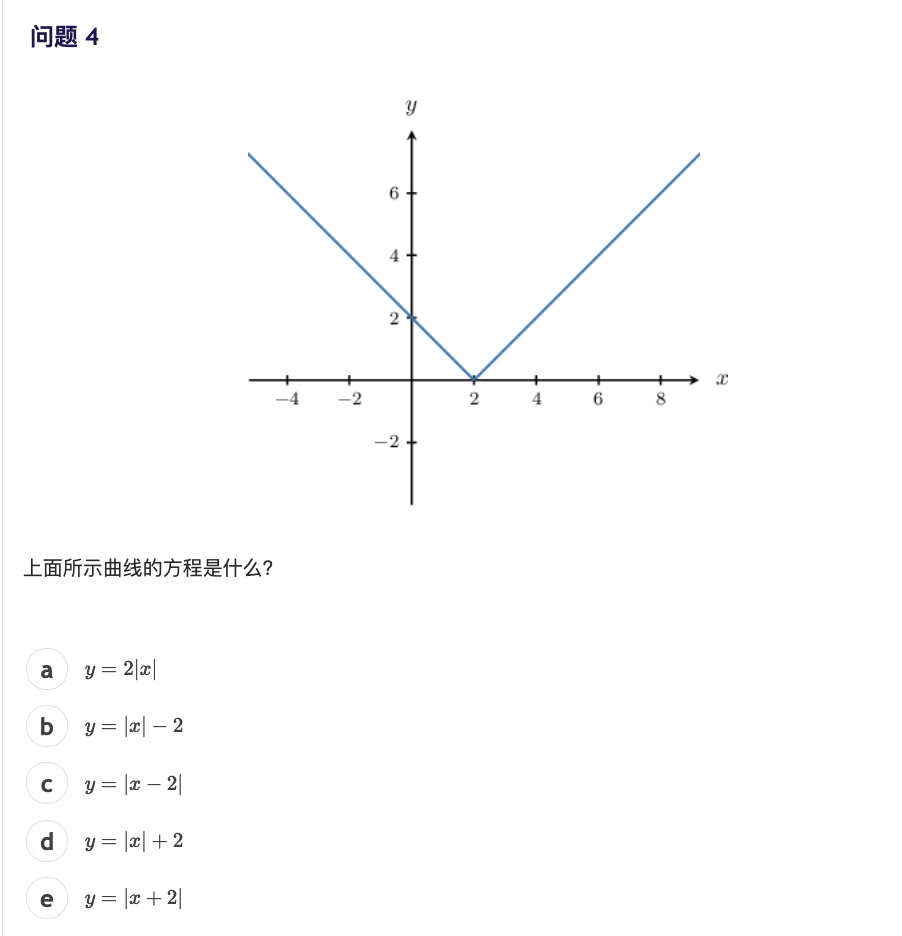

二十多年前马云提出:阿里巴巴让天下没有难做的生意.

今天我想说的是:Math Academy让天下没有学不会的数学.

这么说是基于过去45天在Math Academy(MA)的数学学习体验.

这个数学学习网站能让小学水平的学习者通过自学,一步一步掌握大学数学知识,网址:[www.mathacademy.com](http://www.mathacademy.com)

我最初想研究他家的AI技术如何与教育结合的,没想到对数学上瘾了,学得停不下来,每天上午3小时一晃儿就过去了,到今天8888分,从小学四年级升级到高一.

<figure>

</figure>

我有25年没碰过数学了,上半年女儿的小学6年级的数学题要思考好久.昨天竟然证明出了一道高三立体几何题,感觉太爽了.

Math Academy说白了就是一个AI数学导师,它能为学生评测当前数学水平、制定学习计划、监测学习效果,通过AI自动化工具帮助学生一步一步实现学习目标,学生甚至都不需要记笔记.

Math Academy今年8月发布了一个数学知识图谱,囊括了从小学到大学到人工智能领域相关的所有数学知识.这个图谱清晰的告诉所有学习者,如何从一个点开始,一步一步向上攀登.

<figure>

</figure>

Math Academy参考了维果斯基的最近发展区理论,只向学生推送与当前知识水平最接近的新知识点.这些新知识点学会后就会成为更新知识的基石.看看我现在掌握的知识,深蓝色是学过并掌握的,浅蓝色是正在学习或有待巩固的,灰色是有待学习的.

<figure>

</figure>

Math Academy推崇主动学习.为了达到目的,MA只有文字和配图,一个视频都没有.他们认为看视频学数学会产生幻觉,看完了就认为学会了,是自欺欺人.

主动学习很难,所以Math Academy把知识点分得非常细,尽量降低每个知识点的认知负荷.初一的“绝对值”概念,课本只有几页,Math Academy会分成十几个主题详细讲解.

<figure>

</figure>

<figure>

</figure>

Math Academy在所有知识点后都紧跟着练习题,检测学习效果.每个知识点的练习题3-5个,做错了系统会马上增加1-2个加强练习.这样做的好处是恰到好处,绝不浪费学生宝贵的学习热情.

<figure>

</figure>

<figure>

</figure>

<figure>

</figure>

<figure>

</figure>

Math Academy还引入了间隔复习、交错学习、分层学习等技术,而且所有这些做教育的都研究好多年了,但一直都没有大规模实施过,我在国内也没有见过哪个机构做到过.

Math Academy厉害的地方是他们通过技术手段实现了数学学习的系统化和自动化,让每个学生都可以低成本的享受最优质的数学学习体验.Math Academy绝对是中国学生的福音,在中国学数学太苦了.

这是我对Math Academy系列介绍的第一篇,后面会有更详细的使用方法和学习技巧.
