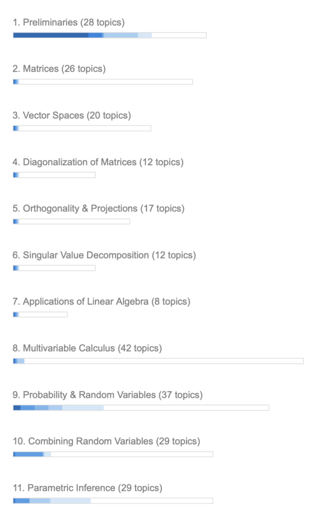

经过两个多月在[Math Academy](https://mathacademy.com/)的学习,我完成了从四年级到[Integrated Math III(Honors)](https://mathacademy.com/courses/integrated-math-iii-honors)的全部课程. 经过一番考虑,特别是看到 [@gmo](https://x.com/gmosync) 调整了自己的学习计划,直接学习M4ML([Math for Machine Learning](https://mathacademy.com/courses/mathematics-for-machine-learning))课程,我也决定直接啃硬骨头.参加M4ML课程的自适应诊断测试后,MA给出了评估报告.总体情况是微积分还可以,线性代数和概率统计太渣,建议从MF3(Math Foundation III)学起. 鉴于[@shuren](https://x.com/shurensha) 同时学了MF II、III和M4ML,我就不返工了,一口气直捣黄龙,目标是2025.6.30拿下.

以下是诊断报告,原文是英文,Claude帮我翻译成了中文,并做了部分调整.

—

Eric 已完成机器学习数学课程的自适应诊断测试。

这项自适应诊断测试通过识别学生的基础知识薄弱环节以及他们已经掌握的课程内容，为每位学生量身定制学习课程。

## 一、课程建议

如果您决定让学生继续学习机器学习数学课程，在课程学习过程中，我们会帮助他补充所缺失的基础知识。

但是，根据机器学习数学诊断测试发现的基础知识缺口数量，我们建议将 Eric 调整至数学基础 III 课程。

您可以在家长/监护人账户的学生设置中更改 Eric 的课程。

## 二、基础知识评估

Eric 在数学基础 II 和数学基础 III 中共缺失 115 个基础知识点。

请不用担心！学生存在大量基础知识缺口是很常见的现象。在某些情况下，可能是因为之前没有完整地学习过相关内容，而在其他情况下，则可能是某些技能因为长期不用而生疏了。

不过，复习和强化这些基础技能将确保学生在进入更高阶内容学习时取得成功。

## 1. 几何

1.  长方体体积
2.  多面体的面、顶点与边

## 2. 线性代数

1.  用矩阵乘法表示3×3线性方程组
2.  线性变换导论
3.  平面中的物体线性变换
4.  用逆矩阵求解2×2线性方程组
5.  线性变换的逆变换
6.  线性变换的面积缩放因子
7.  用逆矩阵求解线性方程组
8.  平面中的奇异线性变换
9.  用矩阵乘法表示2×2线性方程组
10. 线性变换的标准矩阵
11. 平面中点和线的线性变换

## 3. 概率论

1.  正态分布建模

## 4. 统计学

1.  线性相关性
2.  回归模型的选择
3.  线性相关系数
4.  线性回归
5.  协方差
6.  残差及残差图
7.  使用趋势线进行预测

## 5. 三角学

1.  正弦和差公式
2.  正弦的倍角公式
3.  余弦和差公式
4.  余弦的倍角公式
5.  使用正割-正切恒等式化简表达式
6.  使用余切-余割恒等式化简三角表达式
7.  正割-正切恒等式的其他形式

## 6. 代数表达式

1.  多项式的封闭性质
2.  含首项系数的配方法

## 7. 方程与不等式

1.  使用最大公因式解多项式方程
2.  解不同底数的指数方程
3.  解两边都含对数的对数方程
4.  解含指数函数的不等式
5.  解含对数函数的不等式
6.  用对数解不同底数的指数方程
7.  用配方法解含首项系数的二次方程

## 8. 函数与图像

1.  求直线与二次函数的交点
2.  用配方法确定圆的性质
3.  抛物线的对称轴
4.  中心在任意点的双曲线方程
5.  有理根定理
6.  抛物线的顶点形式
7.  计算圆的截距
8.  求椭圆的截距
9.  求双曲线的截距与交点
10. 抛物线的顶点
11. 计算抛物线的截距
12. 根的平均值公式
13. 二次函数的定义域与值域
14. 二次函数的反函数
15. 根式函数的反函数
16. 倒数函数的反函数

## 9. 微分学

1.  在一点处求反函数的导数
2.  全局极值、局部极值与临界点
3.  二阶导数判别法
4.  凹凸区间
5.  使用局部线性性和线性化近似函数
6.  使用微分计算临界点
7.  二阶泰勒多项式
8.  确定函数的增减区间
9.  用一阶导数判别法判断局部极值
10. 可微性与连续性的关系
11. 凹凸性与二阶导数的关系
12. 向量值函数的求导

## 10. 积分学

1.  使用基本三角恒等式积分
2.  反三角函数的换元积分
3.  分部积分法导论
4.  三角函数的换元积分
5.  分段函数的定积分
6.  定积分中积分限的性质
7.  广义积分
8.  使用勾股恒等式积分
9.  使用倍角公式积分
10. 曲线与x轴围成的面积
11. 用左右黎曼和定义定积分
12. 用线性换元积分指数函数
13. 用换元法计算定积分
14. 用换元法积分对数函数
15. 由函数图像计算定积分
16. 定积分的和与常数倍法则
17. 用换元法积分指数函数
18. 含指数函数的广义积分

## 11. 向量与矩阵知识点

1.  矩阵的加法与减法
2.  矩阵的数乘运算
3.  方阵的乘法
4.  2×2矩阵的行列式
5.  3×3矩阵的行列式
6.  用余子式法求3×3矩阵的逆
7.  用分量计算点积
8.  矩阵的转置
9.  3×3矩阵的余子式
10. 用角度和模长计算点积
11. 用行列式计算叉积
12. 两个向量的叉积
13. 矩阵导论
14. 零矩阵、方阵、对角矩阵与单位矩阵
15. 矩阵逆的导论
16. 2×2矩阵的逆
17. 使用向量图解决问题
18. 用已知向量描述点的位置向量
19. 矩阵的下标表示法
20. 2×2行列式的几何解释
21. 矩阵与单位矩阵的乘法
22. 矩阵与列向量的乘法
23. 矩阵乘法
24. 矩阵乘法的相容性
25. 两个向量之间的夹角
26. 标量投影的计算
27. 标量三重积
28. 平行六面体的体积
29. 向量投影的计算
30. 矩阵乘法的性质
31. 矩阵的幂运算
32. 叉积的性质

## 三、机器学习数学课程掌握程度

Eric 已掌握机器学习数学课程的 19%。

以下是课程各单元的掌握程度（颜色越深表示掌握程度越高）：

1.  预备知识（28个知识点）
2.  矩阵（26个知识点）
3.  向量空间（20个知识点）
4.  矩阵对角化（12个知识点）
5.  正交性与投影（17个知识点）
6.  奇异值分解（12个知识点）
7.  线性代数应用（8个知识点）
8.  多元微积分（42个知识点）
9.  概率与随机变量（37个知识点）
10. 随机变量的组合（29个知识点）
11. 参数推断（29个知识点）

<figure>

</figure>

## 四、课程完成时间预估

以下是基于不同每日经验值（XP）进度（仅工作日）的预计完成时间：

<figure>
<table class="has-fixed-layout">
<thead>
<tr>
<th>学习进度</th>
<th>预计完成时间</th>
</tr>
</thead>
<tbody>
<tr>
<td>15 XP/天</td>
<td>2026年3月</td>
</tr>
<tr>
<td>30 XP/天</td>
<td>2025年7月</td>
</tr>
<tr>
<td>50 XP/天</td>
<td>2025年4月</td>
</tr>
<tr>
<td>80 XP/天</td>
<td>2025年2月</td>
</tr>
</tbody>
</table>
</figure>

## 五、评估概述

自适应诊断系统通过直接评估70个知识点后，对Eric的知识掌握情况形成了具体估计。

**评分说明**：

- 满分：在规定时间内正确回答问题
- 部分分：超出规定时间但答对
- 零分：回答答错(曾经学过)
- 不正确：I don’t know(没学过)

## 六、评估结果详情

### 满分题目

\[1\] 基本二次函数图像  
\[5\] 倒数三角函数求导  
\[9\] 正弦和余弦图像变换组合  
\[11\] 从图像计算导数  
\[22\] 含一个相异实根的三次曲线图像  
\[25\] 根式函数的极限  
\[26\] 勾股定理恒等式的其他形式  
\[34\] 反函数图像变换组合  
\[36\] 从图像判断连续性  
\[37\] 求解含复数根的二次方程  
\[38\] 将微积分基本定理应用于指数和三角函数  
\[40\] 用反三角函数积分  
\[55\] 解含指数函数的方程  
\[56\] 函数的运算  
\[62\] 向量导论

### 部分得分题目

\[4\] 特殊三角比的进一步扩展  
\[10\] 集合的条件定义  
\[18\] 正切和余切的图像变换  
\[29\] 指数和对数函数的反函数  
\[32\] 离散随机变量的多对一变换  
\[39\] 向量值函数求导  
\[42\] 统计学与抽样分布  
\[43\] 多元函数的定义域  
\[48\] 假设检验中的第一类和第二类错误  
\[49\] 计算偏导数  
\[53\] 复数的除法  
\[57\] 趋势线  
\[58\] 含变量表达式的阶乘  
\[66\] 散点图  
\[67\] 加法法则和乘法法则  
\[68\] 向量值函数的定义  
\[69\] 判断函数的增减区间

### 零分题目

\[2\] 判断函数的增减区间  
\[6\] 离散均匀分布的均值和方差  
\[12\] 求导中的反函数  
\[13\] 无穷集  
\[16\] 基本三角方程的通解  
\[17\] 双曲函数图像  
\[21\] 向量的线性组合及其性质  
\[23\] 向量值函数的定义  
\[30\] 对数求导法  
\[35\] 几何数列项的序号确定  
\[41\] 离散随机变量的独立性  
\[45\] 用换元法积分指数函数  
\[46\] 用和式表示左右黎曼和  
\[50\] 无穷区间上的连续随机变量  
\[59\] 识别三维图形  
\[60\] 以原点为中心的双曲线方程  
\[70\] 无穷区间上的连续随机变量

### 不正确答题

\[3\] 用行变换求3×3矩阵的逆  
\[7\] 对称矩阵  
\[8\] 用分量计算点积  
\[14\] 向量值函数的定义域  
\[15\] 矩阵逆的导论  
\[19\] 三维笛卡尔向量的加法和数乘  
\[20\] 用回代法解方程组  
\[24\] 用正态分布建模  
\[27\] 直线的笛卡尔方程  
\[28\] 函数的连续性  
\[31\] 笛卡尔积的可视化  
\[44\] 用换元法积分指数函数  
\[47\] 假设检验中的第一类和第二类错误  
\[51\] 连续随机变量的期望值  
\[52\] 贝叶斯定理的扩展  
\[54\] 2×2矩阵的行列式  
\[61\] 向量导论  
\[63\] 增广矩阵形式的方程组  
\[64\] 三角矩阵  
\[65\] 矩阵导论

对自己目前的数学水平有了清醒认识,继续加油吧

PS: Math Academy是我体验过的最有效的数学学习平台,欢迎各位朋友去亲身体验. 另外,MA的学员创建了两个非官方的MA社区,一个是[discord](https://discord.com/invite/Wb8H8yzU),一个是[twitter community:mathacademy](https://x.com/i/communities/1833198423593431339),欢迎加入一起学习交流. 我也准备开一个知识星球,专门讨论在K12学生如何使用MA学好数学.
