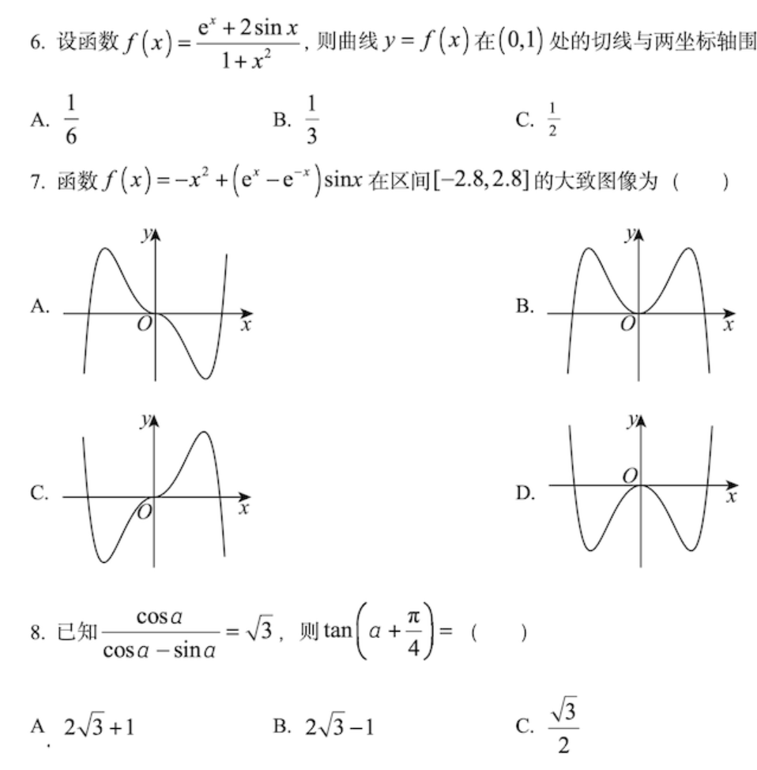
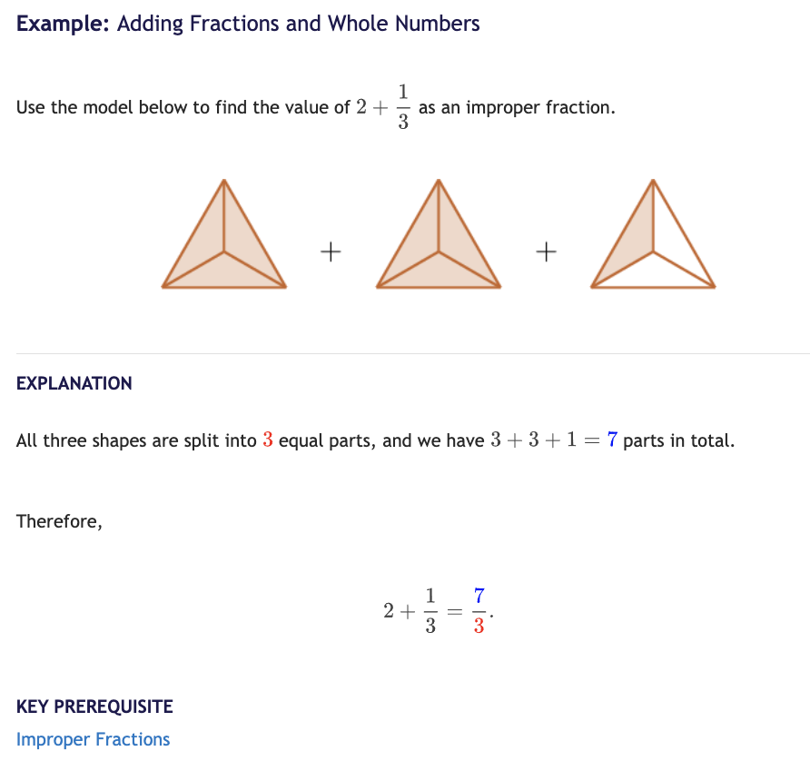

Math Academy最适合备战高考数学?

是的,MA最适合中国学生备战高考.

我不开玩笑,也不敢开这么大的玩笑.我在用今年的高频使用体验说出我的感受.

<figure>

</figure>

参加过高考的人都知道,高考数学试卷除了文字和图表,什么提示都没有.考场上,没人辅导,考生必须依靠自己答题.

MA和高考数学一样,只有文字和图表. 但Math Academy多了强大的数学知识图谱、细致入微的图文说明,和 1V1 的学习规划系统,让每位学生以最有效(效果X效率)的方式自主学习数学.

一旦学生掌握了自主学习数学的能力,就具备了独立应付考试的技能,高考100-140大有希望,这就是MA最适合中国学生的根本原因.

下图是Math Academy的一个内容示例: 整数与分数的加减法,细节藏在图中的蓝色和红色数字,英文不是问题,翻译软件就能搞定🤝

<figure>

</figure>

这么说吧,MA是个私教,但不PUA家长,不diss学生,也不讲段子注水课长.

MA只关注学生已经掌握了多少知识点? 下一步最应该学哪个知识点? 学过的知识点什么时候复习? 

Math Academy尤其关注降低学生的认知负荷.而认知负荷过载是高考发挥失常的主要原因. 日常解题常犯的错误,比如审题不清,计算失误大都是认知负荷不足导致的.

Math Academy适合备考,已经在美国版高考SAT中得到验证.MA很多学员的SAT成绩都非常棒,而且很多学生都提前参加,然后拿到最高分,类似中国初三或高一学生参加高考数学考了140多. 

如果你有孩子今后要参加中国高考,或是美国高考(SAT/ACT),欢迎加我的微信(newstart),一起交流利用Math Academy高效学习数学的方法.

<figure>

</figure>
