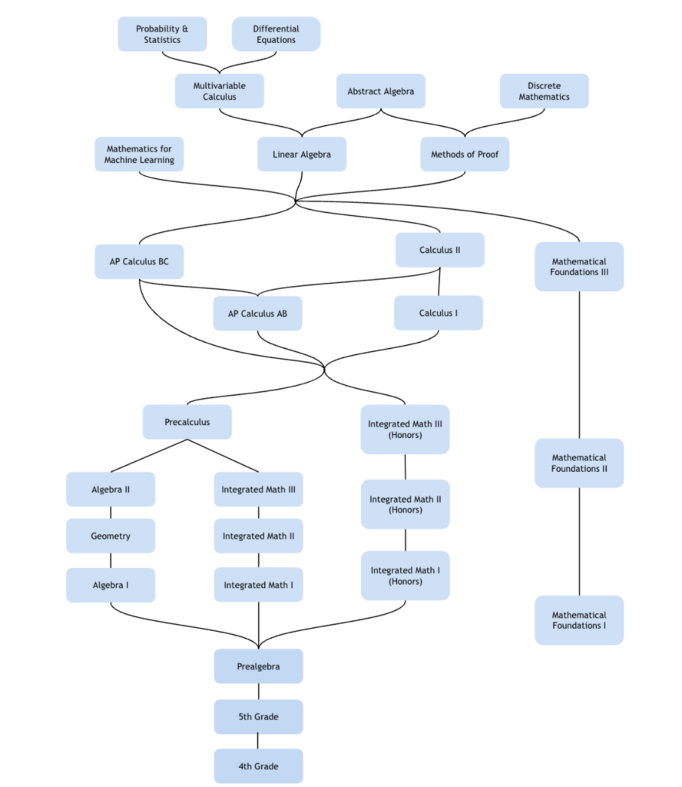
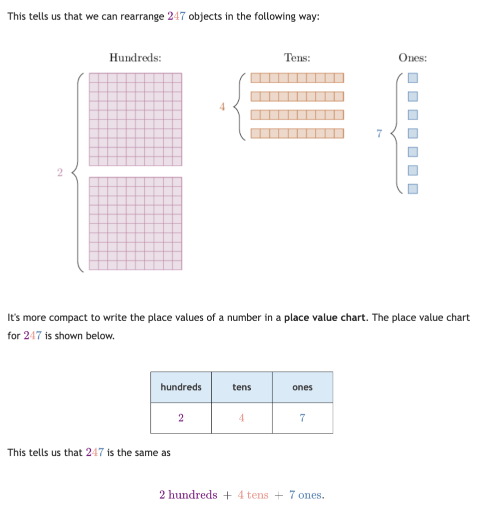
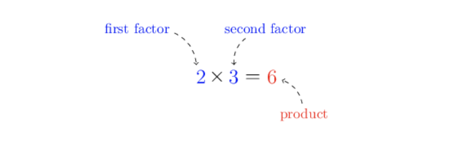
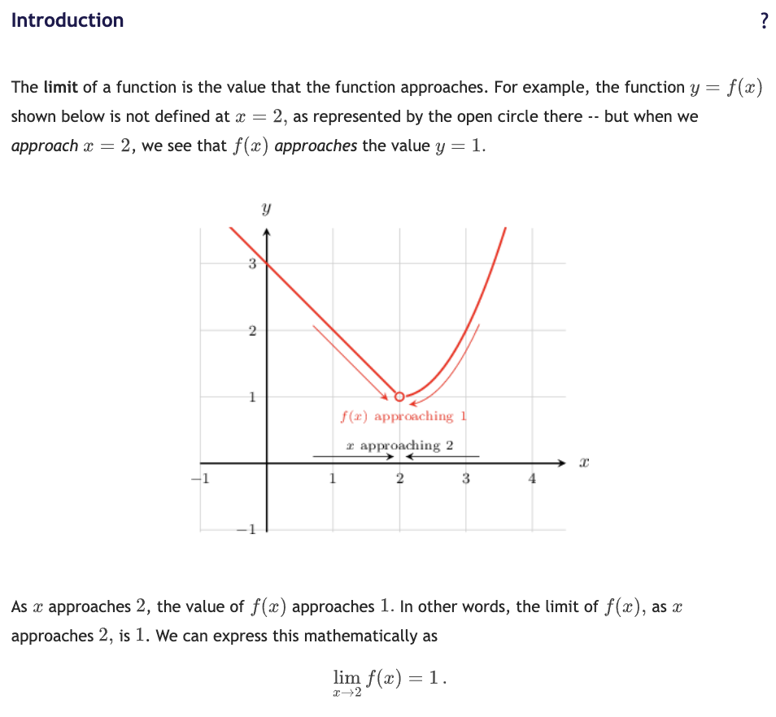
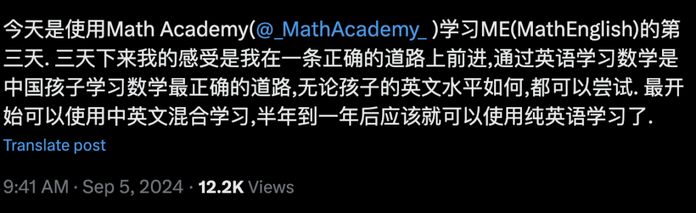
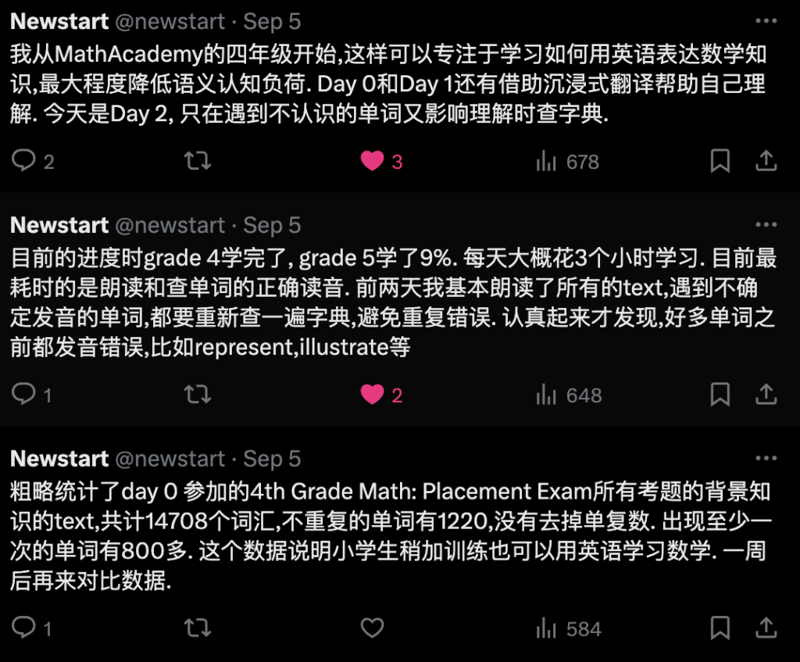

上周读者咨询Math Academy,最多的问题是:

1.   我家娃儿 X 年级,适合用MA学习吗?
2.  我娃儿英语不行,能学吗?

简洁回答是:

1.  学会12以内的乘法,就可以在MA学数学了
2.  MA用最简单的英语教数学,普娃3-6个月就能适应全英文环境

详细解答如下:

**第一:MA适合什么数学水平的学习者?**

Math Academy对学习者数学水平的最低要求是会12以内的乘法. 中国小学二年级就会涉及这部分内容,美国通常要到3-4年级.

MA的官网是这样描述的: 

Our curriculum begins at the 4th grade level. 

If the student knows their multiplication facts through the 12’s, then they are ready to begin our 4th Grade Math course.

所以,如果你的孩子已经学会了简单的加减乘除,就可以尝试家长陪着一起学,等孩子适应了MA的学习方法,就可以ta的自学之旅了.

MA的课程包含了K12的所有数学知识,也有适合大学水平的微积分、线性代数和概率统计(开发中).今年还上线了针对机器学习的数学课程.

以下是官网的一个课程网络图,有兴趣的朋友可以对照自己的水平选择对应的课程. 

<https://mathacademy.com/courses>

<figure>

</figure>

**二、MA适合什么英文水平的学习者?**

Math Academy的所有内容都是英文制作的.这对多数中国学习者都有一定障碍. 

那么,这个障碍有多大吗?非常小. 

掌握1000-1500英文单词就可以比较顺畅的使用MA学习了.如果再配上翻译工具,基本就没有障碍了.

MA会有一些比较长的词汇,通常都是频繁使用的,比如evaluate(估计),respectively(分别地),quadratic(二次的)

任何词汇在上下文中见的多了,自然就能理解意思.

我家娃儿最早认识的字包括“厦”,因为他天天看到“厦门”,听到“厦门”,嘴里说“厦门”.

这里截取MA的课程内容为例说明.

第一个来自4th的数位内容.

When we write down a whole number, the position of each digit has a name.

For example, let’s look at the following three-digit whole number: 247

当我们写下一个整数时,每个数字的位置都有一个名字. 

例如,我们看下面的三位整数:247

这里有一个数学名词:整数,英文是whole number. 我们的中小学英语都不会教,但它不难,whole和number都是常见词. 

孩子一旦知道 “**whole number=整数**” ,就很难忘记.因为在接下来的10年内,可能要说这个词成千上万遍.

<figure>

</figure>

第二个例子同样来自四年级,讲的是乘法的积.

The result of a multiplication is called a product.

For example, when we multiply the numbers  and , the result is  We say that the number  is the product of  and  The numbers  and  are called factors.

In general, a product is a result we get when we multiply two or more factors.

乘法的结果称为积.

例如,当我们对2和3做乘法时,结果是6. 我们说数字6是2和3的积. 数字2和3称为因子.

通常,积是两个或更多因子相乘得到的结果.

这里会遇到的数学词汇有:

multiplication:乘法

multiply:乘

product:积

factor:因子

插一句:估计95%学英语的人都知道 product 的意思是“产品”,可能只有5%的人知道 product 的还有一个意思是“乘积”. 

用英语学数学,很快就会掌握一批专八、托福、雅思、GMAT词汇,而这些是大部分学英语的人一辈子都用不上但很重要的词汇.

初看起来对小学生很难,但是配上图,这些英文单词的难度并不比孩子理解对应的汉语难,特别是有对应的图辅助说明.

<figure>

</figure>

第三个例子来自大学的微积分知识,学过之后就会知道,它使用的英语词汇大概就是初中的词汇水平,只是增加了大学数学中的专业术语.

The limit of a function is the value that the function approaches. For example, the function  shown below is not defined at  as represented by the open circle there — but when we *approach* , we see that  *approaches* the value y = 1

函数的极限是函数逼近的值. 例如,下面的函数 y = f(x) 在 x=2 时没有被定义,用虚心的原点表示. 但当我们向 x=2 逼近时, 我们看到f(x)逼近 y=1 的值.

<figure>

</figure>

所以,我开始在Math Academy学数学时,就提出一个观点: 

> 通过英语学习数学是中国孩子学习数学最正确的道路,无论孩子的英文水平如何,都可以尝试. 最开始可以使用中英文混合学习,半年到一年后应该就可以使用纯英语学习了.

<figure>

</figure>

<figure>

</figure>

**一个反常识的观点: 通过数学学习英语可能是最有效的英语学习方法. **

Math Academy有可能会成为小学生学习英语的最合适的读物. 

**用MA同时学数学和英语. 一鱼两吃,它不香么?**

我是Eric,我在Math Academy学数学和英语,我教自己的娃儿用MA学数学.
