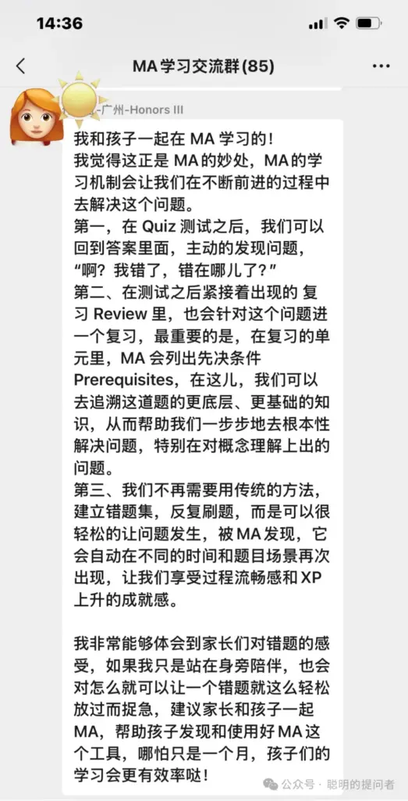
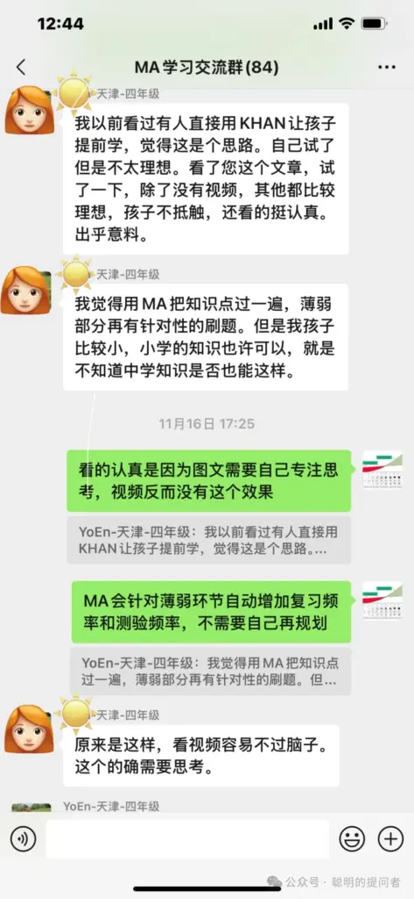

MA共学群全称是“Math Academy共学交流群”,成立于2024年11月15日,到今天刚满一个月.

一个月内,来自全球的华人聚集在一个小小的微信群中,讨论如何学习数学,真是一件奇妙的事

毫不夸张,本群聚集了全球最具行动力的数学学习者,有的是为孩子寻找更好的数学学习路径,有的是自己要加深对人工智能的理解,有的纯粹是对数学的兴趣.

分享本群1个月的成果

1\. 截止15日中午12点,本群有80+名MA用户

2\. 本群的MA用户来自全球10多个城市:北京、上海、广州、深圳、香港、天津、重庆、成都、西安、杭州、厦门、泉州、福州、武汉、苏州、宁波、葫芦岛,还有海外的洛杉矶、东京、都柏林

3\. 本群用户画像:大部分是带娃儿学数学的,占比在90%,娃儿公立校的,国际校的,也有homeschool的.学生的年级分布小学生最多,其次是初中生和高中生.

4\. 截止目前为止,没有出现对MA学习内容的负面反馈

5\. 截止目前为止,对MA吐槽最多的是访问速度慢和非选择题不能输入答案.

6\. 群友们向MA官方反馈了大量问题,MA对中国用户反馈的问题非常重视,正在努力解决输入和访问速度慢的问题.而且,为了方便支付,MA正在计划加入支付宝等更便捷的支付工具.

7\. 制作了一个Math Academy系统介绍视频

8\. 创建了MA共学群问答文档,目前更新了2周

以下是群内MA用户对MA学习的一些反馈,供目前还不是Math Academy用户的家长参考.

<figure>

<figcaption>Math Academy wechat group conversation</figcaption>
</figure>

<figure>

</figure>

<figure>

</figure>

<figure>

</figure>

<figure>

</figure>

<figure>

</figure>

接下来,我会在征得群友同意的情况下,发布MA的使用心得.

MA注册后,

第一个月不满意全额退款,

实际上你得到了一个月的安全体验期,

没有比这更贴心的了.

[[2024-11-16-register-math-academy-hang-by-hand|具体注册请参考: 手把手教你注册Math Academy]]

了解MA请参考

[[2024-12-05-math-academy-surpass-khan-academy|Math Academy正在取代可汗学院成为数学学习首选平台]]

[[2024-10-22-math-academy-mathematician-dad-make-magical-tools-for-son|Math Academy: 数学奇才为儿子打造的数学学习神器]]
