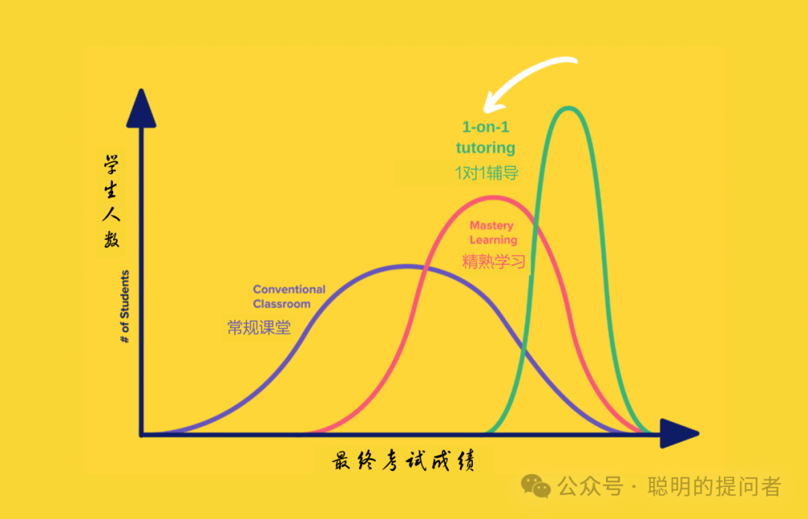
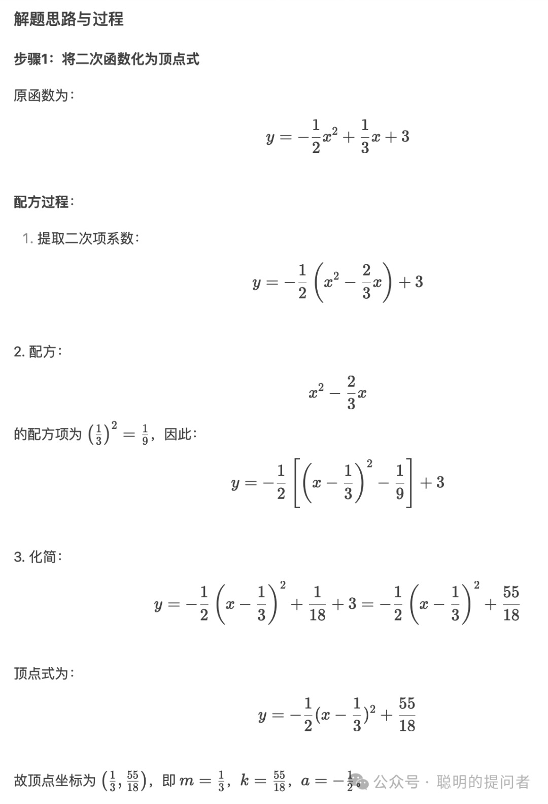
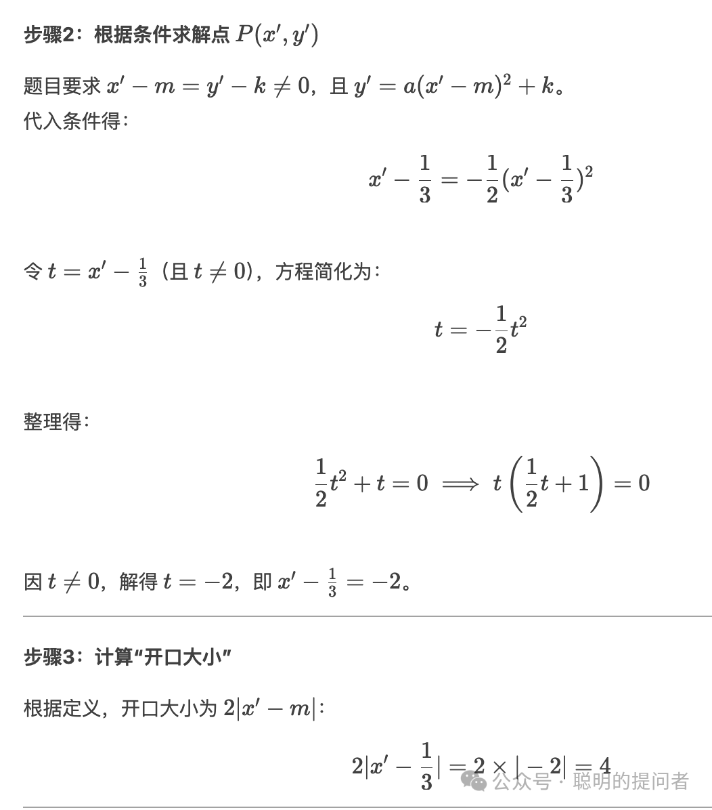
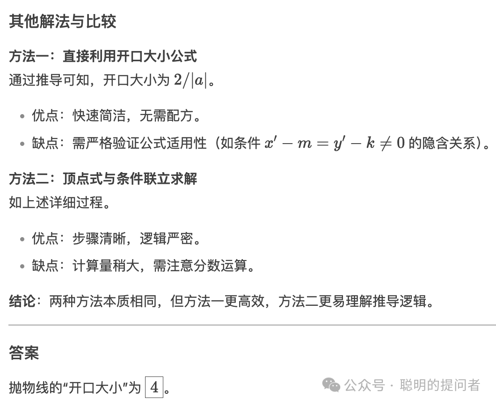

过去半个月我一直在测试Deepseek V3的数学推理能力,特别是观察它的思考过程是否学习数学有帮助.

我的初步结论是:

研读Deepseek的思考过程,可以大幅度提高自己的数学解题能力.

传统教育一直无法解决布鲁姆的2Sigma难题.

1. 一对一辅导效果超好,但人工太贵,无法大规模应用.

2. 匹配成本高,大户人家也不一定能找到适合自己娃儿的老师

3. 双向忽悠.老师和学生都有动机忽悠付费的家长. 家长还很难甄别究竟谁有问题.

Deepseek可以部分解决2Sigma难题.

1. Deepseek很便宜,网页端免费使用,API也是白菜价.

2. Deepseek可以变换各种风格,符合学生的偏好

3. Deepseek不会为了经济目的骗家长,而且辅导过程可以全程透明,有助于家长识别问题,改进对策.

下面我会用一个完整案例展示Deepseek的数学推理能力.

题目来自2024年上海中考第18题.

提示词:

>

图片是某城市某年中考题目截图,请站在出题人的角度,详细解释这道题目的考察目标,试题亮点,以及详细的解题思路和过程,如果有多种解法,请一并列出,并比较这些解法的优劣.

Deepseek给出的答案非常清晰,但更棒的是它的整个思考过程,像是自言自语.

先看Deepseek V3的答案:

### 考察目标:

### 本题旨在考查学生对二次函数顶点式的理解与应用能力，同时引入新定义“开口大小”，要求学生具备将新概念与已有知识结合的迁移能力。具体包括：

1.

1. 将一般式二次函数转化为顶点式，识别顶点坐标及开口方向。

2.

2. 根据题目定义建立方程，求解满足条件的特殊点坐标。

3.

3. 理解“开口大小”这一新概念，并将其转化为数学表达式进行运算。

---

###

### 试题亮点

1.

**1. 新定义引入**：通过自定义“开口大小”，考查学生快速理解并应用新概念的能力，避免机械套用公式。

2.

**2. 综合能力测试**：需综合配方、解方程、绝对值运算等知识点，体现数学知识的连贯性。

3.

**3. 逆向思维**：从给定条件反推参数关系，打破常规开口方向/大小的直接计算模式，增强思维灵活性。

最后是看Deepseek的思考过程,像不像一个学霸在自言自语

---

嗯，这道题看起来是关于二次函数的“开口大小”的定义和应用。

首先，我需要仔细理解题目中给出的新定义，也就是所谓的“开口大小”是2倍|x' - m|，其中点P满足x' - m = y' - k ≠ 0。

题目给出的是具体的抛物线方程，我需要先把它转换成顶点式，找到顶点（m, k），然后根据条件找到符合条件的点P，最后计算开口大小。

首先，原抛物线方程是y = -1/2 x² + 1/3 x + 3。为了转换成顶点形式y = a(x - m)² + k，我需要完成平方。

可能这里会有一些分数运算，需要仔细计算。转换成顶点式后，就能得到m和k的值。

接下来，题目中提到存在一点P(x', y')，使得x' - m = y' - k ≠ 0。

根据抛物线的方程，y'应该等于a(x' - m)² + k。

因此，代入条件x' - m = y' - k，可以得到x' - m = a(x' - m)² + k - k = a(x' - m)²。

这样方程就变成x' - m = a(x' - m)²。

因为x' - m ≠ 0，两边可以同时除以(x' - m)，得到1 = a(x' - m)，从而解出x' - m = 1/a。

这时候开口大小就是2|x' - m|=2|1/a|。

所以最终的结果可能与a的值有关，即开口大小是2/|a|。

不过我需要验证这个结论是否正确，尤其是是否符合题目的定义。

题目中定义的开口大小是2|x' - m|，而根据推导，x' - m = 1/a，所以开口大小应该是2/|a|。

对于给定的抛物线方程，a是二次项的系数，也就是-1/2。

因此，|a|=1/2，那么开口大小应该是2/(1/2)=4。

但是需要确认是否正确，或者是否在步骤中哪里出错了。

再仔细检查推导过程：假设点P(x', y')在抛物线上，所以y' = a(x' - m)^2 + k。

根据条件，x' - m = y' - k，即x' - m = a(x' - m)^2。

因为x' - m ≠0，可以两边约去，得到1 = a(x' - m)，所以x' - m =1/a。

因此开口大小是2|x' - m|=2/|a|。

确实如此。

那么原抛物线转换成顶点式后的a值是多少呢？

原式是y = -1/2 x² +1/3 x +3。

完成平方：

首先提取x²的系数：y = -1/2(x² - (2/3)x) +3。

然后配方，x的系数是-2/3，所以平方项需要加上( (-2/3)/2 )² = (1/3)² =1/9。

因此，y = -1/2[ x² - (2/3)x +1/9 -1/9 ] +3 = -1/2[(x - 1/3)^2 -1/9] +3 = -1/2(x -1/3)^2 +1/18 +3 = -1/2(x -1/3)^2 + 55/18。

所以顶点式中的a是-1/2，因此开口大小是2/(1/2)=4。

不过，这里需要注意符号，因为a是负数，但绝对值是1/2，所以开口大小是4。对吗？

不过题目中的例子给出的a是-1/2，而根据上面的推导，开口大小是2/|a|=4，所以答案应该是4。

但需要确认是否在顶点式的转换过程中正确计算了常数项k。

再检查一遍顶点式的转换：

原式：y = -1/2 x² +1/3 x +3.

提取-1/2作为x²的系数：

y = -1/2 [x² - (2/3)x] +3.

配方：系数为-2/3，半数是-1/3，平方是1/9。因此，里面加上1/9，同时外面要减去这部分乘以系数-1/2：

所以y = -1/2 [ (x -1/3)^2 -1/9 ] +3 = -1/2(x -1/3)^2 + (-1/2)*(-1/9) +3 = -1/2(x -1/3)^2 + 1/18 +3 = -1/2(x -1/3)^2 + 55/18。

对的，所以顶点式中的k是55/18，m是1/3，a是-1/2。

因此，开口大小是2/|a|=2/(1/2)=4。所以答案应该是4。

不过有没有可能题目中的定义有其他考虑？比如是否应该考虑点P的存在性或者其他的条件？

根据题目，只要存在这样的点P，即满足x' -m = y' -k ≠0，那么开口大小就是2|x' -m|。

根据推导，这种情况下x' -m=1/a，而a≠0，因此只要存在这样的点，开口大小就由a的绝对值决定，即2/|a|。

对于这个例子，a=-1/2，所以开口大小是4。这似乎正确。

总结步骤：

1. 将一般式转换为顶点式，得到a, m, k的值。

2. 根据条件x' -m = y' -k，结合抛物线方程，解出x' -m =1/a。

3. 开口大小即为2/|a|。

这样看来，答案应该是4。

不过需要确保顶点式转换正确，以及推导过程中没有错误。

---

看,就是这么一个看似婆婆妈妈的AI,把整个解题过程清晰的展现出来了.

要学好数学,不仅要会单点突破,还要能全局规划,因为每一个数学知识,都有前置知识做铺垫. 我翻译过一篇文章:

[数学不会?你不是笨,只是基础还不够扎实](https://mp.weixin.qq.com/s?__biz=MzIwNzMzODkyNA==&mid=2247483943&idx=1&sn=a914e248997d3c371f2c0987986fe024&scene=21#wechat_redirect)

如果你家孩子不知道如何学习数学,可以体验一下Math Academy.

这是我遇到的最靠谱的数学学习工具,完全基于学习科学原理和AI代理驱动,是[新一代的AI数学学习平台](https://mp.weixin.qq.com/s?__biz=MzIwNzMzODkyNA==&mid=2247484169&idx=1&sn=fd8f4d65ea68eb3f59caf16239e82794&scene=21#wechat_redirect).

Math Academy注册后,第一个月不满意全额退款,

实际上用户得到了一个月的安全体验期.

具体注册请参考

[手把手教你注册Math Academy](https://mp.weixin.qq.com/s?__biz=MzIwNzMzODkyNA==&mid=2247484009&idx=1&sn=95ca5bd210dc22300030f485e1d131c8&scene=21#wechat_redirect)

了解MA请参考

[Math Academy正在取代可汗学院成为数学学习首选平台](https://mp.weixin.qq.com/s?__biz=MzIwNzMzODkyNA==&mid=2247484169&idx=1&sn=fd8f4d65ea68eb3f59caf16239e82794&scene=21#wechat_redirect)

[Math Academy: 数学奇才为儿子打造的数学学习神器](https://mp.weixin.qq.com/s?__biz=MzIwNzMzODkyNA==&mid=2247483928&idx=1&sn=16fb7b41ca69377c67c3c3c4738ae737&scene=21#wechat_redirect)

MA共学微信群,供MA用户交流学习.

加我微信,验证MA身份后会邀请入群.

