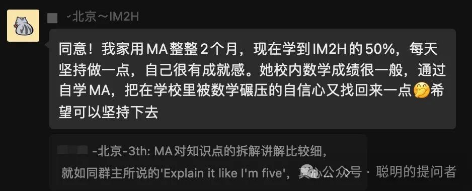
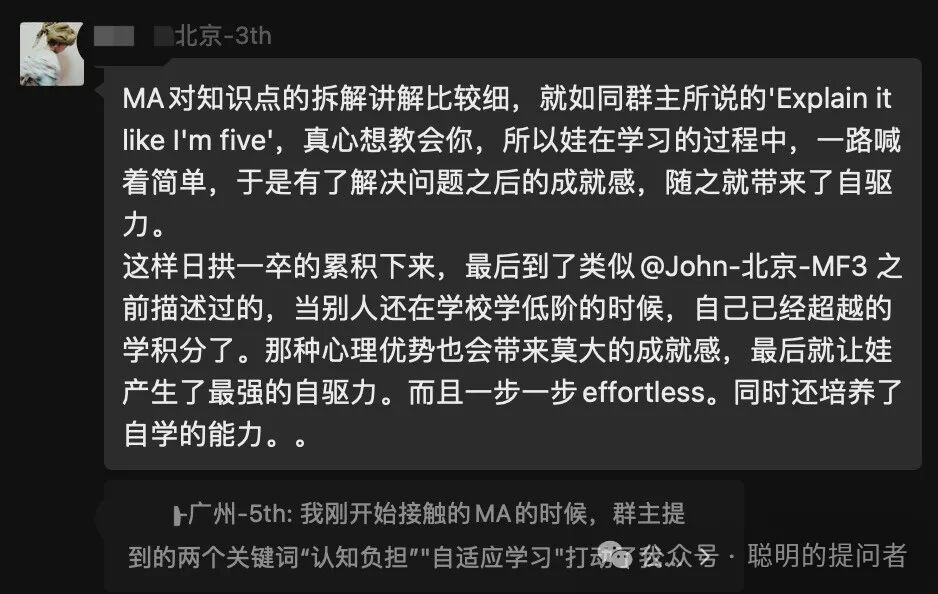
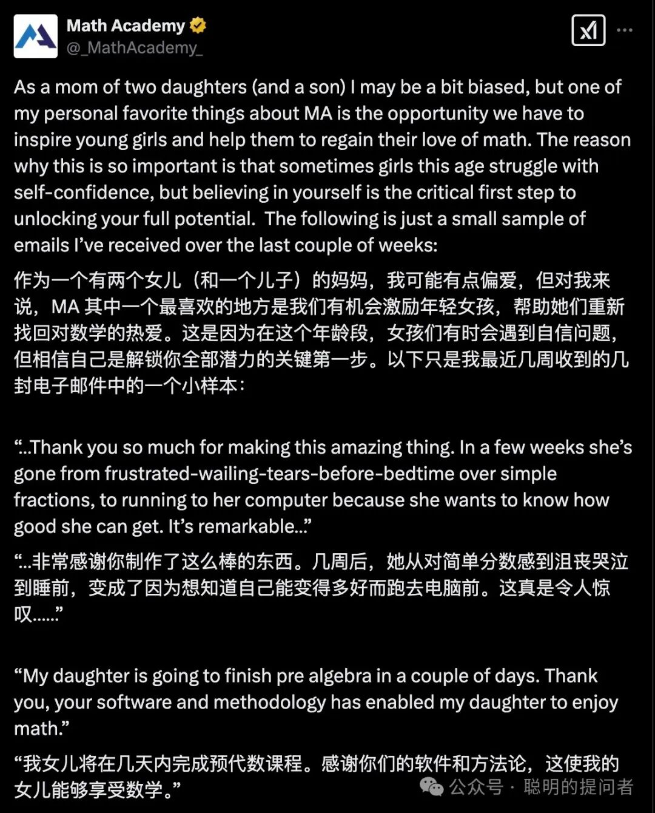

Math Academy共学群成立三个月了,越来越多家长认识到MA的价值.
前两个月的总结文章

[Math Academy共学群成立第一月回顾](https://mp.weixin.qq.com/s?__biz=MzIwNzMzODkyNA==&mid=2247484186&idx=1&sn=35538691651ce001dd6ecd4a5dbdab3e&scene=21#wechat_redirect)

[Math Academy共学群成立第二月回顾](https://mp.weixin.qq.com/s?__biz=MzIwNzMzODkyNA==&mid=2247484219&idx=1&sn=49490eef8516334ccdd2b62925cde33a&scene=21#wechat_redirect)

以下是MA共学群2024年1-2月总结

1.

1. 截至2025年2月15日,本群共用210+MA用户.

2.

2. 人群分布:小学超过60%,初中其次,高中以上比较少.

3.

3. 地理分布:北上广深占比50%,海外华人用户越来越多.

4.

4. 中国和美国都有妈妈反映女儿在MA找到了学习数学的自信.

5.

1.

5. 我和群友羊叔在大年初二做了一次在线交流,关于如何用 Math Academy 学习英语,羊叔非常专业地回答了群友的多个问题.

2.

6. 我做了一个实验,暂停MA学习30天,结果发现:

  1.

1. 新学的的线性代数和概率统计知识忘记了80%,大部分题目做不出来.

  2.

2. 新学的多元微积分忘记了40%,少数题目能做出来.

  3.

3. 高中就熟练掌握的知识大部分题目都能做出来,就是有些慢.

  4.

4. 这印证了我之前的猜想. 对普通人而言,数学新知识的遗忘速度比自己以为的还要快.想要通过突击学习掌握大量新知识不切实际,神经元重塑初期非常不稳定,需要多次间隔复习才能巩固.

  5.

5. 相反,对于之前熟练掌握的旧知识,很容易从记忆深处挖掘出来. 参加过高考的家长,相信你们能通过MA重新掌握之前学会的数学知识,面对孩子的数学提问能很自信的接招(^_^)

3.

7. 2025年上半年推进几件事情:

  1.

1. 邀请更多群友分享数学学习和自主学习的经验

  2.

2. 翻译《The Math Academy Way》.这是Justin Skycak写的关于学习科学的书,是理解Math Academy的重要材料. 知乎的Thoughts Memo已经翻译了1-6章,有兴趣的也可以过去看看.

  3.

3. 设计一门小学数学中英双语在线课程,降低MA学习的语言门槛.

Math Academy,

一个打破布鲁姆 2 Sigma难题的学习系统.

一个不仅为学霸,更是为普娃儿准备的学习系统.

一个让孩子重建数学学习信心的自主学习系统.

MA注册后,第一个月不满意全额退款,

实际上用户得到了一个月的安全体验期.

具体注册请参考

[手把手教你注册Math Academy](https://mp.weixin.qq.com/s?__biz=MzIwNzMzODkyNA==&mid=2247484009&idx=1&sn=95ca5bd210dc22300030f485e1d131c8&scene=21#wechat_redirect)

了解MA请参考

[Math Academy正在取代可汗学院成为数学学习首选平台](https://mp.weixin.qq.com/s?__biz=MzIwNzMzODkyNA==&mid=2247484169&idx=1&sn=fd8f4d65ea68eb3f59caf16239e82794&scene=21#wechat_redirect)

[Math Academy: 数学奇才为儿子打造的数学学习神器](https://mp.weixin.qq.com/s?__biz=MzIwNzMzODkyNA==&mid=2247483928&idx=1&sn=16fb7b41ca69377c67c3c3c4738ae737&scene=21#wechat_redirect)

MA共学群现有用户200+,供MA用户交流学习.

加我微信,验证MA用户身份后邀请入群.

如果你有娃儿要学数学,欢迎订阅+点赞+转发本文,一起共学
