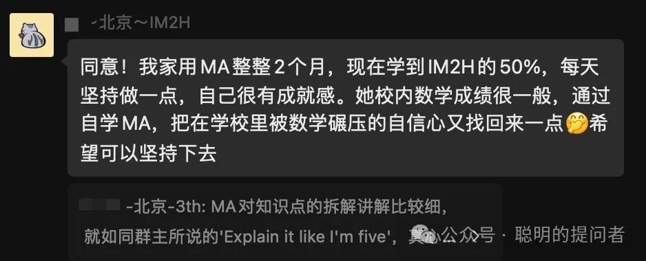
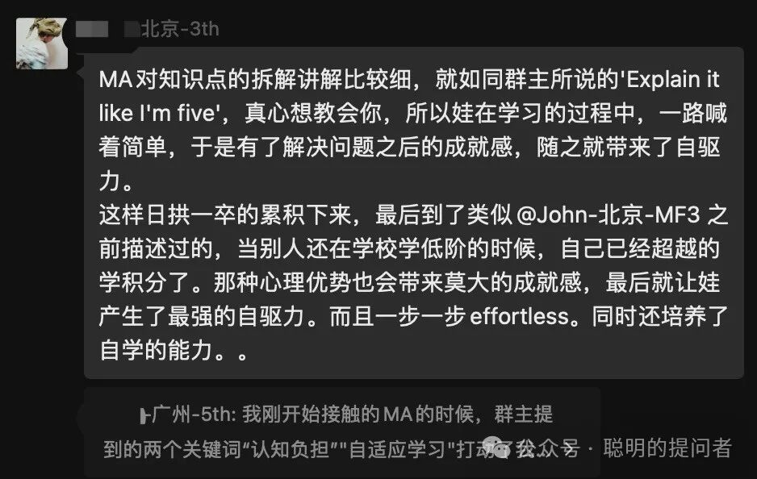
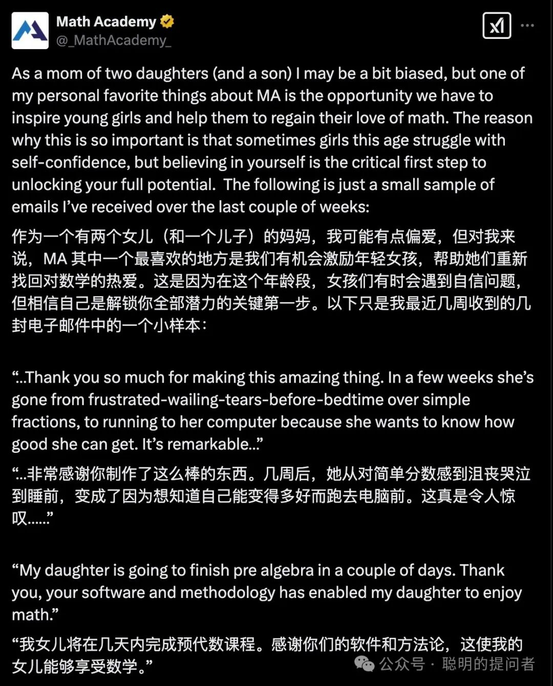
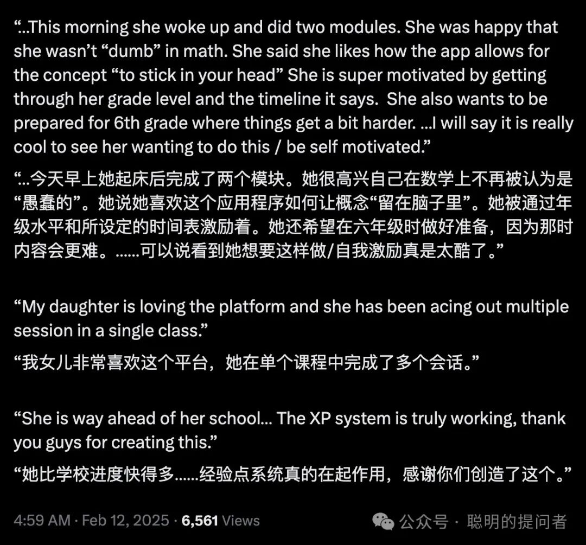

Math Academy共学群成立三个月了,越来越多家长认识到MA的价值.
前两个月的总结文章

[Math Academy共学群成立第一月回顾](https://mp.weixin.qq.com/s?__biz=MzIwNzMzODkyNA==&mid=2247484186&idx=1&sn=35538691651ce001dd6ecd4a5dbdab3e&scene=21#wechat_redirect)

[Math Academy共学群成立第二月回顾](https://mp.weixin.qq.com/s?__biz=MzIwNzMzODkyNA==&mid=2247484219&idx=1&sn=49490eef8516334ccdd2b62925cde33a&scene=21#wechat_redirect)

以下是MA共学群2024年1-2月总结

1. 截至 2025 年 2 月 15 日，本群共有 210+ MA 用户。
2. 人群分布：小学超过 60%，初中其次，高中以上比较少。
3. 地理分布：北上广深占比 50%，海外华人用户越来越多。
4. 中国和美国都有妈妈反映女儿在 MA 找到了学习数学的自信。

5. 我和群友羊叔在大年初二做了一次在线交流，关于如何用 Math Academy 学习英语，羊叔非常专业地回答了群友的多个问题。
6. 我做了一个实验，暂停 MA 学习 30 天，结果发现：
   1. 新学的线性代数和概率统计知识忘记了 80%，大部分题目做不出来。
   2. 新学的多元微积分忘记了 40%，少数题目能做出来。
   3. 高中就熟练掌握的知识，大部分题目都能做出来，就是有些慢。
   4. 这印证了我之前的猜想。对普通人而言，数学新知识的遗忘速度比自己以为的还要快。想要通过突击学习掌握大量新知识并不切实际，神经元重塑初期非常不稳定，需要多次间隔复习才能巩固。
   5. 相反，对于之前熟练掌握的旧知识，很容易从记忆深处挖掘出来。参加过高考的家长，相信你们能通过 MA 重新掌握之前学会的数学知识，面对孩子的数学提问能很自信地接招（^_^）。
7. 2025 年上半年推进几件事情：
   1. 邀请更多群友分享数学学习和自主学习的经验。
   2. 翻译《The Math Academy Way》。这是 Justin Skycak 写的关于学习科学的书，是理解 Math Academy 的重要材料。知乎的 Thoughts Memo 已经翻译了 1–6 章，有兴趣的也可以过去看看。
   3. 设计一门小学数学中英双语在线课程，降低 MA 学习的语言门槛。

Math Academy,

一个打破布鲁姆 2 Sigma难题的学习系统.

一个不仅为学霸,更是为普娃儿准备的学习系统.

一个让孩子重建数学学习信心的自主学习系统.

MA注册后,第一个月不满意全额退款,

实际上用户得到了一个月的安全体验期.

具体注册请参考

[手把手教你注册Math Academy](https://mp.weixin.qq.com/s?__biz=MzIwNzMzODkyNA==&mid=2247484009&idx=1&sn=95ca5bd210dc22300030f485e1d131c8&scene=21#wechat_redirect)

了解MA请参考

[Math Academy正在取代可汗学院成为数学学习首选平台](https://mp.weixin.qq.com/s?__biz=MzIwNzMzODkyNA==&mid=2247484169&idx=1&sn=fd8f4d65ea68eb3f59caf16239e82794&scene=21#wechat_redirect)

[Math Academy: 数学奇才为儿子打造的数学学习神器](https://mp.weixin.qq.com/s?__biz=MzIwNzMzODkyNA==&mid=2247483928&idx=1&sn=16fb7b41ca69377c67c3c3c4738ae737&scene=21#wechat_redirect)

MA共学群现有用户200+,供MA用户交流学习.

加我微信,验证MA用户身份后邀请入群.

