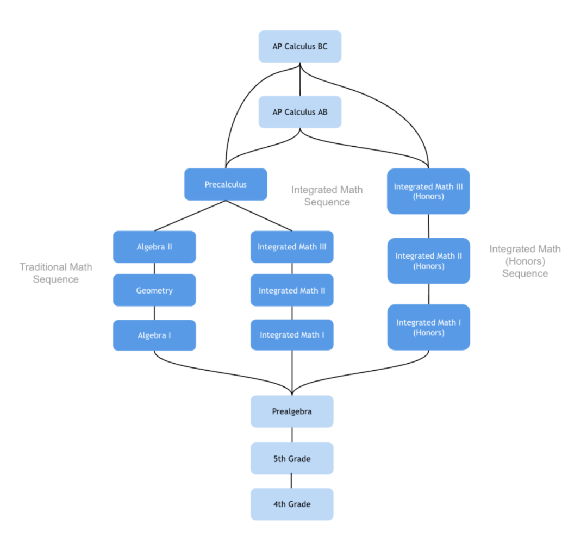
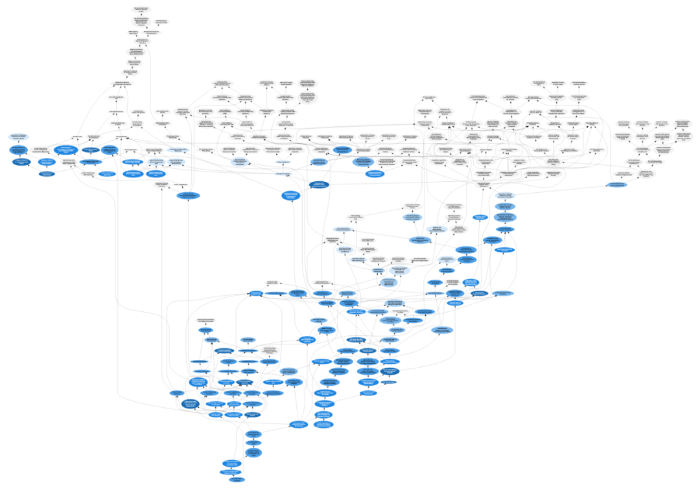
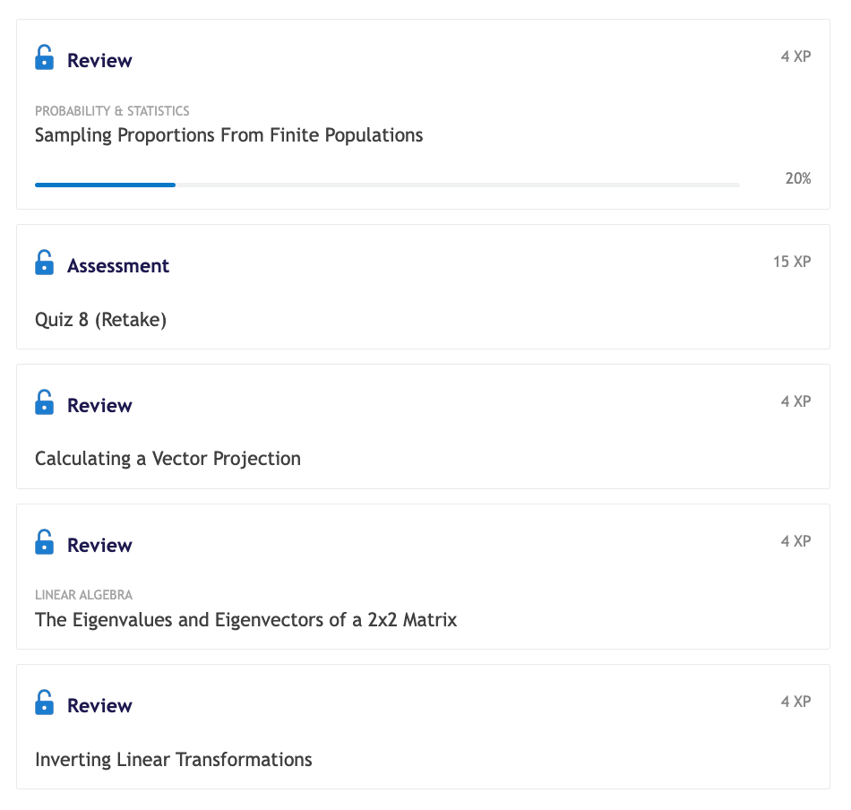
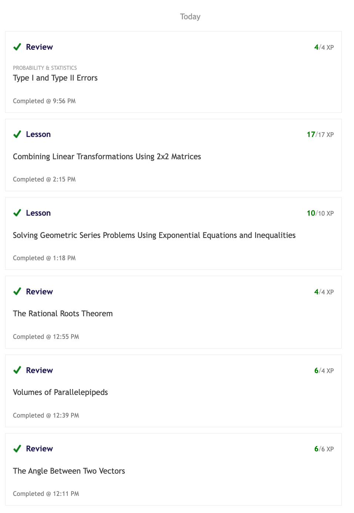

国务院关于深入实施“人工智能+”行动的意见2025年8月26日发布了.

在“人工智能+民生福祉”部分提到了推行更富有成效的学习方式.

>

2.推行更富成效的学习方式。把人工智能融入教育教学全要素、全过程，创新智能学伴、智能教师等人机协同教育教学新模式，推动育人从知识传授为重向能力提升为本转变，加快实现大规模因材施教，提高教育质量，促进教育公平。构建智能化情景交互学习模式，推动开展方式更灵活、资源更丰富的自主学习。鼓励和支持全民积极学习人工智能新知识、新技术。

公众号：国家发展改革委[国务院关于深入实施“人工智能+”行动的意见](http://mp.weixin.qq.com/s?__biz=MzA3MDE5NjE2Mg==&mid=2650792903&idx=1&sn=cbbec44deb093ec29397113dba86dd8a&chksm=86cbcd6ab1bc447c60871ce7b2a6e0d7a43e2f0a51cb990d5ce35fb301a896e9cc646ffde59e#rd)

对普通用户而言,对话框式的chatbot是最常见的AI,有什么不知道但又想知道的,直接问AI就OK了.

但对中小学生来说,AI Agent是比chatbot更好的选择.

AI Agent像一位老师,主要任务是深入了解每个学生已经掌握的知识,并给出适合学生当前进度的学习计划(lesson plan). AI不需要自己生成学习内容,只需要匹配最合适的内容就好.

以数学为例,中小学数学课程标准圈定的知识点是有限的,而且数学知识之间有内在的逻辑关系.高难度数学都可以通过prerequsite向前追溯到最简单的四则运算.

Math Academy通过知识图谱(knowledge graph)用一套体系把小学四年级到大学水平的数学全部连接起来,真是太强大了.

注册Math Academy后可以加我,申请加入微信共学群.

[手把手教你注册Math Academy](https://mp.weixin.qq.com/s?__biz=MzIwNzMzODkyNA==&mid=2247484009&idx=1&sn=95ca5bd210dc22300030f485e1d131c8&scene=21#wechat_redirect)

了解MA请参考

[Math Academy正在取代可汗学院成为数学学习首选平台](https://mp.weixin.qq.com/s?__biz=MzIwNzMzODkyNA==&mid=2247484169&idx=1&sn=fd8f4d65ea68eb3f59caf16239e82794&scene=21#wechat_redirect)

[Math Academy: 数学奇才为儿子打造的数学学习神器](https://mp.weixin.qq.com/s?__biz=MzIwNzMzODkyNA==&mid=2247483928&idx=1&sn=16fb7b41ca69377c67c3c3c4738ae737&scene=21#wechat_redirect)

