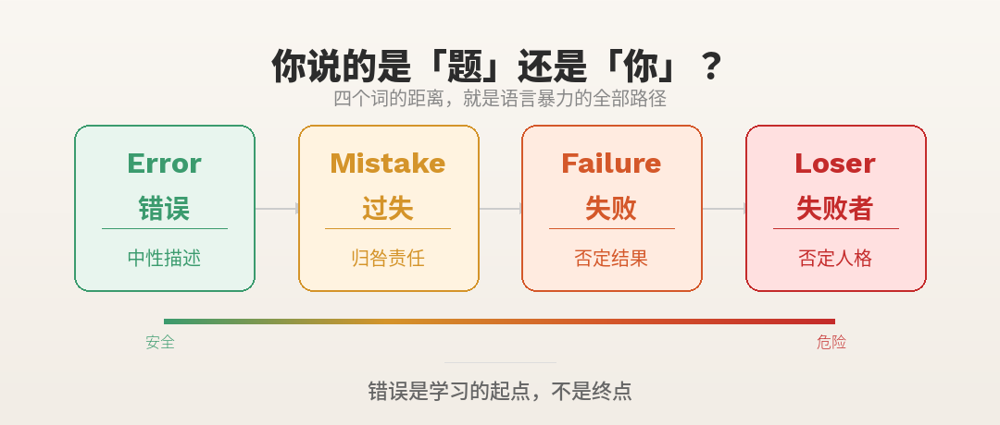

前几天，朋友跟我讲了一件小事。

她儿子三年级，数学作业有道题做错了。她随口说了句："这么简单的题都能做错？"

孩子没说话，低头把答案改了。

后来她无意间翻到孩子的日记本，上面写着："我是个笨蛋，连简单的题都不会。"

朋友愣住了。她觉得自己只是陈述事实，但孩子接收到的信息是：**我很笨。**

---

## 四个词，四重伤害

假设孩子算错了题，8+5写成了12。以下四种说法，有什么区别？

>

"这里有个错误。"
"这题你做错了。"
"说了多少回了,每次都错,不长脑子呀。"
"你就不是学数学的料儿！"

英语里有四个单词对应这四种说法.
**Error（错误）**——中性词，只描述客观事实：答案有偏差。不带任何情绪。

**Mistake（过失）**——有价值判断了。潜台词：你本该做对，但没有。

**Failure（失败）**——给结果定性。你这个人在这件事上"失败"了。

**Loser（失败者）**——最狠一击。从评价行为，变成定义人格。

这四个词是一条滑坡：**描述现象 → 归咎责任 → 否定结果 → 否定人格。**

**
**

**
**

其中最危险的，不是后面两个。"失败""失败者"这种词太重了，家长说出口自己也会意识到不对。

**最危险的是从error到mistake的滑坡——因为它太隐蔽了。**

"这道题有个错误"和"你做错了这道题"，听起来差不多，对吗？但前者在说"题"，后者在说"你"。这个微小的转向，就是语言暴力的起点。

---

## 犯错，是学习的唯一方式

想象婴儿学走路。摇摇晃晃站起来，摔倒，再站，再摔。

没有家长会说："这么简单都学不会？"因为我们本能地知道：**摔倒不是失败，摔倒就是学习本身。**

做错数学题也一样。8+5=12，大脑发现不对，才会反思哪里出了问题。

如果我们平静地指出"这里有个错误"，孩子的注意力在：**怎么改正。**

如果我们说"你怎么这么笨"，孩子的注意力变成：**我是不是真的很笨。**

学习的通道，就这样被关上了。

---

## 我们改变不了学校，但能改变家

学校的环境我们管不了。老师要面对几十个学生，同学之间难免比较。

但家不一样。**家是孩子的充电站，不是第二个战场。** 如果孩子在学校被打击了一天，回家又面对批评和否定，他去哪里恢复能量？

我们能做的，就是守住家庭这块净土——**把后三个词换成第一个词。**

---

## 今天就能做的三件事

**第一件：换一种说法**

✅ 这样说

❌ 不这样说

这道题有个错误

你做错了

这里需要检查一下

你怎么不检查

答案和标准不一样

你又粗心了

核心原则只有一条：**说"这道题"，别说"你这人"。**

**第二件：每天自检一次**

晚上躺下时，回想今天跟孩子说过的话，问自己：**我刚才说的是"题"还是"你"？** 不用自责，只要觉察，改变就已经开始了。

**第三件：在家里贴几张标语**

给自己的（贴在书桌旁或镜子上）：

>

**题错了，人没错**

**先说"这里"，再说其他**

**我说的是"题"还是"你"？**

给孩子的（贴在书桌前或床头）：

>

**我做错了题，但我不是错误**

**每个错误都是大脑在升级**

**犯错说明我在学习，不学习的人才不犯错**

全家共用的（贴在客厅）：

>

**这个家，只讨论"错误"，不定义"错人"**

---

## 最后

我们这代人很多被打击式教育带大，也"好好的"活下来了。

但那个总觉得自己不够好的声音，是从哪来的？那个害怕失败、不敢尝试的心理，是从哪来的？

我们好好的，但也许可以更好。我们的孩子，值得更好。

**从今天起，试着把"你怎么又错了"换成"这里有个错误"。**

一个小小的改变，可能会让孩子的整个世界不一样。

---

错误，是学习的起点，不是终点。
