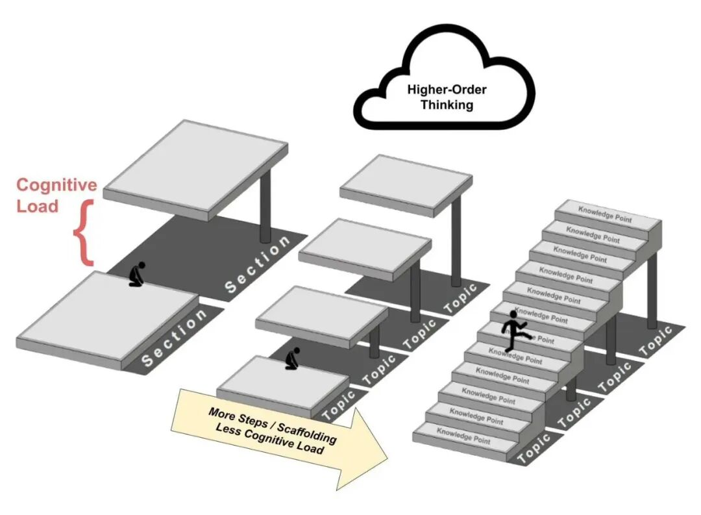

本文来自 Math Academy 播客第四期的后半部分。Jason和Justin分享了多年来在教学设计上的核心心得：

-

• 如何把复杂的数学知识拆解成孩子真正能吃透的小步骤;

-

• 如何用数据发现孩子普遍卡壳的地方并加以改进;

-

• 以及什么样的教学节奏才能让学生既不"被劝退"，又能持续进步。

---

## 核心要点

**学习台阶要小，不要大。** 每个知识点最多依赖三四个"前置知识"，这与人类大脑工作记忆的容量相吻合。如果孩子在某个地方卡住了，往往不是孩子不努力，而是台阶跨得太大了。

**把大主题拆成小步骤，是真正的帮助。** Math Academy 会把一个数学主题分成三四个"知识点"，孩子从最基础的版本开始，达到熟练后才进入下一个，而不是一股脑地全部灌输。这种设计能让孩子在每一步都获得真实的成就感，避免还没打好基础就被拖着往前走。

**循序渐进＋分散练习，是最有效的学法。** 研究表明，最好的教学方式是"小步走、常练习"，而不是某天突击猛学、跨越式跳跃。家长不必担心 MA 的进度"太慢"——这种节奏本身就是设计的一部分。

**先动手算，再理解原理。** MA 的教学哲学是"自下而上"：先让孩子通过具体计算建立感觉，再引入抽象概念。家长如果想在家辅导孩子，也可以参考这个思路——先给例子，再讲道理。

**数据会说话，卡壳的地方有规律。** Math Academy 会持续追踪哪些题目、哪些知识点让学生普遍失败，并据此改进内容。孩子在某道题上反复出错，背后往往有教学设计层面的原因，平台会持续优化，家长不必过度焦虑。

---

## 问答精选

**问：为什么孩子有时候会在某个知识点上突然"卡死"，怎么看待这个问题？**

答：通常这不是孩子的问题，而是"台阶跨太大"造成的。Math Academy 把每个知识点拆分成三到四个小阶段，第一阶段只讲最核心的基础版本，让孩子先获得成功体验。后续阶段再逐步引入负数、特殊情况等复杂变量。只有孩子在当前阶段真正熟练了，才会进入下一阶段——这是系统有意为之的设计。

**问：MA 的教学节奏看起来比学校慢，这样真的有效吗？**

答：有效，而且恰恰是因为慢。最好的学习是"小步走＋分散练习"，大幅跳跃需要极高的天赋才能跟上，而大多数孩子在跨越式教学中只是表面上"学过了"，并没有真正掌握。MA 的节奏设计，是为了让更广泛的孩子都能建立扎实的基础，而不是只服务少数天才。

**问：欧拉方法等看起来很难的内容，MA 是怎么让孩子学会的？**

答：欧拉方法曾经是平台通过率最低的内容之一，经过多次打磨才做好。关键是两点：

1.

1. 用简洁直观的符号和表格，降低孩子的认知负担；

2.

2. 先让孩子用手算一遍切线逼近，从具体计算中建立直觉，再引出正式的方法名称和公式。先有感觉，再有概念，理解才能落地。

**问：孩子在使用 MA 时遇到的那些"小摩擦"（比如看不懂题目），会有人处理吗？**

答：会。MA 专门关注这类"小摩擦"——比如题目阅读难度对年龄偏小的孩子不友好，或者题目预设了孩子还不具备的背景知识。这些看起来不起眼的小问题，会被专项收集和修复，目标是不让任何孩子因为与数学本身无关的原因而受阻。如果孩子反映"看不懂题目说什么"，这是一个值得向平台反馈的信号。

**问：MA 的课程内容和顶尖大学的标准有可比性吗？**

答：以微分方程课程为例，平台参考了美国八到十所顶尖高校的课程大纲，在一学期的课时范围内尽量覆盖这些高校普遍包含的全部内容。MA 的定位不是走捷径，而是在保证系统性的前提下，让孩子用更高效的方式达到同等甚至更高的学术水准。

---

有对数学学习和Math Academy感兴趣的,加我一起交流.

