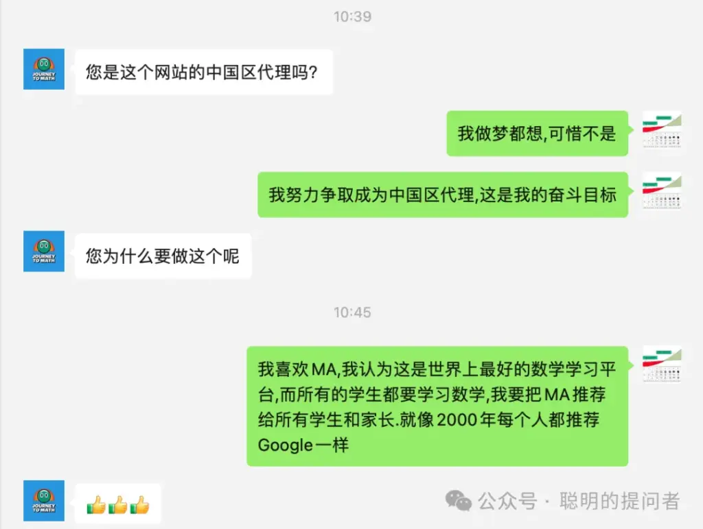
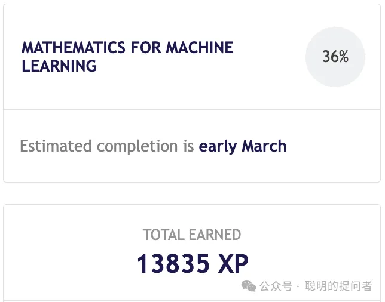

> 免费最贵,它让你忘了还有更好的选择  

最近很多家长来咨询: Math Academy为什么比可汗学院好?

有家长以为我是MA的代理. 

我做梦都想,可惜还不是.

<figure>

</figure>

01 成本:看得见的和看不见的

有人说可汗学院是免费的,

Math Academy49美金/月是在抢钱.

他们只看到看得见的支出,

却忘了,

孩子付出的时间精力,

和看不见的机会成本.

而机会成本不可挽回,

青春一去不复还.

为了免费,

一个孩子失去了,

体验世界上最好的学习系统的机会,

值得么?

02 收益:当下的和将来的

选择Math Academy,你会得到什么?

**无干扰界面**

据我所知,

MA是唯一没有提供

闪烁和声音刺激的学习工具.

所有的升学考试现场都如此.

**成长性思维**

从数轴到矩形,

再到平面直角坐标系.

从代数到几何,

从三角函数到双曲线,

MA用一个个小台阶,

带学生来到笛卡尔的世界.

笛卡尔坐标系,

把中小学数学知识融为一体.  一致性体验

学生用一套体系,

学完从4年级到大学的全部数学.

再用大学数学视角看高考题目,

就像高三学生参加中考.

03 不选择也是一种选择

所有的行动,都有一个默认选项.

无需痛苦的比较,

只要安于现状.

有初三家长问,现在这个阶段,

能用Math Academy提分吗?

我无法判断.

但我觉得,作为家长

你可以替孩子试一试.

有天津妈妈已经迈出这一步.

我的经验:

教不会家长的老师,

大概率也教不会孩子.

在MA学习后,

家长将掌握一种能力,

鉴别学习工具优劣的能力.

04 行动:先体验一个月再说

不要把孩子当试验田,

未经检验的老师,

不应该推给孩子.

不要给自己找借口,

说数学早忘光了.

从加减乘除开始,

半年后你也敢对娃儿说:

什么难题?给我看看

今天是我在MA学习的第100天.

从 4年级开始,

如今大学数学完成了36%,

每天3小时,300页稿纸,13835经验值.

<figure>

</figure>

你不必像我一样,

但仍然可以用行动,

做出明智的选择.

我选择了MA,你呢?

MA注册后,

第一个月不满意全额退款,

实际上你得到了一个月的安全体验期,

没有比这更贴心的了.

[[publish/手把手教你注册Math Academy|具体注册请参考: 手把手教你注册Math Academy]]

了解MA请参考

[[publish/Math Academy正在取代可汗学院成为数学学习首选平台|Math Academy正在取代可汗学院成为数学学习首选平台]]

[[publish/Math Academy 数学奇才为儿子打造的数学学习神器|Math Academy: 数学奇才为儿子打造的数学学习神器]]
