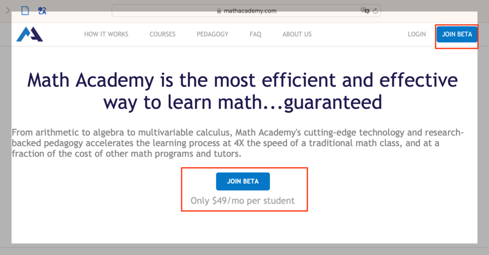
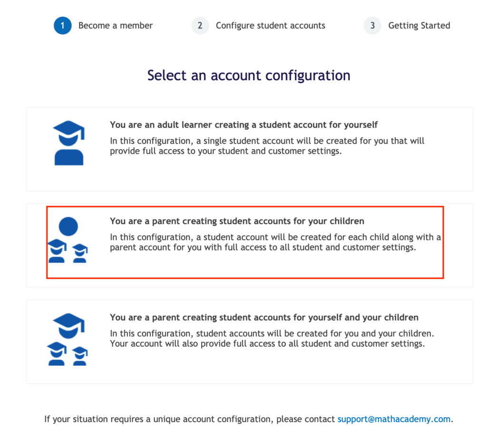
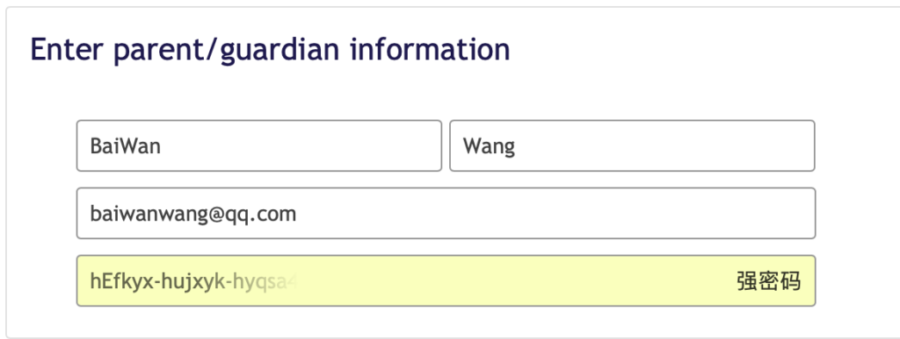
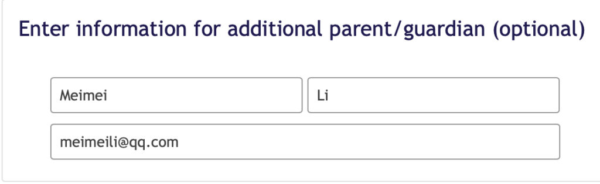
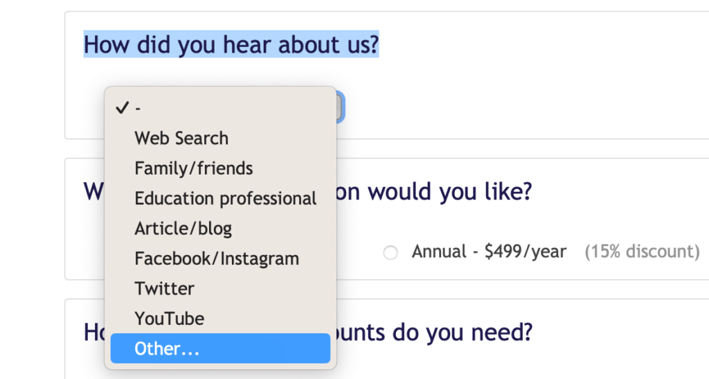
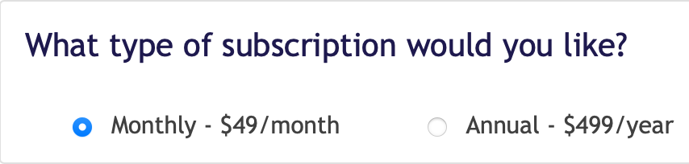
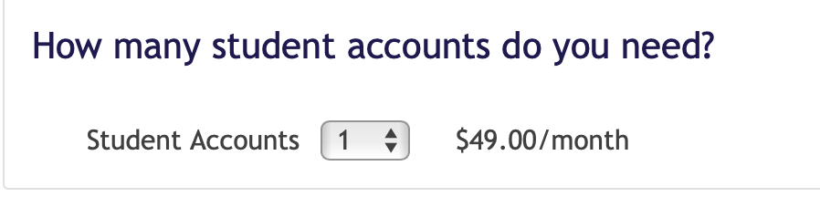
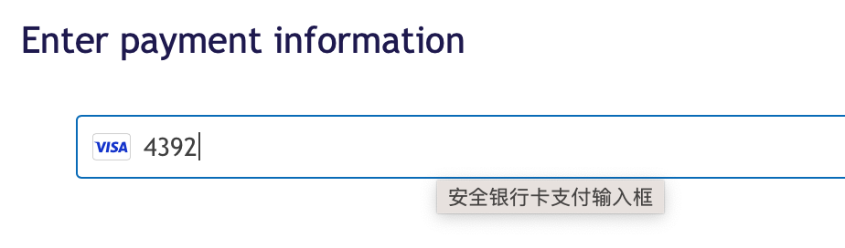
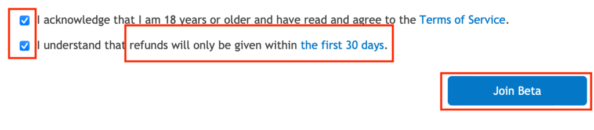

最近几天了解Math Academy的朋友越来越多,特别是有娃的家长,来咨询的比做AI的多.

咨询中问到最多的是如何成功注册MA. 我之前写过一篇文章: [[中国大陆用户如何使用Math Academy|中国大陆用户如何使用Math Academy?]] 提过几个注意要点,今天这篇是手把手注册教程.

1\. 登录MA官网: <https://mathacademy.com>

2\. 点击中间或右上角的”JOIN BETA”按钮,都可以进入注册页面. MA第一时间明确告诉你49美元/月/学生,不会引诱注册,免得扯皮.

<figure>

</figure>

3\. MA提供三种账户身份,只是为了方便选择课程,不是区别收费. 任何一个要学习的账户都是49美元/月.

<figure>

</figure>

上面的成人(Adult)是为成年人准备的,他们因为工作或业余爱好学习数学.

中间是父母(Parent)为孩子注册的账户,他们自己不学习,但有监督账户,监督账户不收费.最下面的是父母和都有各自的学习账户,要交两份钱对于第一次体验Math Academy的家长朋友,直接选择中间这个就好了.

4\. 选择账户类型后进入个人信息填写页面,包括父母信息(可以增加其他监护人信息)

**Enter parent/guardian information**

<figure>

</figure>

姓名最好和后面付款信用卡账户姓名一致. 注意first name和last name顺序.

邮箱(Email)是用来接收包括学生学习进度信息的,一定要填写正确.

密码(password)就不用多说了吧

**Enter information for additional parent**

这是可选项,可以填写其他监护人信息,比如另一位家长或孩子的老师.

<figure>

</figure>

**How did you hear about us?**

这个选项是关于你是如何知道MA的,请选择“Article/blog”。

<figure>

</figure>

**What type of subscription would you like?**

订阅类型月付还是年付.初次使用建议选择默认49美元/月,决定长期使用后可以改为年费,可以节省15%费用.

<figure>

</figure>

**How many student accounts do you need?**

默认是1个,不用改. 如果有多个人想学,可以熟悉后再添加账户.MA的收费账户原则是按照学生(student)人头收费的,比如你家有两个孩子都在MA学数学,就要开2个学习账户,每个收费49美元/月,共计98美元/月.

<figure>

</figure>

**Enter payment information**

填写双币卡信息,信用卡号,到期日,安全码.

<figure>

</figure>

双币信用卡一般有Visa和MasterCard,都可以用.

注意,大陆用户的单人民币卡不能直接用,需要开通美元支付才能用.

**最后勾选两个选项,然后点击“Join Beta”按钮,就注册成功了.**

<figure>

</figure>

第二个选项是提示使用的第一个月可以无条件退款,超过1个月就不行了.

MA可以随时退订,退订从下个月开始生效.

到此就注册完了,大功告成.

注册成功的朋友加我微信: newstart,或直接扫码.我有一个MA家长共学群,主要交流学生如何通过MA高效.

注册完成后就可以选择要学习的课程,成人账户一般选择MF系列,这里主要针对家长/学生账户.

**新用户最好选择从四年级开始,**即使你是大学教授,你的孩子已经高中了.

最重要的是熟悉系统和使用方法,给后面孩子使用铺路.

我建议父母自己先使用一个月,然后再决定要不要让孩子使用.

这么做有几个好处:

1\. 孩子学习压力大,不喜欢增加学习负担. 突然增加学习任务,只会引起反感. 我家娃儿就是这样,刚听到学MA,第一反应就是“又增加学习任务?不要”

2\. 孩子时间宝贵,机会成本高.让孩子去试用不如家长自己来.

3\. 父母是掏钱的人,自己体验一下才知道值不值.

MA的退款政策是第一个月内无理由退款. 开通账户后父母应该尽可能多花时间体验,最好每天1小时.

把常见的语言障碍/间隔复习/交叉学习/自适应评测等功能全部体验完,才能真正体会MA的好处.我自己第一个月比较疯狂,从小学四年级刷到高中2年级.

没有时间的家长可以从四年级起,一个月内可以把小学数学全部刷完.

我下一篇文章介绍Math Academy的课程体系,然后是如何开始MA的第一门课.

如果你有孩子今后要参加中国高考,或是美国高考(SAT/ACT),欢迎加我的微信(newstart),一起交流利用Math Academy高效学习数学的方法.
