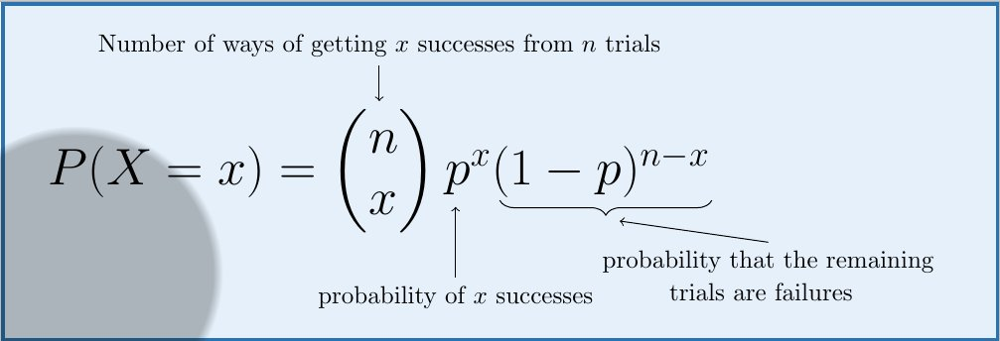

数学是学科的元科学.

那么学习数学时有没有高级的元认知策略?

Math Academy数学家Alex一口气推荐了6个.

元认知意味着”思考如何思考”,接下来一一解释.

1\. 大声解释/Explain-Alouds

一旦你掌握了一个新概念，想象你正在教导一个学生。使用纸笔或白板清晰响亮地解释它(是的,真的要大声!)。

通过将你的思维过程转化为语言并提炼成简单的解释，你会更清楚地认识到它们的优缺点。

不要回避重要的技术细节；目标是简化，而不是过度简化。

不断修改你的解释直到你满意为止。

## 

## 2. 解答问题/Q&A

## 

你的学生会问什么问题？你能回答吗？更重要的是，你能很好地回答吗？

不要因为答案看似显而易见就跳过问题。通常，最显而易见的问题反而是最好的问题。

为什么(-1) × (-1) = 1？你能解释吗？如果不能，就要学习为什么这是对的以及如何解释它。

如果你的答案不够好，就回到原点重新改进。然后带着更好的解释回到你的学生身边。

记住，”如果你不能简单地解释它，那说明你理解得还不够透彻。”

## 3. 提取练习/Retrieval Practice

提取练习意味着从记忆中回忆信息。

努力记住关键概念或公式对于将重要信息转移到长期记忆并确保它留在那里至关重要。这就是所谓的测试效应。

大量研究也表明，与重复阅读等策略相比，提取练习能显著增强学习效果。

在学习时，通过尽可能多地从记忆中回忆信息来最大化测试效应！定期测试自己。

如果你经常查看笔记，你可能在不知不觉中做了一件对自己不利的事。只有在完全卡住时才查看笔记！

## 4. 结构识别/Identity Structure 

在教育界，”死记硬背”是一个贬义词。然而，要成为一名成功的数学家，某些死记硬背是不可避免的。

挑战在于知道哪些信息需要死记硬背，哪些应该用其他(元认知)策略来内化。

学生们经常死记硬背数学公式。但是在可能的情况下，应该始终在数学公式中识别结构。识别结构意味着将公式分解成组成部分。

这不仅能提供更深入的理解，而且你也更容易记住它！这是双赢。

有些数学公式比较晦涩，没有明显的结构。三角恒等式和标准导数/积分是需要即时回忆的结果，因此应该被记住。

## 5. 推导关键结果/Derive **Key Results**

在数学中，很少有什么比自己推导出重要结果更令人满意的了。

我对此的方法类似于例题学习：先读懂怎么做，然后把它放在一边自己尝试。重复这个过程直到你做对为止。

运用间隔重复来确保你的新知识能够保持。换句话说，一天后重新构造你的推导过程，然后可能一周后再来一次。

如果你觉得有勇气并且有一些空闲时间，试着用另一种方法推导出相同的结果。

## 6. 图解/Diagrams

绘制图表和流程图来帮助形成心智模型，使信息更容易转移到长期记忆中。

流程图有助于将复杂的过程分解成单个组件，对决策制定非常有价值。

可视化还能帮助将任务的认知负荷分配在两个学习渠道(视觉和文字)之间，从而避免过载。

<figure>

</figure>

Math Academy是一个AI驱动的数学学习平台,是我见过的最好的自主学习平台. 在MA学生不仅可以学习数学,还能养成自主学习习惯. 自主学习是AI时代不可获取的生存技能,欢迎加入一起学习.

MA注册后,第一个月不满意全额退款,

实际上你得到了一个月的安全体验期,

没有比这更贴心的了.

[[手把手教你注册Math Academy|具体注册请参考: 手把手教你注册Math Academy]]

了解MA请参考

[[Math Academy正在取代可汗学院成为数学学习首选平台|Math Academy正在取代可汗学院成为数学学习首选平台]]

[[Math Academy 数学奇才为儿子打造的数学学习神器|Math Academy: 数学奇才为儿子打造的数学学习神器]]
